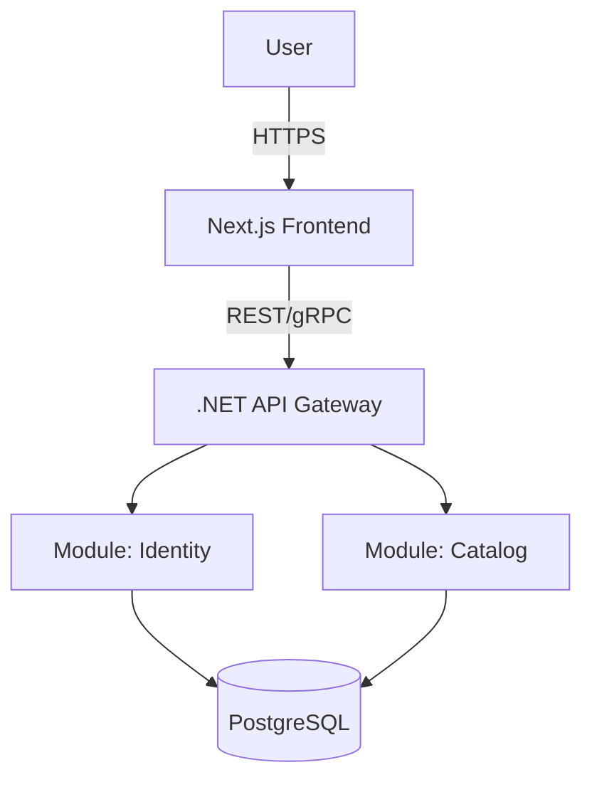
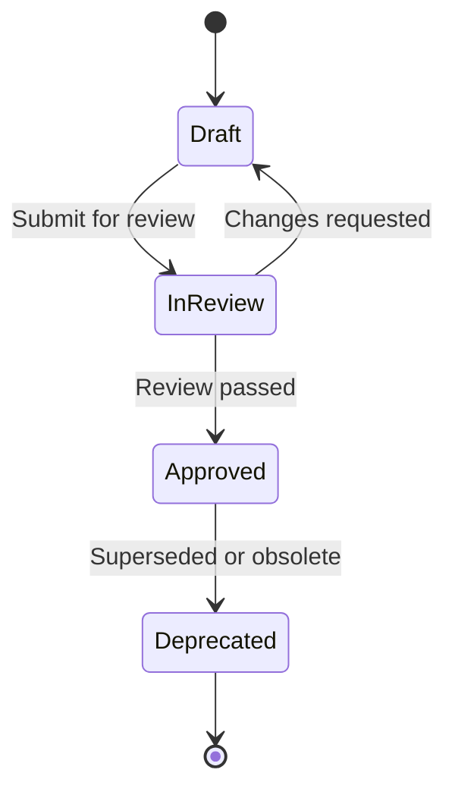

# Documentation Standard

| Field         | Value                                |
|---------------|--------------------------------------|
| **Version**   | 1.0.0                                |
| **Status**    | Draft                                |
| **Author**    | Vox                                  |
| **Reviewer**  | Vox                                  |
| **Created**   | 2026-03-27                           |
| **Updated**   | 2026-03-27                           |
| **Standard**  | ISO/IEC 26514, RFC 2119              |

---

## 1. Purpose

This document defines the documentation standards for the **Utopia** project. All project documentation — technical specifications, architecture documents, runbooks, ADRs, and policies — MUST follow the conventions described herein.

The key words "MUST", "MUST NOT", "REQUIRED", "SHALL", "SHALL NOT", "SHOULD", "SHOULD NOT", "RECOMMENDED", "MAY", and "OPTIONAL" in all Utopia documents are to be interpreted as described in [RFC 2119](https://www.rfc-editor.org/rfc/rfc2119).

## 2. Scope

This standard applies to:

- All Markdown documents within the `documents/` directory
- README files across all project folders
- Inline code documentation (code comments, XML docs, JSDoc)
- API documentation (OpenAPI specs)
- Infrastructure as Code documentation (Terraform docs, Ansible playbooks)
- CI/CD pipeline documentation

## 3. Document Structure

### 3.1. Required Metadata Header

Every document MUST begin with a metadata table containing the following fields:

| Field        | Description                          | Required |
|--------------|--------------------------------------|----------|
| Version      | Semantic version (see VERSIONING-STANDARD.md) | MUST |
| Status       | `Draft` / `In Review` / `Approved` / `Deprecated` | MUST |
| Author       | Document author(s)                   | MUST     |
| Reviewer     | Assigned reviewer(s)                 | MUST     |
| Created      | ISO 8601 date (YYYY-MM-DD)          | MUST     |
| Updated      | ISO 8601 date of last modification  | MUST     |
| Standard     | Referenced standard(s), if any       | SHOULD   |

### 3.2. Required Sections

Every document MUST contain the following sections in order:

1. **Title** — H1 heading, concise and descriptive
2. **Metadata Header** — As defined in Section 3.1
3. **Purpose** — Why this document exists (1–3 paragraphs)
4. **Scope** — What this document covers and does NOT cover
5. **Body Content** — Main content, organized with H2/H3 headings
6. **References** — Links to related documents, external standards
7. **Changelog** — Version history table

### 3.3. Optional Sections

- **Glossary** — When domain-specific terms are used
- **Appendix** — Supporting material, examples
- **Out of Scope** — Explicit exclusions

## 4. Formatting Rules

### 4.1. Markdown Conventions

| Rule | Specification |
|------|---------------|
| Headings | Use ATX-style (`#`). H1 for title only. H2 for major sections. H3–H4 for subsections. MUST NOT skip levels. |
| Line length | SHOULD NOT exceed 120 characters per line for readability |
| Lists | Use `-` for unordered lists. Use `1.` for ordered lists. Indent nested lists with 2 spaces. |
| Code blocks | Use fenced code blocks with language identifier (e.g., ` ```csharp `, ` ```yaml `) |
| Tables | Use GFM tables. Header row MUST be present. Align columns with pipes. |
| Links | Use inline links `[text](url)`. Cross-reference other docs with relative paths. |
| Emphasis | Use `**bold**` for key terms on first use. Use `*italic*` for emphasis. Use `` `backticks` `` for code, commands, file names, and config values. |
| Images | Store in `diagrams/` sub-folder. Use descriptive alt text. |

### 4.2. Language & Tone

- All technical documents MUST be written in **English**
- Use **present tense** and **active voice**
- Be concise — avoid filler phrases ("In order to" → "To")
- Use RFC 2119 keywords in **UPPERCASE** when stating requirements
- Define acronyms on first use: "Identity and Access Management (IAM)"

### 4.3. File Naming

| Rule | Example |
|------|---------|
| Use UPPERCASE with hyphens for document files | `SECURITY-STANDARD.md` |
| Use lowercase with hyphens for folders | `00-standards/` |
| Prefix numbered folders for ordering | `00-`, `01-`, `02-` |
| ADR files use sequential numbering | `ADR-0001-modulith-architecture.md` |
| Runbooks use `RUNBOOK-` prefix | `RUNBOOK-DATABASE-FAILOVER.md` |
| Templates use `-TEMPLATE` suffix | `ADR-TEMPLATE.md` |

## 5. Diagrams

### 5.1. Diagram Tool

- All architecture diagrams MUST use **Mermaid** syntax for GitHub-native rendering
- Complex diagrams MAY use **PlantUML** with exported PNG/SVG stored alongside source
- Source files MUST be stored in `diagrams/` folder alongside the document

### 5.2. Diagram Standards

- Every diagram MUST have a title
- Every diagram MUST have a legend if color-coding is used
- Diagrams MUST follow **C4 Model** notation for architecture:
  - **Level 1**: System Context
  - **Level 2**: Container
  - **Level 3**: Component
  - **Level 4**: Code (optional, auto-generated preferred)

### 5.3. Mermaid Example

```markdown

```

## 6. Cross-Referencing

- Documents MUST cross-reference related documents using relative paths
- Example: `See [SECURITY-STANDARD.md](./SECURITY-STANDARD.md) for security policies`
- ADRs MUST be referenced from architecture documents when a design choice is explained
- Format: `(see [ADR-0001](../03-adr/ADR-0001-modulith-architecture.md))`

## 7. Document Lifecycle

### 7.1. Status Flow



### 7.2. Review Process

1. Author creates document with status `Draft`
2. Author submits Pull Request with document changes
3. Reviewer reviews against `REVIEW-CHECKLIST.md`
4. Status changes to `In Review` during PR review
5. Upon approval, status changes to `Approved`
6. Deprecated documents MUST reference the superseding document

## 8. Templates

All document types have corresponding templates:

| Document Type | Template Location |
|---------------|-------------------|
| ADR | `03-adr/ADR-TEMPLATE.md` |
| Runbook | `06-devops/runbooks/RUNBOOK-TEMPLATE.md` |
| General | Follow Section 3 of this document |

## 9. References

- [RFC 2119 — Key words for use in RFCs](https://www.rfc-editor.org/rfc/rfc2119)
- [ISO/IEC 26514:2022 — Systems and software engineering — Design and development of information for users](https://www.iso.org/standard/77849.html)
- [C4 Model](https://c4model.com/)
- [Mermaid Documentation](https://mermaid.js.org/intro/)
- [Conventional Commits](https://www.conventionalcommits.org/)

## Changelog

| Version | Date       | Author | Description          |
|---------|------------|--------|----------------------|
| 1.0.0   | 2026-03-27 | Vox    | Initial draft        |
