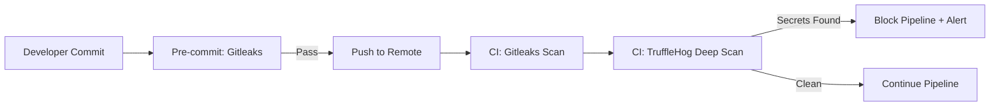
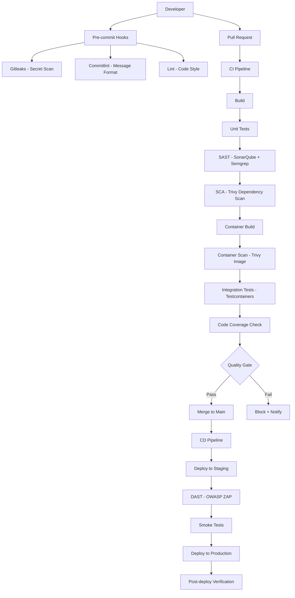

# Security Standard

| Field         | Value                                                  |
|---------------|--------------------------------------------------------|
| **Version**   | 1.0.0                                                  |
| **Status**    | Draft                                                  |
| **Author**    | Vox                                                    |
| **Reviewer**  | Vox                                                    |
| **Created**   | 2026-03-27                                             |
| **Updated**   | 2026-03-27                                             |
| **Standard**  | ISO 27001:2022, OWASP ASVS v4.0.3, OWASP Top 10 2021 |

---

## 1. Purpose

This document defines the security standards for the **Utopia** project, mapping ISO 27001:2022 Annex A controls and OWASP ASVS requirements to specific technical implementations across all codebases and infrastructure.

## 2. Scope

This standard applies to:

- Application source code (backend, frontend)
- Infrastructure as Code (Terraform, Ansible, Kubernetes manifests)
- CI/CD pipelines and deployment processes
- Container images and runtime environments
- Data storage and transmission
- Identity and access management
- Third-party dependencies and supply chain

## 3. ISO 27001:2022 Controls Mapping

### 3.1. Controls Applicability Matrix

The following table maps ISO 27001:2022 Annex A controls to Utopia's implementation. Controls are categorized by relevance to a DevSecOps personal project.

| Control ID | Control Name | Applicability | Utopia Implementation |
|------------|-------------|---------------|----------------------|
| **A.5.1** | Policies for information security | Applicable | This document + related policies |
| **A.5.14** | Information transfer | Applicable | TLS 1.3 everywhere, API encryption |
| **A.5.19** | Information security in supplier relationships | Applicable | Dependency scanning, SCA |
| **A.5.23** | Information security for cloud services | Applicable | Cloud security baseline in Terraform |
| **A.5.24** | Incident management planning | Applicable | Incident Response Plan document |
| **A.5.29** | Information security during disruption | Applicable | DR Plan, backup strategy |
| **A.8.1** | User endpoint devices | Limited | Developer workstation security |
| **A.8.3** | Information access restriction | Applicable | RBAC, least privilege |
| **A.8.4** | Access to source code | Applicable | Branch protection, code review |
| **A.8.5** | Secure authentication | Applicable | Keycloak, MFA, password policy |
| **A.8.7** | Protection against malware | Applicable | Container scanning, runtime security |
| **A.8.9** | Configuration management | Applicable | IaC, GitOps, immutable infra |
| **A.8.10** | Information deletion | Applicable | Data retention policy, GDPR |
| **A.8.12** | Data leakage prevention | Applicable | Secret scanning, DLP in CI |
| **A.8.15** | Logging | Applicable | Centralized logging, audit trails |
| **A.8.16** | Monitoring activities | Applicable | Prometheus, alerting |
| **A.8.20** | Networks security | Applicable | Network policies, firewall rules |
| **A.8.24** | Use of cryptography | Applicable | Encryption at rest and in transit |
| **A.8.25** | Secure development lifecycle | Applicable | DevSecOps pipeline |
| **A.8.26** | Application security requirements | Applicable | OWASP ASVS checklist |
| **A.8.27** | Secure system architecture | Applicable | Architecture review, threat modeling |
| **A.8.28** | Secure coding | Applicable | SAST, code review, standards |
| **A.8.29** | Security testing | Applicable | DAST, penetration testing |
| **A.8.31** | Separation of environments | Applicable | Dev/Staging/Prod isolation |
| **A.8.32** | Change management | Applicable | Git-based change management |

## 4. Authentication & Authorization (A.8.3, A.8.5)

### 4.1. Authentication Requirements

| Requirement | Standard | Implementation |
|-------------|----------|----------------|
| Identity Provider | OWASP ASVS V2 | Keycloak with OAuth 2.0 / OpenID Connect |
| Password Policy | A.8.5 | Min 12 chars, complexity rules, breach check |
| MFA | A.8.5 | MUST support TOTP, SHOULD support WebAuthn |
| Session Management | ASVS V3 | Server-side sessions, secure cookie flags |
| Token Management | ASVS V3 | JWT with RS256, short expiry (15 min access, 7 day refresh) |
| Rate Limiting | ASVS V2 | Max 5 failed login attempts per 15 minutes |

### 4.2. Authorization Model

```
RBAC (Role-Based Access Control)
├── Roles defined in Keycloak
├── Permission mapping per module
├── API endpoint authorization via middleware
└── Frontend route guards
```

- MUST implement **least privilege** — users get minimum required permissions
- MUST use **attribute-based authorization** in .NET for fine-grained control
- MUST NOT rely solely on client-side authorization checks
- API endpoints MUST validate permissions server-side

```csharp
// GOOD — Server-side authorization
[Authorize(Policy = "CanManageUsers")]
public async Task<IResult> DeleteUser(Guid id, IUserService service, CancellationToken ct)
{
    await service.DeleteAsync(id, ct);
    return Results.NoContent();
}
```

### 4.3. API Security

| Control | Requirement |
|---------|-------------|
| Authentication | All API endpoints MUST require authentication except explicitly public ones |
| CORS | MUST whitelist specific origins, MUST NOT use `*` |
| Rate Limiting | MUST implement per-user and global rate limiting |
| Request Size | MUST limit request body size (default: 10MB) |
| Input Validation | MUST validate all inputs server-side (see Section 5) |
| Response Headers | MUST include security headers (see Section 4.4) |

### 4.4. Required HTTP Security Headers

```
X-Content-Type-Options: nosniff
X-Frame-Options: DENY
X-XSS-Protection: 0
Strict-Transport-Security: max-age=31536000; includeSubDomains; preload
Content-Security-Policy: default-src 'self'; script-src 'self'
Referrer-Policy: strict-origin-when-cross-origin
Permissions-Policy: camera=(), microphone=(), geolocation=()
Cache-Control: no-store (for sensitive responses)
```

## 5. Input Validation & Output Encoding (OWASP Top 10: A03)

### 5.1. Input Validation Rules

- MUST validate all input at the **API boundary** using FluentValidation
- MUST use **allowlist** validation over denylist
- MUST validate data type, length, range, and format
- MUST NOT trust any client-side validation
- MUST sanitize file uploads (type, size, content validation)

```csharp
// GOOD — FluentValidation with explicit rules
public class CreateUserValidator : AbstractValidator<CreateUserRequest>
{
    public CreateUserValidator()
    {
        RuleFor(x => x.Email)
            .NotEmpty()
            .EmailAddress()
            .MaximumLength(256);

        RuleFor(x => x.FirstName)
            .NotEmpty()
            .MaximumLength(100)
            .Matches(@"^[\p{L}\s\-']+$").WithMessage("Name contains invalid characters");

        RuleFor(x => x.Password)
            .NotEmpty()
            .MinimumLength(12)
            .Matches(@"[A-Z]").WithMessage("Must contain uppercase letter")
            .Matches(@"[a-z]").WithMessage("Must contain lowercase letter")
            .Matches(@"[0-9]").WithMessage("Must contain a digit")
            .Matches(@"[\W_]").WithMessage("Must contain a special character");
    }
}
```

### 5.2. SQL Injection Prevention (OWASP A03)

- MUST use parameterized queries — EF Core handles this by default
- MUST NOT use string concatenation for SQL
- Raw SQL via Dapper MUST use parameterized queries

```csharp
// GOOD — Parameterized query
var user = await connection.QuerySingleOrDefaultAsync<User>(
    "SELECT * FROM users WHERE email = @Email",
    new { Email = email });

// BAD — SQL injection vulnerability
var user = await connection.QueryAsync($"SELECT * FROM users WHERE email = '{email}'");
```

### 5.3. XSS Prevention (OWASP A03)

- Backend MUST encode output by default (ASP.NET does this automatically)
- Frontend MUST NOT use `dangerouslySetInnerHTML` without sanitization
- Frontend MUST use React's built-in escaping (JSX auto-escapes)
- CSP headers MUST be configured (see Section 4.4)

## 6. Cryptography (A.8.24)

### 6.1. Encryption Standards

| Use Case | Algorithm | Key Size |
|----------|-----------|----------|
| Data at rest | AES-256-GCM | 256-bit |
| Data in transit | TLS 1.3 (minimum TLS 1.2) | - |
| Password hashing | Argon2id (via Keycloak) | - |
| API tokens | RS256 (JWT signing) | 2048-bit RSA |
| Database encryption | TDE (Transparent Data Encryption) | Provider default |

### 6.2. Rules

- MUST NOT implement custom cryptography
- MUST NOT use deprecated algorithms: MD5, SHA-1, DES, 3DES, RC4
- MUST NOT hardcode encryption keys or secrets
- Encryption keys MUST be managed via **HashiCorp Vault**
- TLS certificates MUST be auto-rotated (cert-manager in K8s)

## 7. Secret Management (A.8.12)

### 7.1. Secret Classification

| Classification | Examples | Storage |
|---------------|----------|---------|
| Critical | Database credentials, API keys, signing keys | HashiCorp Vault |
| Sensitive | OAuth client secrets, webhook tokens | Vault or K8s Sealed Secrets |
| Internal | Non-sensitive config, feature flags | ConfigMaps, environment variables |

### 7.2. Rules

- MUST NOT commit secrets to Git — enforced by Gitleaks pre-commit hook
- MUST NOT store secrets in environment variables in production — use Vault
- MUST NOT log secrets — use structured logging with secret masking
- Secrets MUST be rotated on a defined schedule
- CI/CD secrets MUST use GitHub Actions encrypted secrets or OIDC federation

### 7.3. Secret Scanning Pipeline



## 8. Dependency Security (A.5.19)

### 8.1. Supply Chain Security

- All dependencies MUST be scanned for known vulnerabilities in CI
- Critical/High vulnerabilities MUST block the pipeline
- Dependency updates MUST be automated via Dependabot/Renovate
- Lock files (`packages.lock.json`, `pnpm-lock.yaml`) MUST be committed

### 8.2. Scanning Tools

| Tool | Target | Integration Point |
|------|--------|-------------------|
| Trivy | .NET NuGet packages | CI pipeline |
| Trivy | npm/pnpm packages | CI pipeline |
| Dependabot | All dependencies | GitHub automated PRs |
| `dotnet list package --vulnerable` | .NET packages | CI pipeline |
| `pnpm audit` | npm packages | CI pipeline |

### 8.3. Vulnerability SLA

| Severity | Response Time | Resolution Time |
|----------|---------------|-----------------|
| Critical (CVSS 9.0+) | Immediate | 24 hours |
| High (CVSS 7.0-8.9) | 24 hours | 7 days |
| Medium (CVSS 4.0-6.9) | 7 days | 30 days |
| Low (CVSS 0.1-3.9) | 30 days | Next release |

## 9. Container Security (A.8.7, A.8.9)

### 9.1. Image Security Rules

- MUST use **minimal base images** (Alpine or distroless)
- MUST NOT run containers as root
- MUST scan images with Trivy before pushing to registry
- MUST NOT use `latest` tag — use specific version + SHA digest
- MUST include `HEALTHCHECK` in Dockerfile
- Images MUST be signed (Cosign / Notary)

### 9.2. Kubernetes Security

| Control | Requirement |
|---------|-------------|
| Pod Security | MUST use Pod Security Standards (restricted profile) |
| Network Policy | MUST implement default-deny ingress/egress |
| RBAC | MUST use namespace-scoped roles, MUST NOT use cluster-admin |
| Secrets | MUST use Sealed Secrets or External Secrets Operator |
| Admission Control | MUST use OPA Gatekeeper for policy enforcement |
| Resource Limits | MUST set CPU/memory requests and limits |
| Service Mesh | SHOULD use mTLS between services |

```yaml
# GOOD — Pod Security Context
apiVersion: v1
kind: Pod
spec:
  securityContext:
    runAsNonRoot: true
    runAsUser: 1000
    fsGroup: 1000
    seccompProfile:
      type: RuntimeDefault
  containers:
    - name: app
      securityContext:
        allowPrivilegeEscalation: false
        readOnlyRootFilesystem: true
        capabilities:
          drop: ["ALL"]
```

## 10. Logging & Monitoring (A.8.15, A.8.16)

### 10.1. Logging Requirements

- MUST use structured logging (JSON format)
- MUST include correlation ID in all log entries
- MUST NOT log sensitive data (passwords, tokens, PII)
- Application logs MUST be shipped to centralized logging (Loki)
- Audit logs MUST be immutable and retained for 90 days minimum

### 10.2. Required Log Fields

```json
{
  "timestamp": "2026-03-27T10:30:00.000Z",
  "level": "Information",
  "message": "User login successful",
  "correlationId": "abc-123-def",
  "userId": "user-456",
  "sourceContext": "Utopia.Modules.Identity.AuthService",
  "environment": "production",
  "traceId": "4bf92f3577b34da6a3ce929d0e0e4736"
}
```

### 10.3. Security Events to Monitor

| Event | Log Level | Alert |
|-------|-----------|-------|
| Failed login attempts (>5 in 15 min) | Warning | Yes — immediate |
| Privilege escalation attempt | Critical | Yes — immediate |
| Invalid JWT token | Warning | Yes — threshold |
| Unauthorized API access | Warning | Yes — threshold |
| Secret access from Vault | Information | No — audit only |
| Configuration change | Information | Yes — daily digest |
| Dependency vulnerability found | Warning | Yes — per SLA |
| Container image scan failure | Error | Yes — immediate |

## 11. Secure Development Lifecycle (A.8.25–A.8.29)

### 11.1. DevSecOps Pipeline



### 11.2. Quality Gates

| Gate | Criteria | Enforcement |
|------|----------|-------------|
| **Pre-commit** | No secrets, valid commit message, lint passes | Git hooks |
| **PR Gate** | All CI checks pass, code review approved | Branch protection |
| **SAST Gate** | No critical/high issues, no new vulnerabilities | SonarQube Quality Gate |
| **SCA Gate** | No critical/high dependency vulnerabilities | Trivy exit code |
| **Container Gate** | No critical/high image vulnerabilities | Trivy exit code |
| **Coverage Gate** | ≥80% line coverage (new code) | CI check |
| **DAST Gate** | No high-risk findings | OWASP ZAP baseline |

### 11.3. Code Review Security Checklist

Every Pull Request MUST be reviewed against:

- [ ] No hardcoded secrets or credentials
- [ ] Input validation at API boundaries
- [ ] Authorization checks on all endpoints
- [ ] Parameterized queries (no SQL injection)
- [ ] No sensitive data in logs
- [ ] Error messages do not leak internal details
- [ ] Dependencies are from trusted sources
- [ ] Dockerfile follows security best practices

## 12. Data Protection (A.8.10, A.8.11)

### 12.1. Data Classification

| Level | Description | Examples | Controls |
|-------|-------------|----------|----------|
| **Confidential** | Highly sensitive | Passwords, API keys, PII | Encryption at rest + transit, access logging |
| **Internal** | Business sensitive | User emails, order data | Encryption in transit, RBAC |
| **Public** | Non-sensitive | Product catalog, docs | No special controls |

### 12.2. Data Retention

| Data Type | Retention Period | Deletion Method |
|-----------|-----------------|-----------------|
| User accounts | Until deletion requested | Soft delete → hard delete after 30 days |
| Audit logs | 1 year | Automated purge |
| Application logs | 90 days | Log rotation |
| Backups | 30 days | Automated lifecycle policy |
| Session data | 24 hours after expiry | Automated cleanup |

## 13. Environment Separation (A.8.31)

| Control | Dev | Staging | Production |
|---------|-----|---------|------------|
| Data | Synthetic/fake only | Anonymized subset | Real data |
| Access | All developers | Limited | Restricted (break-glass) |
| Secrets | Local Vault dev mode | Vault (staging) | Vault (HA, sealed) |
| Network | Open | Restricted | Zero-trust |
| Monitoring | Basic | Full | Full + alerting |
| Debug | Enabled | Limited | Disabled |

## 14. References

- [ISO/IEC 27001:2022 — Information security management systems](https://www.iso.org/standard/27001)
- [OWASP ASVS v4.0.3](https://owasp.org/www-project-application-security-verification-standard/)
- [OWASP Top 10 (2021)](https://owasp.org/www-project-top-ten/)
- [CIS Kubernetes Benchmark](https://www.cisecurity.org/benchmark/kubernetes)
- [NIST Secure Software Development Framework](https://csrc.nist.gov/Projects/ssdf)
- [SLSA Framework](https://slsa.dev/)
- [SECURITY-STANDARD.md](./SECURITY-STANDARD.md) (this document)
- [CODING-STANDARD.md](./CODING-STANDARD.md)

## Changelog

| Version | Date       | Author | Description          |
|---------|------------|--------|----------------------|
| 1.0.0   | 2026-03-27 | Vox    | Initial draft        |
