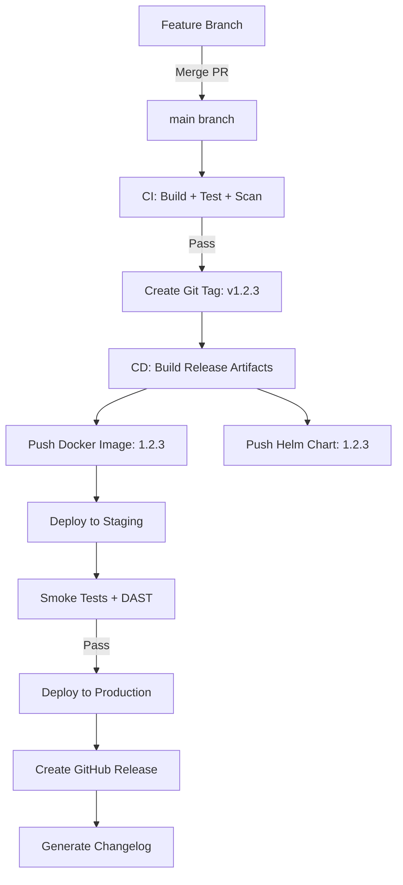

# Versioning Standard

| Field         | Value                             |
|---------------|-----------------------------------|
| **Version**   | 1.0.0                             |
| **Status**    | Draft                             |
| **Author**    | Vox                               |
| **Reviewer**  | Vox                               |
| **Created**   | 2026-03-27                        |
| **Updated**   | 2026-03-27                        |
| **Standard**  | Semantic Versioning 2.0.0         |

---

## 1. Purpose

This document defines the versioning strategy for the **Utopia** project. A consistent versioning scheme is applied across all artifacts: source code, documentation, API versions, Docker images, Helm charts, and Terraform modules.

## 2. Scope

This standard applies to:

- Application releases (backend, frontend)
- Docker images
- Helm charts
- Terraform modules
- API versions
- Documentation files
- Database migrations

## 3. Semantic Versioning (SemVer)

All Utopia artifacts MUST follow [Semantic Versioning 2.0.0](https://semver.org/):

```
MAJOR.MINOR.PATCH[-PRERELEASE][+BUILD]
```

| Segment | When to Increment | Example |
|---------|-------------------|---------|
| **MAJOR** | Breaking changes — incompatible API/contract changes | `1.0.0` → `2.0.0` |
| **MINOR** | New features — backward-compatible additions | `1.0.0` → `1.1.0` |
| **PATCH** | Bug fixes — backward-compatible fixes | `1.0.0` → `1.0.1` |
| **PRERELEASE** | Pre-release builds | `1.1.0-alpha.1`, `1.1.0-rc.1` |
| **BUILD** | Build metadata (informational only) | `1.0.0+20260327.abc1234` |

### 3.1. Pre-release Labels

| Label | Usage | Stability |
|-------|-------|-----------|
| `alpha` | Early development, unstable | Breaking changes expected |
| `beta` | Feature-complete, testing | Minor issues expected |
| `rc` | Release candidate | Production-ready pending final validation |

Example progression: `1.2.0-alpha.1` → `1.2.0-alpha.2` → `1.2.0-beta.1` → `1.2.0-rc.1` → `1.2.0`

### 3.2. Initial Development

- Projects MUST start at version `0.1.0`
- Version `0.x.y` indicates initial development — breaking changes MAY occur in MINOR versions
- Version `1.0.0` marks the first stable release with a public API contract

## 4. Versioning by Artifact Type

### 4.1. Application Code (Backend & Frontend)

| Item | Versioning | Source of Truth |
|------|-----------|-----------------|
| Backend (.NET) | SemVer | `Directory.Build.props` → `<Version>` property |
| Frontend (Next.js) | SemVer | `package.json` → `version` field |
| Release Tag | Git tag | `v{MAJOR}.{MINOR}.{PATCH}` (e.g., `v1.2.3`) |

```xml
<!-- backend/Directory.Build.props -->
<Project>
  <PropertyGroup>
    <Version>0.1.0</Version>
    <AssemblyVersion>0.1.0.0</AssemblyVersion>
    <FileVersion>0.1.0.0</FileVersion>
    <InformationalVersion>0.1.0+abc1234</InformationalVersion>
  </PropertyGroup>
</Project>
```

### 4.2. Docker Images

Image tags MUST follow this scheme:

```
registry/utopia-api:1.2.3              # Release
registry/utopia-api:1.2.3-rc.1         # Pre-release
registry/utopia-api:sha-abc1234        # Commit SHA (for dev/staging)
registry/utopia-api:main-20260327      # Branch + date (for CI builds)
```

- MUST NOT use `latest` tag in production deployments
- Release images MUST be tagged with SemVer
- CI images SHOULD be tagged with commit SHA for traceability

### 4.3. Helm Charts

```yaml
# Chart.yaml
apiVersion: v2
name: utopia-api
version: 0.1.0        # Chart version (SemVer)
appVersion: "0.1.0"    # Application version it deploys
```

- `version` tracks the chart itself (breaking changes to values/templates)
- `appVersion` tracks the application version deployed by the chart
- These MAY differ (chart bugfix without app change)

### 4.4. Terraform Modules

```hcl
# modules/kubernetes-cluster/versions.tf
# Module version is tracked via Git tags: terraform-kubernetes-v1.0.0
```

- Terraform modules MUST be versioned via Git tags
- Tag format: `terraform-{module-name}-v{MAJOR}.{MINOR}.{PATCH}`
- Module references MUST pin versions:

```hcl
module "kubernetes" {
  source  = "git::https://github.com/utopia/infrastructure.git//modules/kubernetes?ref=terraform-kubernetes-v1.0.0"
}
```

### 4.5. API Versions

- API versioning MUST use **URL path versioning**: `/api/v1/users`
- API version increments ONLY on **breaking changes**
- Non-breaking additions (new fields, new endpoints) MUST NOT require version bump
- Deprecated API versions MUST be supported for minimum **6 months** after new version release
- Deprecation MUST be communicated via `Deprecation` and `Sunset` response headers

```
Deprecation: true
Sunset: Sat, 27 Sep 2026 00:00:00 GMT
Link: <https://api.utopia.dev/v2/users>; rel="successor-version"
```

### 4.6. Database Migrations

- Migrations MUST be **forward-only** — no down migrations in production
- Migration naming: `{Timestamp}_{DescriptiveName}` (EF Core default)
- Breaking schema changes MUST follow **expand-contract pattern**:
  1. **Expand**: Add new column/table alongside old
  2. **Migrate**: Backfill data
  3. **Contract**: Remove old column/table in next release

### 4.7. Documentation

- Documents follow SemVer in their metadata header
- MAJOR: Fundamental restructuring or scope change
- MINOR: New sections added, significant content updates
- PATCH: Typo fixes, clarifications, formatting

## 5. Release Process

### 5.1. Release Flow



### 5.2. Git Tags

- Release tags MUST use format: `v{MAJOR}.{MINOR}.{PATCH}`
- Tags MUST be annotated (NOT lightweight):

```bash
git tag -a v1.2.3 -m "Release v1.2.3: Add user registration module"
```

- Tags MUST be signed with GPG in production releases (SHOULD in development)

### 5.3. Changelog Generation

- Changelogs MUST be auto-generated from Conventional Commits
- Tool: `git-cliff` or `conventional-changelog`
- Changelog MUST categorize entries:

```markdown
## [1.2.3] - 2026-03-27

### Features
- feat(identity): add user registration endpoint (#42)

### Bug Fixes
- fix(catalog): correct price calculation for bulk orders (#45)

### Security
- security(deps): update lodash to 4.17.21 (#47)
```

## 6. Version Compatibility Matrix

For every release, a compatibility matrix MUST be maintained:

| Component | Version | Compatible With |
|-----------|---------|-----------------|
| API | v1.2.3 | Frontend ≥1.1.0, Mobile ≥2.0.0 |
| Frontend | v1.1.0 | API v1.x |
| Helm Chart | v0.5.0 | App v1.2.x, K8s ≥1.28 |
| Terraform | v1.0.0 | Provider AzureRM ≥3.0 |

## 7. References

- [Semantic Versioning 2.0.0](https://semver.org/)
- [Conventional Commits](https://www.conventionalcommits.org/)
- [Helm Chart Versioning](https://helm.sh/docs/topics/charts/#charts-and-versioning)
- [API Versioning Best Practices](https://learn.microsoft.com/en-us/azure/architecture/best-practices/api-design#versioning)
- [DOCUMENTATION-STANDARD.md](./DOCUMENTATION-STANDARD.md)

## Changelog

| Version | Date       | Author | Description          |
|---------|------------|--------|----------------------|
| 1.0.0   | 2026-03-27 | Vox    | Initial draft        |
