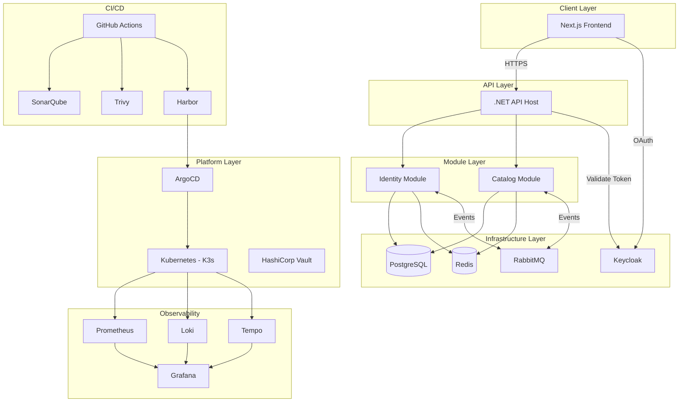

# Project Charter — Utopia

| Field         | Value                                |
|---------------|--------------------------------------|
| **Version**   | 1.0.0                                |
| **Status**    | Draft                                |
| **Author**    | Vox                                  |
| **Reviewer**  | Vox                                  |
| **Created**   | 2026-03-27                           |
| **Updated**   | 2026-03-27                           |

---

## 1. Purpose

This document defines the project charter for **Utopia** — a production-grade personal project designed as a reference implementation for modern DevOps, DevSecOps, and Infrastructure as Code practices. It serves as the single source of truth for the project's objectives, scope, and governance.

## 2. Project Overview

### 2.1. Project Name

**Utopia**

### 2.2. Project Vision

To build a fully production-ready application platform that demonstrates end-to-end DevSecOps practices, from secure coding and automated testing to infrastructure provisioning and continuous deployment — all with comprehensive documentation following industry standards.

### 2.3. Project Goals

| # | Goal | Measurable Outcome |
|---|------|--------------------|
| G1 | Build a modular, maintainable backend | .NET Modulith with ≥2 modules, ≥80% test coverage |
| G2 | Implement a modern, responsive frontend | Next.js application with TypeScript, accessible (WCAG 2.1 AA) |
| G3 | Establish a complete CI/CD pipeline | Automated build → test → scan → deploy in <15 minutes |
| G4 | Implement DevSecOps practices | SAST, SCA, DAST, secret scanning, container scanning integrated |
| G5 | Infrastructure as Code for all environments | 100% of infrastructure defined in Terraform/Ansible |
| G6 | GitOps-driven deployments | ArgoCD syncing from Git to Kubernetes |
| G7 | Full observability stack | Metrics, logs, and traces with alerting |
| G8 | Production-grade documentation | All documents following ISO 27001 and project standards |

### 2.4. Non-Goals

- This project is NOT intended for commercial use or real user traffic
- NOT a tutorial or learning-only project — it follows production standards
- NOT an attempt to showcase every possible technology — only proven, practical stacks

## 3. Scope

### 3.1. In Scope

| Area | Description |
|------|-------------|
| **Backend** | .NET 8 Modulith with Identity and Catalog modules |
| **Frontend** | Next.js 14+ with TypeScript, shadcn/ui, Tailwind CSS |
| **Database** | PostgreSQL 16 with EF Core, schema-per-module |
| **Cache** | Redis for distributed caching and session management |
| **Message Bus** | RabbitMQ with MassTransit for inter-module communication |
| **Identity** | Keycloak for OAuth 2.0 / OpenID Connect |
| **CI/CD** | GitHub Actions pipelines with automated quality gates |
| **Container** | Docker multi-stage builds, Harbor registry |
| **Orchestration** | Kubernetes (K3s local, cloud-ready manifests) |
| **GitOps** | ArgoCD for declarative deployment |
| **IaC** | Terraform for cloud resources, Ansible for configuration |
| **Security** | SonarQube, Trivy, Gitleaks, OWASP ZAP, Vault |
| **Monitoring** | Prometheus, Grafana, Loki, Tempo (OpenTelemetry) |
| **Documentation** | Standards, ADRs, architecture docs, runbooks |

### 3.2. Out of Scope

- Mobile applications
- Multi-region deployment
- Third-party SaaS integrations (Stripe, SendGrid, etc.)
- Performance/load testing infrastructure (may be added later)
- Service mesh implementation (may be added later)

## 4. Stakeholders

| Role | Name | Responsibilities |
|------|------|------------------|
| Project Owner | Vox | Vision, priorities, final decisions |
| Developer | Vox | Design, implementation, testing |
| DevOps Engineer | Vox | CI/CD, infrastructure, monitoring |
| Security Engineer | Vox | Security policies, scanning, compliance |
| Technical Writer | Vox | Documentation, standards |
| Reviewer | Vox | Code and document reviews |

## 5. Technical Architecture Summary

For detailed architecture diagrams, see [02-architecture/](../02-architecture/).

## 6. Development Environment

### 6.1. Hardware

| Spec | Value |
|------|-------|
| Machine | Lenovo Legion 5 Pro |
| CPU | Intel Core i9 |
| RAM | 40 GB |
| Storage | 1 TB SSD |
| OS | Windows (with WSL2 / Docker Desktop) |

### 6.2. Required Software

| Software | Version | Purpose |
|----------|---------|---------|
| Docker Desktop | Latest | Container runtime |
| .NET SDK | 8.0 LTS | Backend development |
| Node.js | 20 LTS | Frontend development |
| pnpm | Latest | Package manager |
| Git | Latest | Version control |
| VS Code | Latest | Primary IDE |
| Terraform | ≥1.7 | IaC |
| kubectl | ≥1.28 | K8s CLI |
| Helm | ≥3.14 | K8s package manager |
| K3d | Latest | Local K8s cluster |

## 7. Conventions & Standards

All project work MUST follow the standards defined in `00-standards/`:

| Standard | Document |
|----------|----------|
| Documentation | [DOCUMENTATION-STANDARD.md](../00-standards/DOCUMENTATION-STANDARD.md) |
| Coding | [CODING-STANDARD.md](../00-standards/CODING-STANDARD.md) |
| Security | [SECURITY-STANDARD.md](../00-standards/SECURITY-STANDARD.md) |
| Versioning | [VERSIONING-STANDARD.md](../00-standards/VERSIONING-STANDARD.md) |
| Review | [REVIEW-CHECKLIST.md](../00-standards/REVIEW-CHECKLIST.md) |

## 8. Risks & Mitigations

| # | Risk | Likelihood | Impact | Mitigation |
|---|------|-----------|--------|------------|
| R1 | Scope creep — adding unnecessary features | High | Medium | Strict scope defined in Section 3 |
| R2 | Over-engineering early | High | Medium | Start simple, iterate (see ADRs) |
| R3 | Local resource exhaustion (RAM/CPU) | Medium | High | Monitor resource usage, use K3d over full K8s |
| R4 | Security misconfiguration | Medium | High | Follow SECURITY-STANDARD.md, automated scanning |
| R5 | Dependency vulnerabilities | Medium | Medium | Automated SCA with Trivy + Dependabot |

## 9. Success Criteria

The project is considered successful when:

1. All modules build and pass tests in CI pipeline
2. Security scanning pipeline runs with zero critical/high findings
3. Application deploys to K8s via ArgoCD from a Git push
4. Full observability — metrics, logs, traces visible in Grafana
5. All documentation is complete and follows standards
6. Infrastructure is 100% defined in code (no manual setup)

## 10. References

- [DOCUMENTATION-STANDARD.md](../00-standards/DOCUMENTATION-STANDARD.md)
- [TECH-STACK-DECISION.md](./TECH-STACK-DECISION.md)
- [Architecture Decision Records](../03-adr/)

## Changelog

| Version | Date       | Author | Description          |
|---------|------------|--------|----------------------|
| 1.0.0   | 2026-03-27 | Vox    | Initial draft        |
