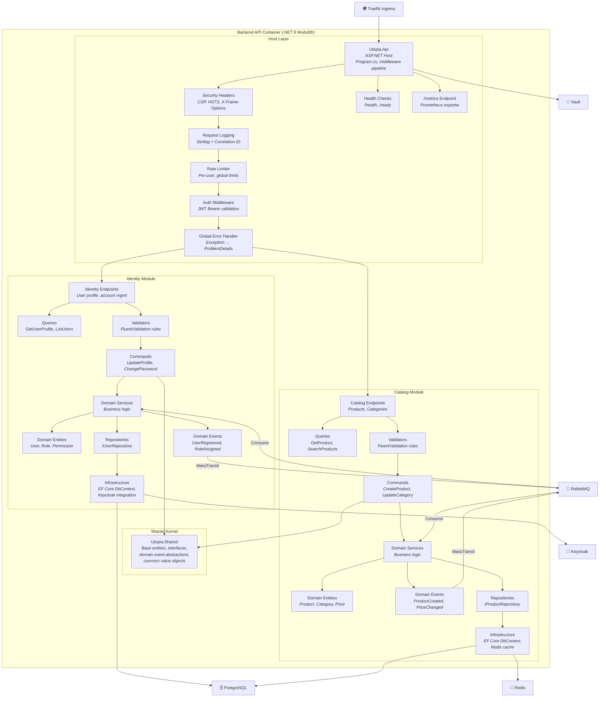
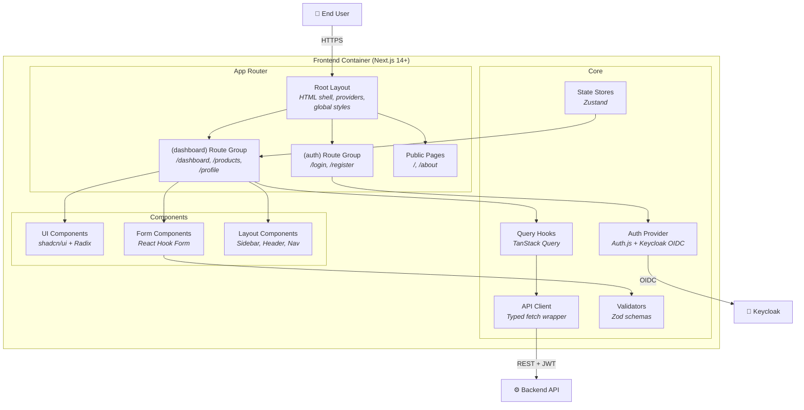
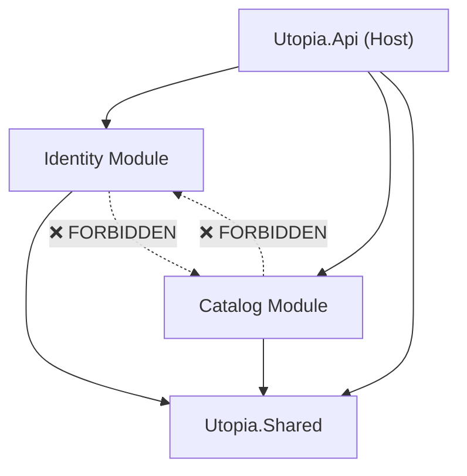
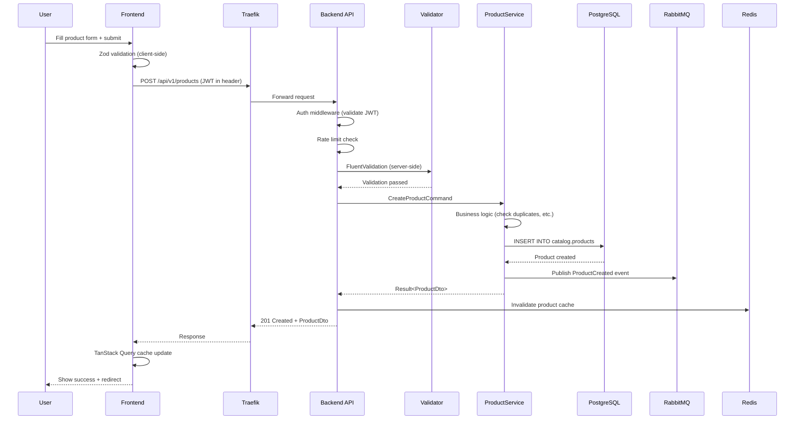

# C4 Component Diagram — Utopia

| Field         | Value                                |
|---------------|--------------------------------------|
| **Version**   | 1.0.0                                |
| **Status**    | Draft                                |
| **Author**    | Vox                                  |
| **Reviewer**  | Vox                                  |
| **Created**   | 2026-03-27                           |
| **Updated**   | 2026-03-27                           |
| **Standard**  | C4 Model — Level 3                   |

---

## 1. Purpose

This document describes the **Component Diagrams** (C4 Level 3) for the Utopia platform. It zooms into each container from the [container diagram](./C4-CONTAINER.md), showing the major structural building blocks (components) and their interactions.

## 2. Scope

Internal components of:

- Backend API (.NET Modulith)
- Frontend (Next.js)

## 3. Backend API — Component Overview

## 4. Backend Components Detail

### 4.1. Host Layer — `Utopia.Api`

The host project is the entry point. It composes all modules and configures the ASP.NET middleware pipeline.

| Component | Responsibility |
|-----------|---------------|
| **Program.cs / Host** | Module registration, DI composition, middleware ordering |
| **Auth Middleware** | Validates JWT tokens against Keycloak JWKS endpoint |
| **Global Error Handler** | Catches unhandled exceptions, maps to RFC 7807 ProblemDetails |
| **Request Logging** | Structured logging with correlation ID propagation via Serilog |
| **Rate Limiter** | Fixed-window and sliding-window rate limits per endpoint |
| **Security Headers** | Adds CSP, HSTS, X-Frame-Options, X-Content-Type-Options |
| **Health Checks** | `/health` (liveness), `/ready` (readiness) — checks DB, Redis, RabbitMQ |
| **Metrics Endpoint** | `/metrics` — exposes Prometheus-format metrics |

### 4.2. Shared Kernel — `Utopia.Shared`

Minimal shared code used by all modules. MUST NOT contain business logic.

| Component | Contents |
|-----------|----------|
| **Base Entities** | `Entity<TId>`, `AggregateRoot<TId>` |
| **Value Objects** | `Money`, `Email`, `DateRange` |
| **Interfaces** | `IRepository<T>`, `IDomainEvent`, `IUnitOfWork` |
| **Event Bus Abstractions** | `IEventPublisher`, `IEventHandler<T>` |
| **Common Exceptions** | `DomainException`, `NotFoundException`, `BusinessRuleException` |
| **Results** | `Result<T>`, `PagedResult<T>` |

### 4.3. Identity Module — `Utopia.Modules.Identity`

| Layer | Components | Responsibility |
|-------|-----------|---------------|
| **Endpoints** | `GET /api/v1/users/{id}`, `PUT /api/v1/users/{id}`, `GET /api/v1/users/me` | HTTP API surface — routing, authorization attributes |
| **Commands** | `UpdateProfileCommand`, `ChangePasswordCommand` | Write operations (CQRS command side) |
| **Queries** | `GetUserProfileQuery`, `ListUsersQuery` | Read operations (CQRS query side) |
| **Validators** | `UpdateProfileValidator`, `ChangePasswordValidator` | Input validation via FluentValidation |
| **Domain Services** | `UserService`, `RoleService` | Business logic orchestration |
| **Entities** | `User`, `Role`, `Permission` | Domain model — rich entities |
| **Value Objects** | `Email`, `FullName` | Immutable typed values |
| **Domain Events** | `UserRegistered`, `UserProfileUpdated`, `RoleAssigned` | Published via MassTransit to RabbitMQ |
| **Repositories** | `IUserRepository` | Data access abstraction |
| **Infrastructure** | `IdentityDbContext`, `UserRepository`, `KeycloakSyncService` | EF Core persistence (schema: `identity`), Keycloak admin API |

### 4.4. Catalog Module — `Utopia.Modules.Catalog`

| Layer | Components | Responsibility |
|-------|-----------|---------------|
| **Endpoints** | `GET /api/v1/products`, `POST /api/v1/products`, `GET /api/v1/categories` | HTTP API surface |
| **Commands** | `CreateProductCommand`, `UpdateProductCommand`, `CreateCategoryCommand` | Write operations |
| **Queries** | `GetProductQuery`, `SearchProductsQuery`, `ListCategoriesQuery` | Read operations with Redis caching |
| **Validators** | `CreateProductValidator`, `UpdateProductValidator` | Input validation |
| **Domain Services** | `ProductService`, `CategoryService`, `PricingService` | Business logic |
| **Entities** | `Product`, `Category`, `ProductVariant` | Domain model |
| **Value Objects** | `Money`, `Sku`, `ProductName` | Typed values |
| **Domain Events** | `ProductCreated`, `ProductUpdated`, `PriceChanged` | Published to event bus |
| **Repositories** | `IProductRepository`, `ICategoryRepository` | Data access |
| **Infrastructure** | `CatalogDbContext`, `ProductRepository`, `CachedProductRepository` | EF Core (schema: `catalog`), Redis cache decorator |

## 5. Frontend — Component Overview

### 5.1. Frontend Components Detail

| Component | Responsibility |
|-----------|---------------|
| **Root Layout** | HTML shell, font loading, theme provider, auth session provider, global error boundary |
| **(auth) Route Group** | Login, register, forgot password pages — server-side rendered, redirects authenticated users |
| **(dashboard) Route Group** | Protected pages requiring authentication — products, categories, user profile |
| **Auth Provider** | Auth.js (NextAuth) with Keycloak OIDC provider — manages tokens, session, refresh |
| **API Client** | Typed fetch wrapper with interceptors — attaches JWT, handles errors, retries |
| **Query Hooks** | TanStack Query hooks per API resource — `useProducts()`, `useUser()` — manages cache, loading, error states |
| **State Stores** | Zustand stores for client-only state — UI preferences, sidebar state, filters |
| **Validators** | Zod schemas matching backend DTOs — client-side validation before API call |
| **UI Components** | shadcn/ui components — Button, Dialog, Table, Form, Card, etc. |
| **Form Components** | React Hook Form wrappers with Zod resolver — `ProductForm`, `ProfileForm` |
| **Layout Components** | Sidebar navigation, header with user menu, breadcrumbs, mobile responsive nav |

## 6. Module Interaction Rules

### 6.1. Allowed Dependencies

### 6.2. Rules

| Rule | Description |
|------|-------------|
| **No cross-module references** | Module A MUST NOT reference Module B's classes, interfaces, or namespaces directly |
| **Shared Kernel only** | Modules MAY only depend on `Utopia.Shared` for common abstractions |
| **Event-based communication** | Inter-module communication MUST use domain events via MassTransit/RabbitMQ |
| **No shared database tables** | Each module MUST own its own schema — no cross-schema JOINs |
| **Host composes** | Only the Host project (`Utopia.Api`) MAY reference all modules for DI registration |
| **Architecture tests** | These rules MUST be verified by automated architecture tests (ArchUnit / NetArchTest) |

## 7. Request Flow Example

### 7.1. Create Product (Authenticated)

## 8. References

- [C4 Model — Component Diagram](https://c4model.com/#ComponentDiagram)
- [C4-CONTEXT.md](./C4-CONTEXT.md) — Level 1
- [C4-CONTAINER.md](./C4-CONTAINER.md) — Level 2
- [DATA-ARCHITECTURE.md](./DATA-ARCHITECTURE.md) — Database schemas
- [INTEGRATION-ARCHITECTURE.md](./INTEGRATION-ARCHITECTURE.md) — Event contracts
- [ADR-0001](../03-adr/ADR-0001-modulith-architecture.md) — Modulith architecture
- [CODING-STANDARD.md](../00-standards/CODING-STANDARD.md) — Module structure

## Changelog

| Version | Date       | Author | Description          |
|---------|------------|--------|----------------------|
| 1.0.0   | 2026-03-27 | Vox    | Initial draft        |
