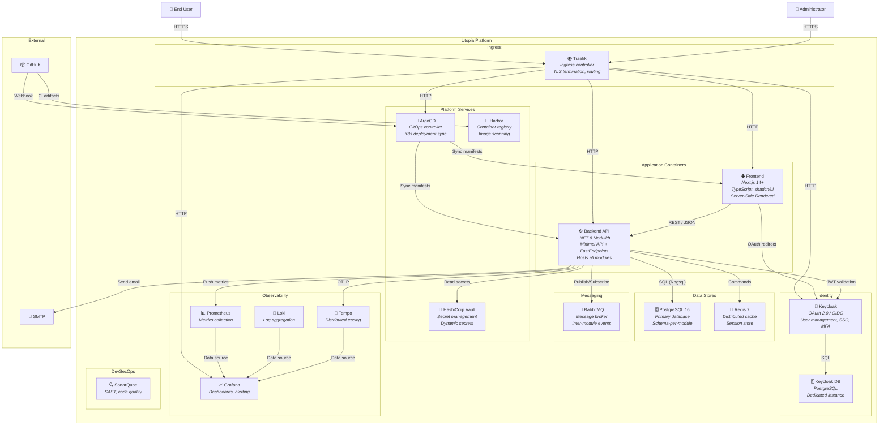

# C4 Container Diagram — Utopia

| Field         | Value                                |
|---------------|--------------------------------------|
| **Version**   | 1.0.0                                |
| **Status**    | Draft                                |
| **Author**    | Vox                                  |
| **Reviewer**  | Vox                                  |
| **Created**   | 2026-03-27                           |
| **Updated**   | 2026-03-27                           |
| **Standard**  | C4 Model — Level 2                   |

---

## 1. Purpose

This document describes the **Container Diagram** (C4 Level 2) for the Utopia platform. It zooms into the Utopia system box from the [context diagram](./C4-CONTEXT.md), showing the high-level technology choices and how containers communicate with each other.

> **C4 "Container"** = a separately deployable/runnable unit (application, database, message broker, etc.), NOT a Docker container (though they often correspond 1:1 in Utopia).

## 2. Scope

All deployable units within the Utopia platform, including applications, data stores, message brokers, and platform services.

## 3. Container Diagram



## 4. Container Inventory

### 4.1. Application Containers

| Container | Technology | Description | Port |
|-----------|-----------|-------------|------|
| **Frontend** | Next.js 14+, TypeScript, shadcn/ui, Tailwind CSS | Server-side rendered web application. Communicates with Backend API for data and Keycloak for authentication. Produces a standalone Node.js server in Docker. | 3000 |
| **Backend API** | .NET 8, C# 12, Minimal API, FastEndpoints | Modulith application hosting all business modules (Identity, Catalog). Single deployment unit serving REST APIs. | 8080 |

### 4.2. Data Stores

| Container | Technology | Description | Port |
|-----------|-----------|-------------|------|
| **PostgreSQL (App)** | PostgreSQL 16 | Primary relational database for all application modules. Each module owns its own schema (e.g., `identity.*`, `catalog.*`). | 5432 |
| **PostgreSQL (Keycloak)** | PostgreSQL 16 | Dedicated database for Keycloak. Isolated from application data for security and independent scaling. | 5433 |
| **Redis** | Redis 7 (Valkey) | Distributed cache for session data, application cache, and rate limiting. | 6379 |

### 4.3. Messaging

| Container | Technology | Description | Port |
|-----------|-----------|-------------|------|
| **RabbitMQ** | RabbitMQ 3.13+ | Message broker for asynchronous inter-module communication via domain events. Managed through MassTransit in .NET. | 5672 (AMQP), 15672 (Management UI) |

### 4.4. Identity

| Container | Technology | Description | Port |
|-----------|-----------|-------------|------|
| **Keycloak** | Keycloak (latest) | OAuth 2.0 / OIDC identity provider. Manages user authentication, authorization, SSO, MFA, and user federation. | 8180 |

### 4.5. Platform Services

| Container | Technology | Description | Port |
|-----------|-----------|-------------|------|
| **ArgoCD** | ArgoCD (latest) | GitOps controller that syncs Kubernetes desired state from Git repository. Monitors Helm charts for changes and applies them automatically. | 8443 |
| **HashiCorp Vault** | Vault (latest) | Centralized secret management. Provides dynamic secrets, encryption as a service, and PKI. | 8200 |
| **Harbor** | Harbor (latest) | Container image registry with built-in Trivy vulnerability scanning, RBAC, and image signing. | 443 |

### 4.6. Observability

| Container | Technology | Description | Port |
|-----------|-----------|-------------|------|
| **Prometheus** | Prometheus (latest) | Metrics collection and storage via scraping. Collects metrics from all application and infrastructure containers. | 9090 |
| **Grafana** | Grafana (latest) | Visualization and alerting platform. Dashboards for metrics (Prometheus), logs (Loki), and traces (Tempo). | 3001 |
| **Loki** | Grafana Loki (latest) | Log aggregation system. Receives structured logs from all containers via Promtail or OpenTelemetry Collector. | 3100 |
| **Tempo** | Grafana Tempo (latest) | Distributed tracing backend. Receives traces via OTLP from instrumented applications. | 4317 (OTLP gRPC), 4318 (OTLP HTTP) |

### 4.7. DevSecOps

| Container | Technology | Description | Port |
|-----------|-----------|-------------|------|
| **SonarQube** | SonarQube Community | Static code analysis and code quality tracking. Integrated into CI pipeline via GitHub Actions. | 9000 |

### 4.8. Ingress

| Container | Technology | Description | Port |
|-----------|-----------|-------------|------|
| **Traefik** | Traefik (bundled with K3s) | Ingress controller and reverse proxy. Handles TLS termination, path-based routing, and load balancing. | 80, 443 |

## 5. Communication Protocols

| From | To | Protocol | Auth | Description |
|------|----|----------|------|-------------|
| Frontend | Backend API | REST / JSON over HTTP | Bearer JWT | All API calls |
| Frontend | Keycloak | OAuth 2.0 / OIDC | Authorization Code + PKCE | Login/logout flow |
| Backend API | PostgreSQL | TCP (Npgsql) | Username/password (Vault) | Data access |
| Backend API | Redis | TCP (RESP) | Password (Vault) | Cache operations |
| Backend API | RabbitMQ | AMQP 0.9.1 | Username/password (Vault) | Event publish/subscribe |
| Backend API | Keycloak | HTTPS (JWKS) | None (public keys) | JWT token validation |
| Backend API | Vault | HTTPS | AppRole / Kubernetes auth | Read secrets |
| Backend API | Tempo | OTLP gRPC | None (cluster-internal) | Send traces |
| Backend API | SMTP | SMTP/TLS | Username/password (Vault) | Send emails |
| Prometheus | Backend API | HTTP (scrape) | None (cluster-internal) | Collect metrics via `/metrics` |
| Promtail/OTel | Loki | HTTP | None (cluster-internal) | Ship logs |
| ArgoCD | K8s API | HTTPS | ServiceAccount token | Apply manifests |
| GitHub | ArgoCD | Webhook HTTPS | HMAC signature | Notify of Git changes |
| Traefik | All services | HTTP | None (cluster-internal) | Reverse proxy |

## 6. Deployment Model

### 6.1. Local Development (Docker Compose)

For local development without Kubernetes:

```
docker-compose.yml
├── frontend       (Next.js dev server with hot reload)
├── backend        (dotnet watch)
├── postgres       (application database)
├── postgres-kc    (Keycloak database)
├── redis
├── rabbitmq
├── keycloak
├── mailpit        (mock SMTP)
└── seq            (dev-friendly log viewer)
```

### 6.2. Kubernetes (K3d)

For production-like deployment:

```
K3s Cluster (via K3d)
├── Namespace: utopia
│   ├── frontend (Deployment + Service)
│   ├── backend-api (Deployment + Service)
│   ├── postgres (StatefulSet + PVC)
│   ├── redis (StatefulSet + PVC)
│   └── rabbitmq (StatefulSet + PVC)
├── Namespace: identity
│   ├── keycloak (Deployment + Service)
│   └── postgres-kc (StatefulSet + PVC)
├── Namespace: platform
│   ├── argocd (Deployment)
│   ├── vault (StatefulSet)
│   └── harbor (Deployment)
├── Namespace: observability
│   ├── prometheus (StatefulSet)
│   ├── grafana (Deployment)
│   ├── loki (StatefulSet)
│   └── tempo (Deployment)
├── Namespace: devsecops
│   └── sonarqube (Deployment + PVC)
└── Namespace: ingress
    └── traefik (DaemonSet — bundled with K3s)
```

## 7. Resource Allocation

| Container | CPU Request | CPU Limit | Memory Request | Memory Limit |
|-----------|-------------|-----------|----------------|--------------|
| Frontend | 100m | 500m | 128 Mi | 512 Mi |
| Backend API | 250m | 1000m | 256 Mi | 1 Gi |
| PostgreSQL (App) | 250m | 1000m | 512 Mi | 1 Gi |
| PostgreSQL (KC) | 100m | 500m | 256 Mi | 512 Mi |
| Redis | 100m | 500m | 128 Mi | 512 Mi |
| RabbitMQ | 100m | 500m | 256 Mi | 512 Mi |
| Keycloak | 250m | 1000m | 512 Mi | 1 Gi |
| ArgoCD | 100m | 500m | 256 Mi | 512 Mi |
| Vault | 100m | 500m | 128 Mi | 256 Mi |
| Prometheus | 100m | 500m | 256 Mi | 1 Gi |
| Grafana | 100m | 500m | 128 Mi | 512 Mi |
| Loki | 100m | 500m | 128 Mi | 512 Mi |
| Tempo | 100m | 500m | 128 Mi | 512 Mi |
| SonarQube | 500m | 2000m | 1 Gi | 2 Gi |
| Harbor | 250m | 1000m | 512 Mi | 2 Gi |

**Total estimated**: ~5 Gi requests, ~13 Gi limits — fits comfortably within 40 GB RAM.

## 8. References

- [C4 Model — Container Diagram](https://c4model.com/#ContainerDiagram)
- [C4-CONTEXT.md](./C4-CONTEXT.md) — Level 1: System Context
- [C4-COMPONENT.md](./C4-COMPONENT.md) — Level 3: Component diagrams
- [ADR-0001](../03-adr/ADR-0001-modulith-architecture.md) — Modulith architecture
- [ADR-0006](../03-adr/ADR-0006-k3s-local-kubernetes.md) — K3s for local Kubernetes
- [TECH-STACK-DECISION.md](../01-project/TECH-STACK-DECISION.md)

## Changelog

| Version | Date       | Author | Description          |
|---------|------------|--------|----------------------|
| 1.0.0   | 2026-03-27 | Vox    | Initial draft        |
