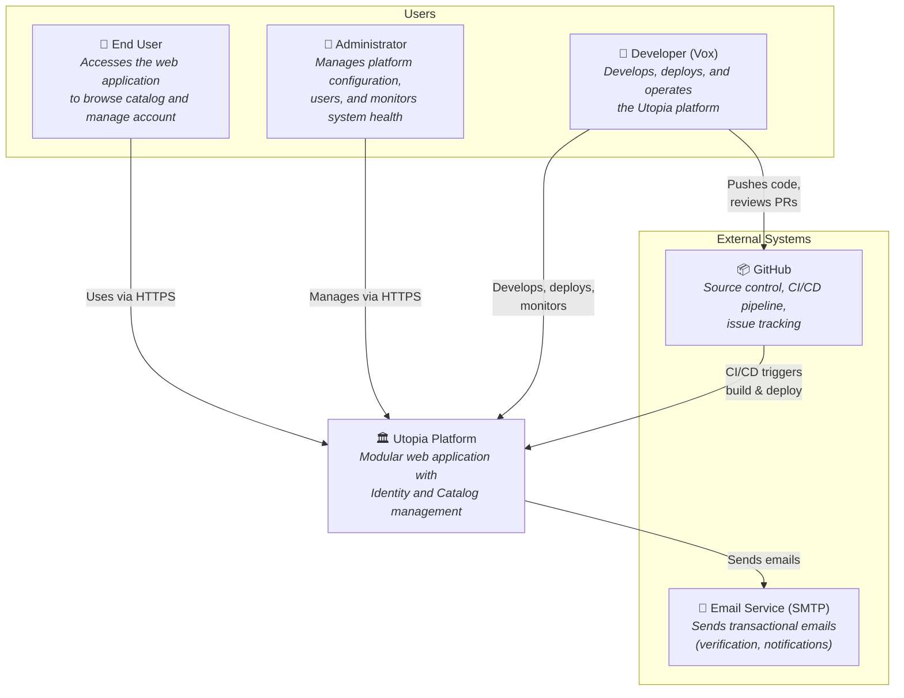
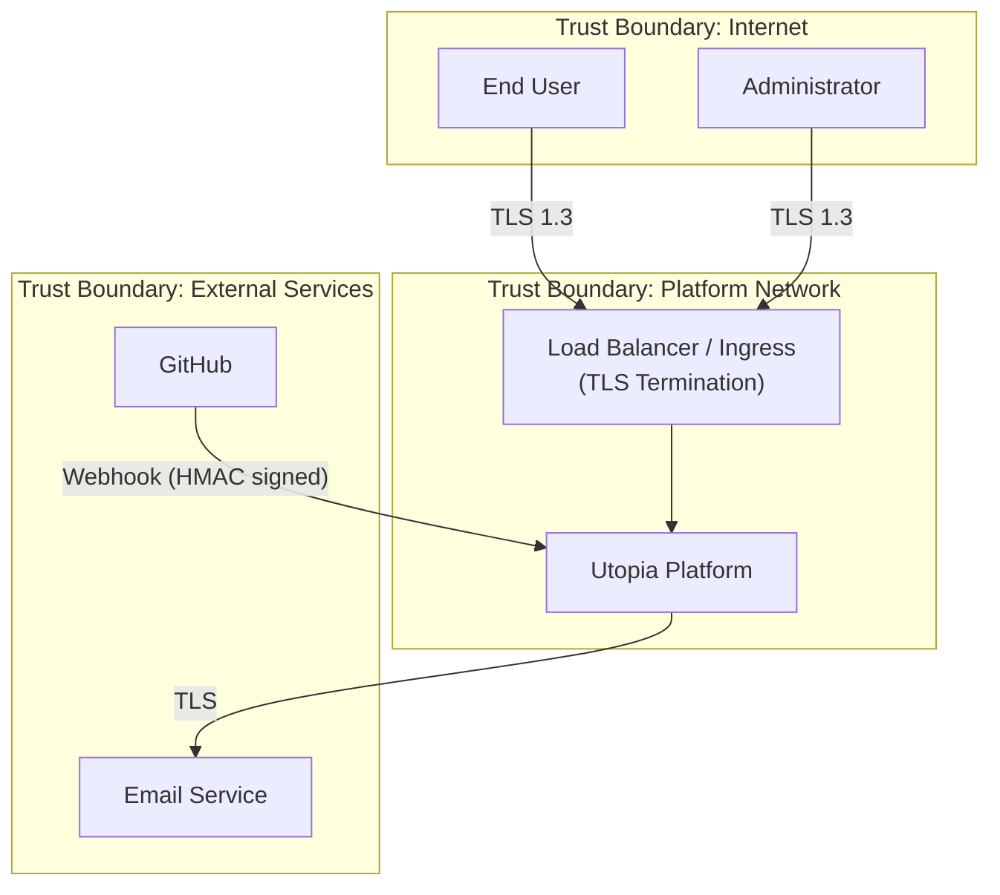

# C4 Context Diagram — Utopia

| Field         | Value                                |
|---------------|--------------------------------------|
| **Version**   | 1.0.0                                |
| **Status**    | Draft                                |
| **Author**    | Vox                                  |
| **Reviewer**  | Vox                                  |
| **Created**   | 2026-03-27                           |
| **Updated**   | 2026-03-27                           |
| **Standard**  | C4 Model — Level 1                   |

---

## 1. Purpose

This document describes the **System Context** (C4 Level 1) for the Utopia platform. It shows the system as a single box, identifying its users and the external systems it interacts with.

## 2. Scope

The context diagram covers the highest-level view of Utopia, including all human actors and external system dependencies.

## 3. System Context Diagram

## 4. Context Elements

### 4.1. People

| Actor | Description | Interaction |
|-------|-------------|-------------|
| **End User** | A person who uses the Utopia web application to browse the catalog, manage their account, and interact with platform features. | Accesses via web browser over HTTPS |
| **Administrator** | A person with elevated privileges who manages platform configuration, user accounts, and monitors system health via Keycloak admin console and Grafana dashboards. | Accesses admin panels via HTTPS |
| **Developer (Vox)** | The developer and operator of the Utopia platform. Writes code, defines infrastructure, deploys releases, and responds to incidents. | Uses IDE, CLI tools, and monitoring dashboards |

### 4.2. Systems

| System | Type | Description |
|--------|------|-------------|
| **Utopia Platform** | Internal | The main software system being developed. A modular web application with Identity and Catalog modules, deployed on Kubernetes. |
| **GitHub** | External | Source code hosting, Pull Request workflow, CI/CD via GitHub Actions, issue tracking, and container registry (GHCR). |
| **Email Service (SMTP)** | External | A generic SMTP service for sending transactional emails such as account verification, password reset, and notifications. In local development, Mailpit is used as a mock SMTP server. |

### 4.3. Interaction Summary

| From | To | Protocol | Description |
|------|----|----------|-------------|
| End User | Utopia Platform | HTTPS | Browse catalog, manage account, authenticate |
| Administrator | Utopia Platform | HTTPS | User management (Keycloak), monitoring (Grafana) |
| Developer | Utopia Platform | HTTPS / CLI | Deploy, monitor, operate |
| Developer | GitHub | HTTPS / SSH | Push code, manage PRs, review CI results |
| GitHub | Utopia Platform | Webhook / ArgoCD | CI/CD pipeline triggers deployment via ArgoCD sync |
| Utopia Platform | Email Service | SMTP/TLS | Send transactional emails |

## 5. Boundaries

### 5.1. Trust Boundaries

- All traffic from the Internet MUST terminate TLS at the ingress/load balancer
- Communication with external services MUST use encrypted channels (TLS)
- GitHub webhooks MUST be verified via HMAC signature
- Internal services within the platform network communicate via mTLS or cluster-internal networking (see [C4-CONTAINER.md](./C4-CONTAINER.md))

## 6. Key Assumptions

1. The platform serves a single tenant (personal project) — no multi-tenancy requirements
2. Internet-facing components are limited to the frontend and API gateway (via ingress)
3. Email is the only external integration initially — additional integrations may be added via ADRs
4. GitHub is both the source control and the CI/CD platform (see [ADR-0005](../03-adr/ADR-0005-github-actions-cicd.md))

## 7. References

- [C4 Model — System Context](https://c4model.com/#SystemContextDiagram)
- [C4-CONTAINER.md](./C4-CONTAINER.md) — Level 2: Container diagram
- [PROJECT-CHARTER.md](../01-project/PROJECT-CHARTER.md) — Project scope
- [SECURITY-STANDARD.md](../00-standards/SECURITY-STANDARD.md) — Trust boundaries

## Changelog

| Version | Date       | Author | Description          |
|---------|------------|--------|----------------------|
| 1.0.0   | 2026-03-27 | Vox    | Initial draft        |
