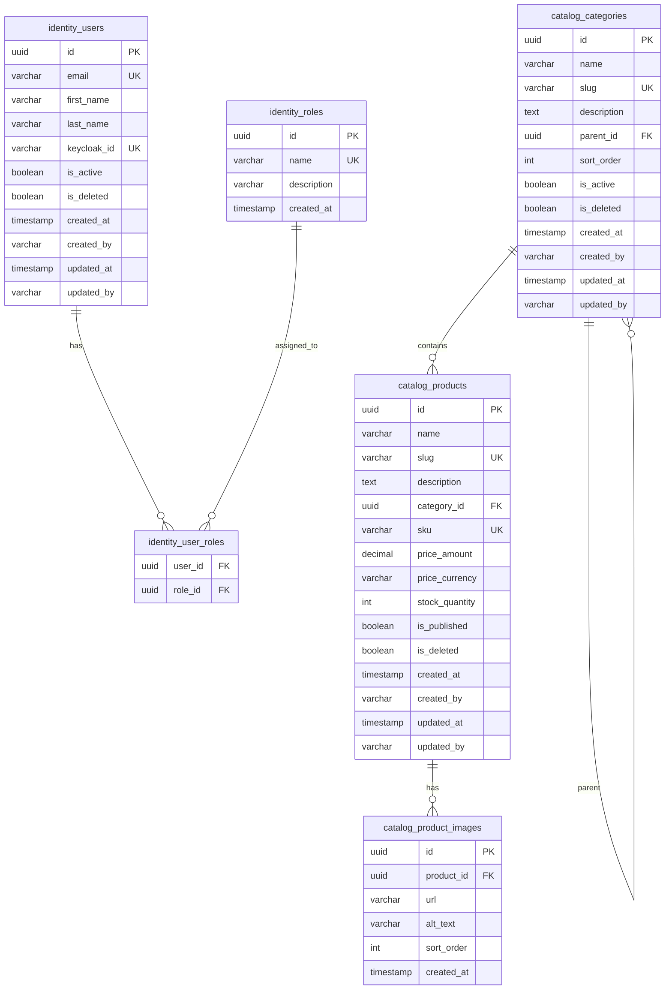
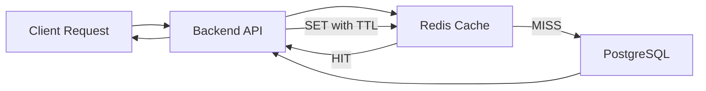
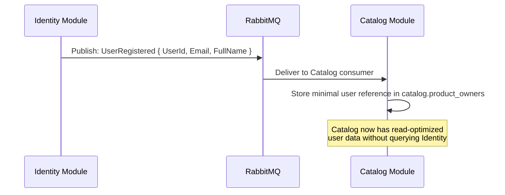

# Data Architecture

| Field         | Value                                |
|---------------|--------------------------------------|
| **Version**   | 1.0.0                                |
| **Status**    | Draft                                |
| **Author**    | Vox                                  |
| **Reviewer**  | Vox                                  |
| **Created**   | 2026-03-27                           |
| **Updated**   | 2026-03-27                           |
| **Standard**  | ISO 27001 A.8.24 (Cryptography), A.8.10 (Data Deletion) |

---

## 1. Purpose

This document defines the data architecture for the **Utopia** project, including database design, schema isolation strategy, data flow patterns, caching strategy, and data lifecycle management.

## 2. Scope

- PostgreSQL schema design for all modules
- Redis caching strategy
- Data flow between modules
- Backup, retention, and deletion policies

## 3. Database Design Principles

1. **Schema-per-module isolation** — each module owns its own PostgreSQL schema (see [ADR-0001](../03-adr/ADR-0001-modulith-architecture.md))
2. **No cross-schema foreign keys** — modules are independent at the data level
3. **Data duplication over coupling** — modules MAY duplicate read-optimized data rather than querying another module's schema
4. **Fluent API configuration** — all entity mappings via `IEntityTypeConfiguration<T>` (see [CODING-STANDARD.md](../00-standards/CODING-STANDARD.md))
5. **Audit columns on all tables** — `created_at`, `created_by`, `updated_at`, `updated_by`
6. **Soft delete** — entities use `is_deleted` flag, hard delete after retention period

## 4. Schema Overview



## 5. Schema Details

### 5.1. Identity Schema (`identity`)

| Table | Description | Estimated Size |
|-------|-------------|----------------|
| `identity.users` | Application user profiles synced from Keycloak | Small (<10K rows) |
| `identity.roles` | Application-level roles (beyond Keycloak realm roles) | Tiny (<50 rows) |
| `identity.user_roles` | Many-to-many user-role assignments | Small |

#### 5.1.1. `identity.users`

| Column | Type | Constraints | Description |
|--------|------|-------------|-------------|
| `id` | `uuid` | PK, DEFAULT gen_random_uuid() | Internal user ID |
| `email` | `varchar(256)` | UNIQUE, NOT NULL | User email address |
| `first_name` | `varchar(100)` | NOT NULL | First name |
| `last_name` | `varchar(100)` | NOT NULL | Last name |
| `keycloak_id` | `varchar(36)` | UNIQUE, NOT NULL | Keycloak user ID (sync reference) |
| `avatar_url` | `varchar(500)` | NULL | Profile picture URL |
| `is_active` | `boolean` | NOT NULL, DEFAULT true | Account active status |
| `is_deleted` | `boolean` | NOT NULL, DEFAULT false | Soft delete flag |
| `created_at` | `timestamptz` | NOT NULL, DEFAULT now() | Creation timestamp |
| `created_by` | `varchar(100)` | NOT NULL | Creator identifier |
| `updated_at` | `timestamptz` | NOT NULL, DEFAULT now() | Last update timestamp |
| `updated_by` | `varchar(100)` | NOT NULL | Last updater identifier |

**Indexes:**
- `ix_users_email` — UNIQUE on `email`
- `ix_users_keycloak_id` — UNIQUE on `keycloak_id`
- `ix_users_is_active` — partial index WHERE `is_deleted = false`

### 5.2. Catalog Schema (`catalog`)

| Table | Description | Estimated Size |
|-------|-------------|----------------|
| `catalog.categories` | Product categories (hierarchical) | Small (<500 rows) |
| `catalog.products` | Product catalog | Medium (<100K rows) |
| `catalog.product_images` | Product image references | Medium |

#### 5.2.1. `catalog.products`

| Column | Type | Constraints | Description |
|--------|------|-------------|-------------|
| `id` | `uuid` | PK, DEFAULT gen_random_uuid() | Product ID |
| `name` | `varchar(200)` | NOT NULL | Product name |
| `slug` | `varchar(220)` | UNIQUE, NOT NULL | URL-friendly slug |
| `description` | `text` | NULL | Product description (Markdown) |
| `category_id` | `uuid` | FK → categories.id, NOT NULL | Category reference |
| `sku` | `varchar(50)` | UNIQUE, NOT NULL | Stock Keeping Unit |
| `price_amount` | `decimal(18,2)` | NOT NULL | Price value |
| `price_currency` | `varchar(3)` | NOT NULL, DEFAULT 'USD' | ISO 4217 currency code |
| `stock_quantity` | `integer` | NOT NULL, DEFAULT 0 | Available stock |
| `is_published` | `boolean` | NOT NULL, DEFAULT false | Visibility flag |
| `is_deleted` | `boolean` | NOT NULL, DEFAULT false | Soft delete flag |
| `created_at` | `timestamptz` | NOT NULL, DEFAULT now() | Creation timestamp |
| `created_by` | `varchar(100)` | NOT NULL | Creator identifier |
| `updated_at` | `timestamptz` | NOT NULL, DEFAULT now() | Last update timestamp |
| `updated_by` | `varchar(100)` | NOT NULL | Last updater identifier |

**Indexes:**
- `ix_products_slug` — UNIQUE on `slug`
- `ix_products_sku` — UNIQUE on `sku`
- `ix_products_category_id` — on `category_id`
- `ix_products_published` — partial index WHERE `is_published = true AND is_deleted = false`
- `ix_products_name_trgm` — GIN trigram index on `name` for text search

## 6. EF Core Configuration

### 6.1. DbContext per Module

```csharp
// Identity module — own DbContext with own schema
public class IdentityDbContext(DbContextOptions<IdentityDbContext> options)
    : DbContext(options)
{
    public DbSet<User> Users => Set<User>();
    public DbSet<Role> Roles => Set<Role>();

    protected override void OnModelCreating(ModelBuilder modelBuilder)
    {
        modelBuilder.HasDefaultSchema("identity");
        modelBuilder.ApplyConfigurationsFromAssembly(typeof(IdentityDbContext).Assembly);
    }
}

// Catalog module — separate DbContext, separate schema
public class CatalogDbContext(DbContextOptions<CatalogDbContext> options)
    : DbContext(options)
{
    public DbSet<Product> Products => Set<Product>();
    public DbSet<Category> Categories => Set<Category>();

    protected override void OnModelCreating(ModelBuilder modelBuilder)
    {
        modelBuilder.HasDefaultSchema("catalog");
        modelBuilder.ApplyConfigurationsFromAssembly(typeof(CatalogDbContext).Assembly);
    }
}
```

### 6.2. Shared Connection String

Both DbContexts connect to the **same PostgreSQL database** but use different schemas:

```
Host=localhost;Port=5432;Database=utopia;Username=utopia_app;Password=<from-vault>
```

### 6.3. Migration Strategy

| Rule | Description |
|------|-------------|
| Forward-only | No down migrations — use expand-contract for breaking changes |
| Per-module migrations | Each module maintains its own migration history |
| Naming | `YYYYMMDDHHMMSS_DescriptiveName` (EF Core default format) |
| CI validation | `dotnet ef migrations has-pending-changes` in CI pipeline |

## 7. Caching Strategy (Redis)

### 7.1. Cache Layers



### 7.2. Cache Patterns

| Pattern | Usage | Example |
|---------|-------|---------|
| **Cache-Aside** | Default for read-heavy data | Product catalog, categories |
| **Write-Through** | When consistency is critical | User profile updates |
| **Cache Invalidation** | On write operations | Invalidate product cache on update |

### 7.3. Cache Key Convention

```
utopia:{module}:{entity}:{identifier}
utopia:{module}:{entity}:list:{hash}
```

Examples:
- `utopia:catalog:product:550e8400-e29b-41d4-a716-446655440000`
- `utopia:catalog:products:list:abc123` (hash of query parameters)
- `utopia:catalog:categories:tree` (full category tree)

### 7.4. TTL Policy

| Data Type | TTL | Rationale |
|-----------|-----|-----------|
| Product detail | 5 minutes | Moderately updated |
| Product list/search | 2 minutes | Frequently changing |
| Category tree | 30 minutes | Rarely changing |
| User profile | 10 minutes | Moderately accessed |
| Rate limit counters | Sliding window | Security requirement |
| Session data | 24 hours | Matches auth session |

## 8. Data Flow Between Modules

Modules MUST NOT read from each other's schemas directly. Data flows via:

### 8.1. Event-Based Synchronization



### 8.2. Data Ownership Matrix

| Data | Owner Module | Consumers | Sync Mechanism |
|------|-------------|-----------|----------------|
| User profile | Identity | Catalog (created_by display name) | Event: `UserRegistered`, `UserProfileUpdated` |
| Products | Catalog | — | — |
| Categories | Catalog | — | — |
| Roles & permissions | Identity | — (checked at API layer via JWT claims) | — |

## 9. Data Protection

### 9.1. Encryption

| Layer | Method | Reference |
|-------|--------|-----------|
| In transit | TLS 1.3 (client ↔ API), TLS (API ↔ PostgreSQL via `sslmode=require`) | [SECURITY-STANDARD.md](../00-standards/SECURITY-STANDARD.md) Section 6 |
| At rest | PostgreSQL TDE or volume-level encryption in K8s | Provider dependent |
| Sensitive fields | Application-level encryption via Vault Transit engine | Email, PII |

### 9.2. PII Handling

| PII Field | Storage | Access | Retention |
|-----------|---------|--------|-----------|
| Email | Encrypted at rest | Identity module only | Until account deletion |
| Full name | Plain text | Identity + denormalized read models | Until account deletion |
| IP address | Logs only | Audit logs | 90 days |

## 10. Backup & Recovery

| Item | Strategy | RPO | RTO | Retention |
|------|----------|-----|-----|-----------|
| PostgreSQL (App) | pg_dump daily + WAL archiving | 1 hour (WAL), 24 hours (dump) | 1 hour | 30 days |
| PostgreSQL (Keycloak) | pg_dump daily | 24 hours | 2 hours | 30 days |
| Redis | RDB snapshot every 15 min | 15 minutes | 5 minutes | 7 days |
| PVCs (K8s) | Volume snapshot daily | 24 hours | 1 hour | 14 days |

### 10.1. Backup Validation

- Backup restoration MUST be tested monthly
- Automated restore test job SHOULD run weekly in dev environment
- See [RUNBOOK-DATABASE-FAILOVER.md](../06-devops/runbooks/RUNBOOK-DATABASE-FAILOVER.md) for restore procedures

## 11. References

- [C4-CONTAINER.md](./C4-CONTAINER.md) — Container overview
- [C4-COMPONENT.md](./C4-COMPONENT.md) — Component details
- [INTEGRATION-ARCHITECTURE.md](./INTEGRATION-ARCHITECTURE.md) — Event schemas
- [ADR-0001](../03-adr/ADR-0001-modulith-architecture.md) — Modulith architecture
- [ADR-0002](../03-adr/ADR-0002-postgresql-over-mssql.md) — PostgreSQL decision
- [SECURITY-STANDARD.md](../00-standards/SECURITY-STANDARD.md) — Data protection
- [CODING-STANDARD.md](../00-standards/CODING-STANDARD.md) — EF Core conventions

## Changelog

| Version | Date       | Author | Description          |
|---------|------------|--------|----------------------|
| 1.0.0   | 2026-03-27 | Vox    | Initial draft        |
