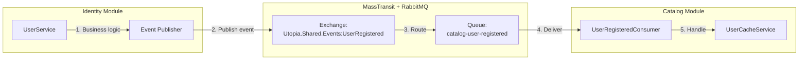
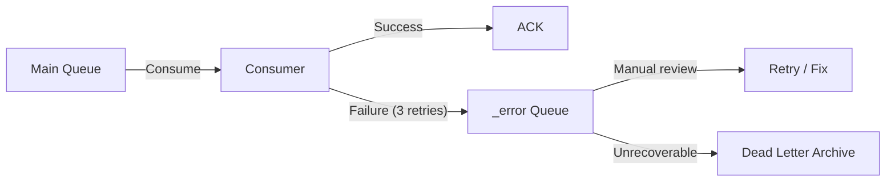

# Integration Architecture

| Field         | Value                                |
|---------------|--------------------------------------|
| **Version**   | 1.0.0                                |
| **Status**    | Draft                                |
| **Author**    | Vox                                  |
| **Reviewer**  | Vox                                  |
| **Created**   | 2026-03-27                           |
| **Updated**   | 2026-03-27                           |

---

## 1. Purpose

This document defines the integration architecture for the **Utopia** platform, covering API design, inter-module messaging, event schemas, and external system integration points.

## 2. Scope

- REST API conventions and contracts
- Inter-module event-based communication via MassTransit / RabbitMQ
- Domain event schemas and versioning
- External integration patterns (Keycloak, SMTP)

## 3. API Architecture

### 3.1. API Design Principles

| Principle | Description |
|-----------|-------------|
| **RESTful** | Resources as nouns, HTTP methods as verbs |
| **Consistent** | Uniform response envelope, error format, pagination |
| **Versioned** | URL path versioning: `/api/v1/...` |
| **Secure** | JWT authentication, RBAC authorization on all endpoints |
| **Documented** | OpenAPI 3.1 spec auto-generated from code |

### 3.2. URL Conventions

```
/api/v{version}/{module}/{resource}
/api/v{version}/{module}/{resource}/{id}
/api/v{version}/{module}/{resource}/{id}/{sub-resource}
```

Examples:
```
GET    /api/v1/catalog/products              → List products (paginated)
GET    /api/v1/catalog/products/{id}         → Get product by ID
POST   /api/v1/catalog/products              → Create product
PUT    /api/v1/catalog/products/{id}         → Update product
DELETE /api/v1/catalog/products/{id}         → Delete product (soft)
GET    /api/v1/catalog/products/{id}/images  → List product images
GET    /api/v1/catalog/categories            → List categories
GET    /api/v1/identity/users/me             → Get current user profile
PUT    /api/v1/identity/users/me             → Update current user profile
GET    /api/v1/identity/users                → List users (admin only)
```

### 3.3. HTTP Methods

| Method | Usage | Idempotent | Response Code |
|--------|-------|-----------|---------------|
| `GET` | Retrieve resource(s) | Yes | `200 OK` |
| `POST` | Create resource | No | `201 Created` + `Location` header |
| `PUT` | Replace/update resource | Yes | `200 OK` or `204 No Content` |
| `PATCH` | Partial update | No | `200 OK` |
| `DELETE` | Delete resource (soft) | Yes | `204 No Content` |

### 3.4. Response Envelope

All API responses MUST follow a consistent structure:

#### Success Response

```json
{
  "data": {
    "id": "550e8400-e29b-41d4-a716-446655440000",
    "name": "Wireless Keyboard",
    "slug": "wireless-keyboard",
    "price": {
      "amount": 49.99,
      "currency": "USD"
    },
    "isPublished": true,
    "createdAt": "2026-03-27T10:30:00Z"
  }
}
```

#### List Response (Paginated)

```json
{
  "data": [
    { "id": "...", "name": "..." },
    { "id": "...", "name": "..." }
  ],
  "pagination": {
    "page": 1,
    "pageSize": 20,
    "totalCount": 142,
    "totalPages": 8,
    "hasNextPage": true,
    "hasPreviousPage": false
  }
}
```

#### Error Response (RFC 7807)

```json
{
  "type": "https://utopia.dev/errors/validation",
  "title": "Validation Failed",
  "status": 422,
  "detail": "One or more validation errors occurred.",
  "instance": "/api/v1/catalog/products",
  "traceId": "4bf92f3577b34da6a3ce929d0e0e4736",
  "errors": {
    "name": ["Product name is required."],
    "price.amount": ["Price must be greater than 0."]
  }
}
```

### 3.5. Pagination

- MUST use query parameters: `?page=1&pageSize=20`
- Default page size: `20`
- Maximum page size: `100`
- Response MUST include pagination metadata (see Section 3.4)

### 3.6. Filtering & Sorting

```
GET /api/v1/catalog/products?categoryId={id}&isPublished=true&sort=name:asc&search=keyboard
```

| Parameter | Format | Example |
|-----------|--------|---------|
| Filter | `field=value` | `categoryId=abc-123` |
| Sort | `sort=field:direction` | `sort=name:asc`, `sort=price:desc` |
| Search | `search=term` | `search=wireless keyboard` |

### 3.7. Status Codes

| Code | Usage |
|------|-------|
| `200 OK` | Successful GET, PUT, PATCH |
| `201 Created` | Successful POST (resource created) |
| `204 No Content` | Successful DELETE or PUT with no body |
| `400 Bad Request` | Malformed request (invalid JSON, missing fields) |
| `401 Unauthorized` | Missing or invalid JWT token |
| `403 Forbidden` | Valid token but insufficient permissions |
| `404 Not Found` | Resource does not exist |
| `409 Conflict` | Resource conflict (duplicate slug, SKU) |
| `422 Unprocessable Entity` | Validation errors (valid JSON but business rule violation) |
| `429 Too Many Requests` | Rate limit exceeded |
| `500 Internal Server Error` | Unhandled server error (MUST NOT leak details) |

## 4. Inter-Module Communication

### 4.1. Communication Pattern

Modules communicate exclusively via **asynchronous domain events** through RabbitMQ, orchestrated by MassTransit.



### 4.2. Event Design Rules

| Rule | Description |
|------|-------------|
| **Events are facts** | Past tense: `UserRegistered`, NOT `RegisterUser` |
| **Events are immutable** | Once published, the schema MUST NOT change (add fields, never remove) |
| **Events carry data** | Include enough data for consumers to act without querying the publisher |
| **Events are idempotent** | Consumers MUST handle duplicate delivery gracefully |
| **Events live in Shared** | Event contracts are defined in `Utopia.Shared.Events` |
| **Events are versioned** | Breaking changes create new event type (e.g., `UserRegisteredV2`) |

### 4.3. MassTransit Configuration

```csharp
// In Host — Program.cs
services.AddMassTransit(x =>
{
    // Auto-discover consumers from module assemblies
    x.AddConsumers(typeof(IdentityModule).Assembly);
    x.AddConsumers(typeof(CatalogModule).Assembly);

    x.UsingRabbitMq((context, cfg) =>
    {
        cfg.Host("rabbitmq://localhost", h =>
        {
            h.Username("utopia");
            h.Password("<from-vault>");
        });

        cfg.ConfigureEndpoints(context);
    });
});
```

## 5. Domain Event Catalog

### 5.1. Identity Module Events

#### `UserRegistered`

Published when a new user completes registration via Keycloak.

```csharp
namespace Utopia.Shared.Events;

public record UserRegistered
{
    public Guid UserId { get; init; }
    public string Email { get; init; } = default!;
    public string FirstName { get; init; } = default!;
    public string LastName { get; init; } = default!;
    public string KeycloakId { get; init; } = default!;
    public DateTimeOffset OccurredAt { get; init; }
}
```

| Field | Type | Description |
|-------|------|-------------|
| `UserId` | `Guid` | Internal user identifier |
| `Email` | `string` | User email address |
| `FirstName` | `string` | User first name |
| `LastName` | `string` | User last name |
| `KeycloakId` | `string` | Keycloak subject ID |
| `OccurredAt` | `DateTimeOffset` | Timestamp of the event |

**Consumers:** Catalog module (stores user reference for `created_by` display)

---

#### `UserProfileUpdated`

Published when a user updates their profile.

```csharp
public record UserProfileUpdated
{
    public Guid UserId { get; init; }
    public string FirstName { get; init; } = default!;
    public string LastName { get; init; } = default!;
    public string? AvatarUrl { get; init; }
    public DateTimeOffset OccurredAt { get; init; }
}
```

**Consumers:** Catalog module (updates denormalized user display name)

---

#### `UserDeactivated`

Published when a user account is deactivated.

```csharp
public record UserDeactivated
{
    public Guid UserId { get; init; }
    public string Reason { get; init; } = default!;
    public DateTimeOffset OccurredAt { get; init; }
}
```

**Consumers:** Catalog module (marks user's draft products as unpublished)

---

### 5.2. Catalog Module Events

#### `ProductCreated`

Published when a new product is created.

```csharp
public record ProductCreated
{
    public Guid ProductId { get; init; }
    public string Name { get; init; } = default!;
    public string Sku { get; init; } = default!;
    public decimal PriceAmount { get; init; }
    public string PriceCurrency { get; init; } = default!;
    public Guid CategoryId { get; init; }
    public Guid CreatedByUserId { get; init; }
    public DateTimeOffset OccurredAt { get; init; }
}
```

**Consumers:** (none currently — prepared for future modules like Inventory, Search)

---

#### `ProductUpdated`

```csharp
public record ProductUpdated
{
    public Guid ProductId { get; init; }
    public string Name { get; init; } = default!;
    public decimal PriceAmount { get; init; }
    public string PriceCurrency { get; init; } = default!;
    public bool IsPublished { get; init; }
    public DateTimeOffset OccurredAt { get; init; }
}
```

---

#### `PriceChanged`

Published specifically when a product's price changes (separate from general update for downstream analytics).

```csharp
public record PriceChanged
{
    public Guid ProductId { get; init; }
    public decimal OldAmount { get; init; }
    public string OldCurrency { get; init; } = default!;
    public decimal NewAmount { get; init; }
    public string NewCurrency { get; init; } = default!;
    public DateTimeOffset OccurredAt { get; init; }
}
```

## 6. Event Versioning Strategy

When a breaking change is needed in an event schema:

1. Create a new event type: `UserRegisteredV2`
2. Publish both `UserRegistered` and `UserRegisteredV2` during transition period
3. Update consumers to handle `V2`
4. Deprecate the original event after all consumers migrate
5. Remove the original event in the next major release

```csharp
// V1 — original
public record UserRegistered { ... }

// V2 — breaking change (e.g., FullName split into FirstName + LastName)
public record UserRegisteredV2
{
    public Guid UserId { get; init; }
    public string Email { get; init; } = default!;
    public string FirstName { get; init; } = default!;
    public string LastName { get; init; } = default!;
    public DateTimeOffset OccurredAt { get; init; }
}
```

## 7. Error Handling in Events

### 7.1. Retry Policy

```csharp
cfg.UseMessageRetry(r => r.Incremental(3, TimeSpan.FromSeconds(1), TimeSpan.FromSeconds(2)));
```

| Attempt | Delay |
|---------|-------|
| 1st retry | 1 second |
| 2nd retry | 3 seconds |
| 3rd retry | 5 seconds |
| After 3 retries | Move to error queue |

### 7.2. Error Queue

- Failed messages are moved to `_error` queue after retries are exhausted
- Error queue MUST be monitored via RabbitMQ management UI metrics in Prometheus
- Alert if error queue depth exceeds 10 messages

### 7.3. Dead Letter Handling



## 8. External Integrations

### 8.1. Keycloak Integration

| Integration Point | Direction | Protocol | Purpose |
|--------------------|-----------|----------|---------|
| Frontend → Keycloak | Outbound | OIDC (HTTPS) | User login/logout, token exchange |
| Backend → Keycloak | Outbound | HTTPS (JWKS) | JWT token validation (public keys) |
| Backend → Keycloak Admin API | Outbound | HTTPS + Service Account | User sync, role management |
| Keycloak → Backend | Inbound (webhook) | HTTPS | User registration event (admin event listener) |

### 8.2. SMTP Integration

| Field | Value |
|-------|-------|
| Protocol | SMTP over TLS (port 587) |
| Library | MailKit (via .NET) |
| Templates | Razor-based email templates |
| Local dev | Mailpit (fake SMTP that captures emails) |
| Events triggering email | `UserRegistered` (welcome), password reset, account deactivation |

### 8.3. Integration Error Handling

| Scenario | Strategy |
|----------|----------|
| Keycloak unavailable | Circuit breaker (Polly) — fail open for reads (cached JWKS), fail closed for writes |
| SMTP unavailable | Retry with exponential backoff (3 attempts) → log and alert |
| RabbitMQ unavailable | MassTransit auto-reconnect — messages buffered in application until reconnection |

## 9. API Documentation (OpenAPI)

- OpenAPI 3.1 spec MUST be auto-generated from code using Swashbuckle or NSwag
- Swagger UI MUST be available in development environment at `/swagger`
- Swagger UI MUST NOT be exposed in production
- OpenAPI spec file MUST be exported to `documents/07-api/contracts/` during CI

```csharp
// Program.cs
if (app.Environment.IsDevelopment())
{
    app.UseSwagger();
    app.UseSwaggerUI();
}
```

## 10. References

- [C4-COMPONENT.md](./C4-COMPONENT.md) — Component details
- [DATA-ARCHITECTURE.md](./DATA-ARCHITECTURE.md) — Database schemas
- [MassTransit Documentation](https://masstransit.io/)
- [RFC 7807 — Problem Details](https://www.rfc-editor.org/rfc/rfc7807)
- [OpenAPI 3.1 Specification](https://spec.openapis.org/oas/v3.1.0)
- [CODING-STANDARD.md](../00-standards/CODING-STANDARD.md) — API conventions
- [SECURITY-STANDARD.md](../00-standards/SECURITY-STANDARD.md) — API security

## Changelog

| Version | Date       | Author | Description          |
|---------|------------|--------|----------------------|
| 1.0.0   | 2026-03-27 | Vox    | Initial draft        |
