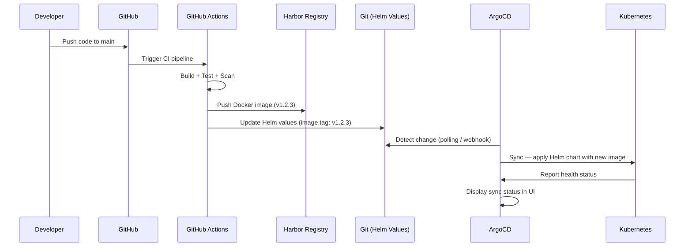

# ADR-0008: ArgoCD for GitOps Deployments

| Field         | Value                                |
|---------------|--------------------------------------|
| **Version**   | 1.0.0                                |
| **Status**    | Accepted                             |
| **Author**    | Vox                                  |
| **Reviewer**  | Vox                                  |
| **Created**   | 2026-03-27                           |
| **Updated**   | 2026-03-27                           |

---

## Context

Utopia follows a CI/CD separation pattern: GitHub Actions handles CI (build, test, scan, publish artifacts), and a separate tool is needed for CD (deploying to Kubernetes). The deployment tool must implement GitOps — using Git as the single source of truth for the desired state of the Kubernetes cluster, with automatic synchronization.

## Decision Drivers

- **GitOps native** — Git repository as the single source of truth for deployments
- **Kubernetes native** — designed specifically for K8s deployments
- **Automatic sync** — detect drift and reconcile automatically
- **Multi-environment** — support dev, staging, production from same tool
- **Helm support** — deploy Helm charts directly
- **Visibility** — UI dashboard for deployment status
- **Open source** — CNCF project with active community

## Considered Options

1. **ArgoCD** — CNCF graduated GitOps controller for Kubernetes
2. **Flux** — CNCF graduated GitOps toolkit
3. **GitHub Actions CD** — extend CI pipeline with deployment steps
4. **Spinnaker** — multi-cloud CD platform by Netflix

## Decision

We will use **ArgoCD** as the GitOps deployment controller for Utopia.

ArgoCD will:
- Watch the Git repository for Helm chart / manifest changes
- Automatically sync desired state to the K8s cluster
- Provide a web UI for deployment visibility and manual overrides
- Support multiple environments (dev, staging, production) via ApplicationSets

## Comparison

| Criterion | ArgoCD | Flux | GitHub Actions CD | Spinnaker |
|-----------|--------|------|-------------------|-----------|
| GitOps native | ✅ Core design | ✅ Core design | ❌ Push-based | ⚠️ Optional |
| Web UI | ✅ Rich dashboard | ❌ CLI only (Weave GitOps for UI) | ❌ GitHub UI only | ✅ Rich UI |
| Helm support | ✅ Native | ✅ HelmRelease CRD | ⚠️ Via `helm` CLI | ✅ Native |
| Multi-environment | ✅ ApplicationSets | ✅ Kustomize overlays | ⚠️ Matrix/env jobs | ✅ Pipelines |
| Drift detection | ✅ Continuous | ✅ Continuous | ❌ None | ⚠️ Limited |
| Auto-sync | ✅ Configurable | ✅ Configurable | ❌ Manual trigger | ⚠️ Pipeline trigger |
| RBAC | ✅ Fine-grained | ⚠️ K8s RBAC only | ⚠️ GitHub permissions | ✅ Fine-grained |
| Resource usage | ✅ ~500 MB | ✅ ~300 MB | ✅ None (external) | ❌ ~2 GB |
| Learning curve | ✅ Moderate | ⚠️ Moderate (CRDs) | ✅ Low | ❌ High |
| CNCF status | ✅ Graduated | ✅ Graduated | ❌ N/A | ❌ N/A |
| Community adoption | ✅ Highest for GitOps | ✅ High | ✅ Highest overall | ⚠️ Declining |
| Rollback | ✅ One-click | ✅ Git revert | ⚠️ Manual | ✅ Built-in |

## Consequences

### Positive

- True GitOps — Git commit triggers deployment, full audit trail
- Web UI provides real-time deployment status, diff view, and health monitoring
- Automatic drift detection — if someone manually changes K8s, ArgoCD detects and optionally reverts
- ApplicationSets enable templated multi-environment deployments from a single definition
- CNCF Graduated — production-grade, widely adopted, active development
- Clean CI/CD separation — GitHub Actions builds artifacts, ArgoCD deploys them
- One-click rollback to any previous Git commit state

### Negative

- Additional component to maintain in K8s (~500 MB RAM) — mitigation: acceptable within resource budget
- Learning curve for ApplicationSet patterns and sync policies — mitigation: start simple, iterate
- Requires manifest/chart repository structure conventions — mitigation: defined in deployment documentation

### Risks

- ArgoCD admin access = full cluster access — likelihood: Medium, impact: High — mitigation: RBAC configured per namespace, SSO via Keycloak
- Sync loop if manifests are auto-generated incorrectly — likelihood: Low, impact: Medium — mitigation: manual sync for production, auto-sync for dev/staging only

## Deployment Flow

## Environment Sync Strategy

| Environment | Sync Policy | Approval | Auto-Prune |
|-------------|-------------|----------|------------|
| Development | Auto-sync | None | Yes |
| Staging | Auto-sync | None | Yes |
| Production | Manual sync | Required (UI/CLI) | No (manual) |

## References

- [ArgoCD Documentation](https://argo-cd.readthedocs.io/)
- [ArgoCD ApplicationSets](https://argo-cd.readthedocs.io/en/stable/user-guide/application-set/)
- [GitOps Principles](https://opengitops.dev/)
- [ADR-0005](./ADR-0005-github-actions-cicd.md) — GitHub Actions for CI
- [ADR-0006](./ADR-0006-k3s-local-kubernetes.md) — K3s for local Kubernetes

## Changelog

| Version | Date       | Author | Description          |
|---------|------------|--------|----------------------|
| 1.0.0   | 2026-03-27 | Vox    | Initial decision     |
