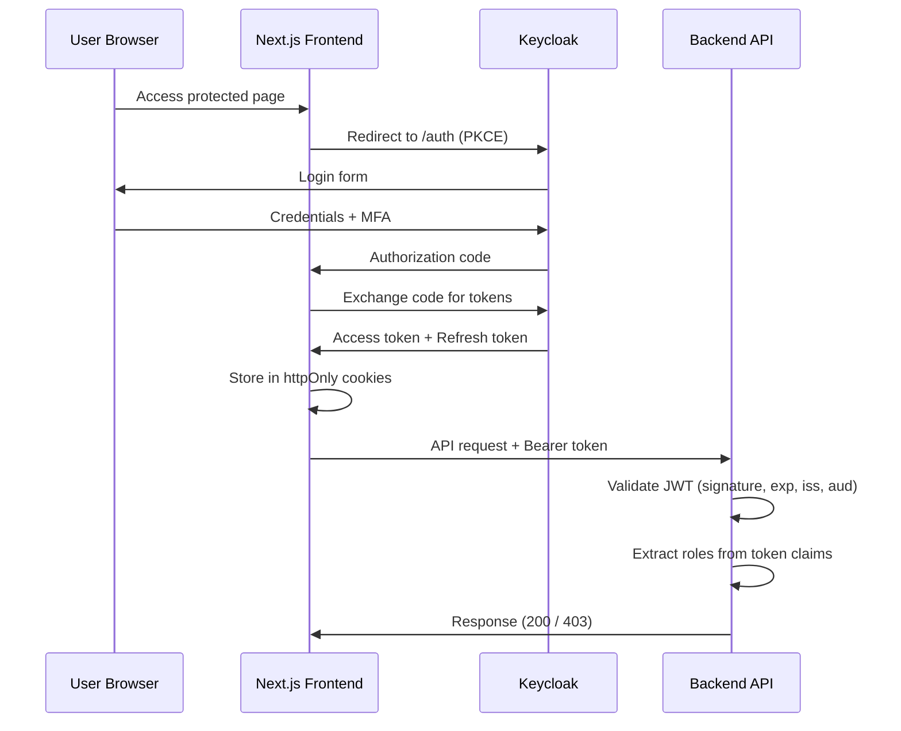
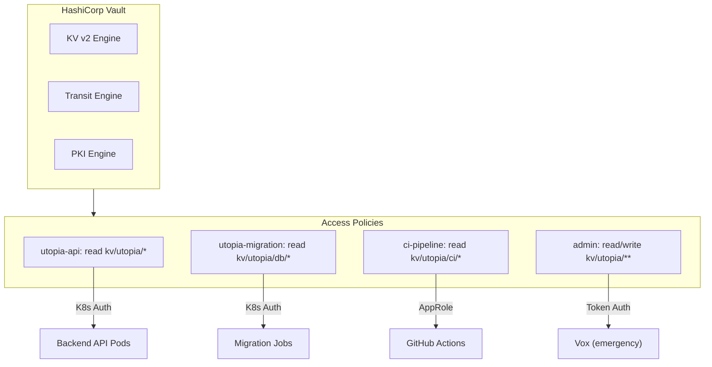

# Access Control Policy

| Field         | Value                                |
|---------------|--------------------------------------|
| **Version**   | 1.0.0                                |
| **Status**    | Draft                                |
| **Author**    | Vox                                  |
| **Reviewer**  | Vox                                  |
| **Created**   | 2026-03-27                           |
| **Updated**   | 2026-03-27                           |
| **Standard**  | ISO/IEC 27001:2022 Annex A.5.15–A.5.18, A.8.2–A.8.5 |

---

## 1. Purpose

This policy defines the access control requirements for all Utopia systems, services, and data. It ensures that access is granted based on the principle of **least privilege** and enforced through **role-based access control (RBAC)** across application, infrastructure, and platform layers.

## 2. Scope

This policy applies to:

- Application users (end users, administrators)
- Developer access (Vox — sole operator)
- Service-to-service communication
- Kubernetes cluster resources
- Database access
- CI/CD pipeline permissions
- Secret management access

## 3. Access Control Principles

All access control decisions MUST follow these principles:

| Principle | Description |
|-----------|-------------|
| **Least Privilege** | Grant minimum access required to perform the function |
| **Need-to-Know** | Restrict data access to those who need it |
| **Separation of Duties** | Distinct roles for distinct functions (enforced in application) |
| **Defense in Depth** | Multiple layers of access control |
| **Default Deny** | All access MUST be explicitly granted; deny by default |
| **Audit Trail** | All access events MUST be logged |

## 4. Identity & Authentication

### 4.1. Identity Provider

Keycloak is the single identity provider for all Utopia services.

| Aspect | Configuration |
|--------|---------------|
| **Protocol** | OAuth 2.0 + OpenID Connect (OIDC) |
| **Token Type** | JWT (RS256) |
| **Access Token TTL** | 15 minutes |
| **Refresh Token TTL** | 7 days |
| **Refresh Token Rotation** | Enabled (one-time use) |
| **Session Idle Timeout** | 30 minutes |
| **Session Max Lifespan** | 10 hours |
| **Realm** | `utopia` |

### 4.2. Authentication Requirements

| Requirement | Detail |
|-------------|--------|
| **Password Policy** | Minimum 12 characters, mixed case, digits, special characters |
| **Password Hashing** | Argon2id (Keycloak default) |
| **MFA** | SHOULD be available for admin accounts (TOTP) |
| **Brute Force Protection** | Lock account after 5 failed attempts for 15 minutes |
| **PKCE** | REQUIRED for all OAuth 2.0 Authorization Code flows |
| **Token Storage (Frontend)** | httpOnly, Secure, SameSite=Strict cookies |

### 4.3. Authentication Flow



## 5. Role-Based Access Control (RBAC)

### 5.1. Application Roles

| Role | Code | Description | Permissions |
|------|------|-------------|-------------|
| **Super Admin** | `super-admin` | Full system access | All operations |
| **Admin** | `admin` | Administrative operations | User management, content moderation, system config |
| **User** | `user` | Standard authenticated user | CRUD own resources, view public resources |
| **Guest** | `guest` | Unauthenticated visitor | View public resources only |

### 5.2. Keycloak Role Mapping

| Keycloak Concept | Usage |
|------------------|-------|
| **Realm Roles** | Global roles: `super-admin`, `admin`, `user` |
| **Client Roles** | Per-client fine-grained: `catalog:read`, `catalog:write`, `identity:manage` |
| **Composite Roles** | `admin` = `catalog:read` + `catalog:write` + `identity:manage` |
| **Groups** | Future: Organizational grouping if multi-tenant |

### 5.3. Token Claims Structure

```json
{
  "sub": "uuid-of-user",
  "iss": "https://keycloak.utopia.local/realms/utopia",
  "aud": "utopia-api",
  "exp": 1711555200,
  "realm_access": {
    "roles": ["user"]
  },
  "resource_access": {
    "utopia-api": {
      "roles": ["catalog:read", "catalog:write"]
    }
  },
  "preferred_username": "vox",
  "email": "vox@utopia.local"
}
```

### 5.4. Authorization Enforcement

#### 5.4.1. Backend API (.NET)

Authorization is enforced at two levels:

**Endpoint level** (FastEndpoints / Minimal API):

| Authorization Type | Usage |
|--------------------|-------|
| `RequireAuthorization()` | Require valid JWT |
| `RequireAuthorization("admin")` | Require specific role |
| `[Authorize(Policy = "CanManageCatalog")]` | Policy-based authorization |

**Policy definitions**:

| Policy | Requirements |
|--------|--------------|
| `CanManageCatalog` | Role: `admin` OR Client Role: `catalog:write` |
| `CanViewCatalog` | Role: `user` OR Client Role: `catalog:read` |
| `CanManageUsers` | Role: `super-admin` OR Role: `admin` + Client Role: `identity:manage` |
| `OwnerOnly` | Resource owner == authenticated user |

**Resource-level authorization**:

```
Resource Access Rule:
- Users MUST only access their own resources (user_id match)
- Admin MAY access all resources within their permission scope
- All resource access MUST be checked server-side, NEVER rely on client-side filtering
```

#### 5.4.2. Frontend (Next.js)

| Layer | Mechanism |
|-------|-----------|
| **Route Protection** | `middleware.ts` — redirect unauthenticated users |
| **Component Visibility** | Role-based conditional rendering |
| **API Calls** | Attach Bearer token from httpOnly cookie (server-side) |

> **WARNING**: Frontend authorization is for UX only. All security enforcement MUST occur server-side.

## 6. Infrastructure Access Control

### 6.1. Kubernetes RBAC

| Subject | Namespace | Role | Bindings |
|---------|-----------|------|----------|
| Utopia API ServiceAccount | `utopia` | Pod-specific role | Read own ConfigMap/Secrets only |
| ArgoCD ServiceAccount | `argocd` | Cluster role | Manage deployments (limited namespaces) |
| Prometheus ServiceAccount | `observability` | Cluster role | Read-only metrics from all namespaces |
| Default ServiceAccount | All | No bindings | `automountServiceAccountToken: false` |

**Kubernetes access rules**:

- `cluster-admin` ClusterRoleBinding MUST NOT be assigned to any application ServiceAccount
- Each Pod MUST use a dedicated ServiceAccount with minimal permissions
- NetworkPolicies MUST restrict inter-namespace communication
- Pod Security Standards MUST be set to `restricted` profile

### 6.2. Database Access Control

| User | Database | Schema | Privileges | Purpose |
|------|----------|--------|------------|---------|
| `utopia_identity` | `utopia` | `identity` | SELECT, INSERT, UPDATE, DELETE on `identity.*` | Identity module runtime |
| `utopia_catalog` | `utopia` | `catalog` | SELECT, INSERT, UPDATE, DELETE on `catalog.*` | Catalog module runtime |
| `utopia_migration` | `utopia` | `identity`, `catalog` | ALL (DDL + DML) | Schema migrations only |
| `utopia_readonly` | `utopia` | All | SELECT only | Monitoring, troubleshooting |
| `postgres` (superuser) | All | All | ALL | Emergency recovery only |

**Database access rules**:

- Application connection strings MUST use module-specific users
- `postgres` superuser MUST NOT be used in application code
- All connections MUST use TLS
- Connection strings MUST be stored in Vault, injected as K8s Secrets

### 6.3. CI/CD Access Control

| System | Access Level | Credential Type |
|--------|-----------|-----------------|
| **GitHub Actions** | Repository-scoped | OIDC federation (no static tokens) |
| **ArgoCD** | Namespace-scoped | K8s ServiceAccount token |
| **Harbor** | Project-scoped | Robot accounts (push/pull) |
| **SonarQube** | Project-scoped | API token (Vault-managed) |
| **Vault** | Policy-scoped | AppRole / K8s auth |

**CI/CD access rules**:

- GitHub Actions MUST use `permissions:` block with least privilege
- Secrets MUST be GitHub Encrypted Secrets or Vault-injected
- No long-lived static tokens; prefer OIDC or short-lived tokens

### 6.4. Secret Management Access



## 7. Access Review & Audit

### 7.1. Access Events Logging

All of the following events MUST be logged:

| Event | Log Level | Details |
|-------|-----------|---------|
| Successful login | Info | User ID, IP, timestamp, method |
| Failed login | Warning | Username (hashed), IP, timestamp, failure reason |
| Account lockout | Warning | User ID, IP, attempt count |
| Permission denied (403) | Warning | User ID, resource, action, required role |
| Admin action | Info | User ID, action, target resource, before/after |
| Token refresh | Debug | User ID, token ID (jti) |
| Token revocation | Info | User ID, reason |

### 7.2. Access Review Schedule

| Review | Frequency | Scope |
|--------|-----------|-------|
| Application role assignments | Quarterly | Keycloak realm |
| K8s RBAC bindings | Every 6 months | All namespaces |
| Database user privileges | Every 6 months | PostgreSQL |
| Vault policies | Every 6 months | All policies |
| CI/CD credentials | Quarterly | GitHub, Harbor, SonarQube |
| Emergency access usage | After each use | Audit log review |

## 8. Break-Glass Procedure

For emergency access when normal channels are unavailable:

1. **Document the reason** before escalating access
2. **Use the emergency credentials** stored in Vault under `kv/utopia/emergency/`
3. **Time-limit**: Emergency access MUST be revoked within 4 hours
4. **Audit**: All actions performed during emergency access MUST be logged
5. **Post-incident review**: Review the incident and update access controls as needed

## 9. References

- [ISO/IEC 27001:2022](https://www.iso.org/standard/27001) — Annex A.5.15–A.5.18, A.8.2–A.8.5
- [SECURITY-STANDARD.md](../00-standards/SECURITY-STANDARD.md)
- [ISMS-SCOPE.md](./ISMS-SCOPE.md)
- [RISK-ASSESSMENT.md](./RISK-ASSESSMENT.md)
- [ADR-0004-keycloak-identity.md](../03-adr/ADR-0004-keycloak-identity.md)
- [C4-COMPONENT.md](../02-architecture/C4-COMPONENT.md)
- [DATA-ARCHITECTURE.md](../02-architecture/DATA-ARCHITECTURE.md)

## Changelog

| Version | Date       | Author | Description          |
|---------|------------|--------|----------------------|
| 1.0.0   | 2026-03-27 | Vox    | Initial draft        |
