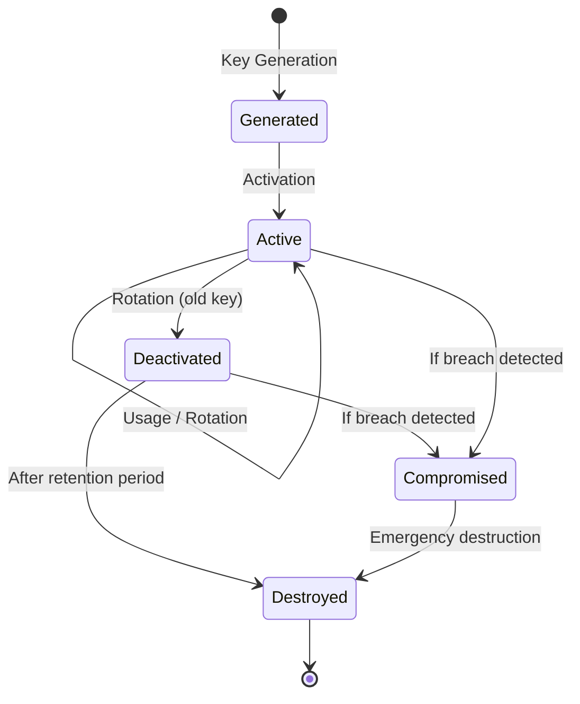
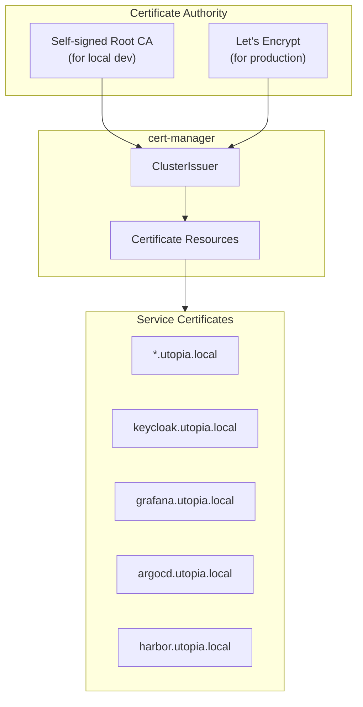

# Cryptography Policy

| Field         | Value                                |
|---------------|--------------------------------------|
| **Version**   | 1.0.0                                |
| **Status**    | Draft                                |
| **Author**    | Vox                                  |
| **Reviewer**  | Vox                                  |
| **Created**   | 2026-03-27                           |
| **Updated**   | 2026-03-27                           |
| **Standard**  | ISO/IEC 27001:2022 Annex A.8.24; NIST SP 800-57 |

---

## 1. Purpose

This policy defines the cryptographic requirements for the Utopia project, including approved algorithms, key management procedures, certificate management, and data protection standards.

## 2. Scope

Applies to all cryptographic operations within Utopia:

- Data encryption (at rest and in transit)
- Password hashing
- Token signing (JWT)
- Secret management
- TLS certificate management
- Message integrity verification

## 3. Approved Cryptographic Algorithms

### 3.1. Algorithm Selection

| Use Case | Algorithm | Key Size | Notes |
|----------|-----------|----------|-------|
| **Symmetric Encryption** | AES-256-GCM | 256-bit | Authenticated encryption with associated data (AEAD) |
| **Asymmetric Encryption** | RSA-OAEP | 2048-bit minimum | Key exchange, digital signatures |
| **Digital Signatures** | RS256 (RSASSA-PKCS1-v1_5 + SHA-256) | 2048-bit | JWT signing (Keycloak) |
| **Hashing (General)** | SHA-256 / SHA-384 / SHA-512 | — | Integrity checks, checksums |
| **Password Hashing** | Argon2id | — | Keycloak default; memory-hard |
| **Key Derivation** | PBKDF2-SHA256 | Minimum 600,000 iterations | Where Argon2id is unavailable |
| **TLS** | TLS 1.3 (preferred), TLS 1.2 (minimum) | — | All network communication |
| **HMAC** | HMAC-SHA256 | 256-bit | Message authentication |
| **Random Generation** | CSPRNG | — | `System.Security.Cryptography.RandomNumberGenerator` (.NET) |

### 3.2. Prohibited Algorithms

The following algorithms MUST NOT be used:

| Algorithm | Reason |
|-----------|--------|
| MD5 | Collision attacks; cryptographically broken |
| SHA-1 | Collision attacks; deprecated |
| DES / 3DES | Insufficient key length; deprecated |
| RC4 | Multiple known attacks |
| Blowfish | Superseded by AES |
| ECB mode | No diffusion; pattern leakage |
| RSA PKCS#1 v1.5 (encryption) | Padding oracle attacks |
| TLS 1.0 / 1.1 | Deprecated; known vulnerabilities |
| SSL 3.0 | POODLE attack |
| bcrypt (new implementations) | Prefer Argon2id for new systems |

## 4. Encryption Requirements

### 4.1. Data in Transit

| Component | Protocol | Minimum Version | Configuration |
|-----------|----------|-----------------|---------------|
| Browser ↔ Frontend | HTTPS | TLS 1.3 | HSTS enabled, min-age 31536000 |
| Frontend ↔ Backend API | HTTPS | TLS 1.3 | mTLS optional for service mesh |
| Backend ↔ PostgreSQL | TLS | TLS 1.2 | `sslmode=verify-full` |
| Backend ↔ Redis | TLS | TLS 1.2 | `ssl=true, sslProtocols=Tls13` |
| Backend ↔ RabbitMQ | AMQPS | TLS 1.2 | TLS-encrypted AMQP |
| Backend ↔ Keycloak | HTTPS | TLS 1.3 | Certificate validation required |
| K8s inter-pod | mTLS | TLS 1.3 | Via service mesh or network policy |
| Vault communication | HTTPS | TLS 1.3 | Auto-unseal, TLS listener |

**TLS Cipher Suites (TLS 1.3)**:

- `TLS_AES_256_GCM_SHA384`
- `TLS_AES_128_GCM_SHA256`
- `TLS_CHACHA20_POLY1305_SHA256`

### 4.2. Data at Rest

| Data Type | Encryption | Implementation |
|-----------|------------|----------------|
| **PostgreSQL data files** | Transparent Data Encryption (TDE) | Volume-level encryption (LUKS) or pg_tde |
| **PostgreSQL backups** | AES-256-GCM | Encrypted before storage |
| **Redis persistence** | Volume encryption | K8s PV encryption |
| **Vault storage** | AES-256-GCM | Vault auto-seal with transit key |
| **Container registry (Harbor)** | Volume encryption | K8s PV encryption |
| **Terraform state** | AES-256 | Encrypted backend (S3-compatible with SSE) |
| **Git repository** | N/A | Public code; secrets excluded |

### 4.3. Application-Level Encryption

| Field / Data | Method | Key Source |
|--------------|--------|------------|
| PII fields (if needed) | AES-256-GCM via Vault Transit | Vault Transit engine |
| API keys / connection strings | Vault KV v2 | Vault-managed |
| JWT tokens | RS256 | Keycloak RSA key pair |
| CSRF tokens | HMAC-SHA256 | Application-managed key |
| File checksums | SHA-256 | Computed at upload |

## 5. Key Management

### 5.1. Key Lifecycle



### 5.2. Key Management Responsibilities

| Responsibility | Implementation |
|---------------|----------------|
| **Key generation** | HashiCorp Vault (Transit engine) or Keycloak |
| **Key storage** | Vault (encrypted at rest, access-controlled) |
| **Key distribution** | K8s Secrets (injected by Vault Agent / CSI driver) |
| **Key rotation** | Automated via Vault key version rotation |
| **Key revocation** | Vault API or Keycloak admin console |
| **Key destruction** | Vault key deletion (after retention period) |

### 5.3. Key Rotation Schedule

| Key Type | Rotation Period | Method |
|----------|----------------|--------|
| TLS certificates | 90 days | cert-manager auto-renewal |
| JWT signing keys (Keycloak) | 90 days | Keycloak key rotation with grace period |
| Vault Transit keys | 180 days | `vault write transit/keys/utopia/rotate` |
| Database credentials | 90 days | Vault dynamic secrets or manual rotation |
| CI/CD tokens | 90 days | Regenerate and update in Vault |
| Encryption keys (KV) | 365 days | Re-encrypt with new key version |

### 5.4. Key Storage Rules

- Cryptographic keys MUST NOT exist in source code, configuration files, or environment variables
- All keys MUST be stored in HashiCorp Vault
- Backup keys MUST be encrypted and stored separately from the data they protect
- Key material MUST NOT be logged or included in error messages
- Key access MUST follow the access control policy defined in [ACCESS-CONTROL-POLICY.md](./ACCESS-CONTROL-POLICY.md)

## 6. Certificate Management

### 6.1. Certificate Architecture



### 6.2. Certificate Requirements

| Requirement | Value |
|-------------|-------|
| **Minimum key size** | RSA 2048-bit or ECDSA P-256 |
| **Signature algorithm** | SHA-256 or higher |
| **Maximum validity** | 90 days (auto-renewed by cert-manager) |
| **Revocation** | CRL or OCSP (production) |
| **Wildcard certificates** | Allowed for `*.utopia.local` (local dev only) |
| **Self-signed** | Local development only; NEVER in production |

### 6.3. Certificate Monitoring

| Check | Tool | Alert Threshold |
|-------|------|-----------------|
| Certificate expiry | cert-manager + Prometheus | < 14 days |
| Certificate renewal failure | cert-manager events | Any failure |
| Certificate chain validity | Prometheus blackbox exporter | Invalid chain |

## 7. Password & Secret Requirements

### 7.1. Password Policy

| Parameter | Value |
|-----------|-------|
| **Minimum length** | 12 characters |
| **Complexity** | Mixed case, digits, special characters |
| **History** | Last 5 passwords cannot be reused |
| **Maximum age** | 90 days (configurable) |
| **Hashing** | Argon2id (Keycloak managed) |
| **Storage** | NEVER in plaintext; always hashed |

### 7.2. Secret Classification

| Type | Examples | Storage | Rotation |
|------|----------|---------|----------|
| **Infrastructure secrets** | DB passwords, Redis password | Vault KV v2 | 90 days |
| **Application secrets** | API keys, SMTP credentials | Vault KV v2 | 90 days |
| **Signing keys** | JWT private keys | Keycloak / Vault Transit | 90 days |
| **Encryption keys** | Data encryption keys | Vault Transit | 180 days |
| **Personal credentials** | Vox login password | Keycloak (hashed) | 90 days |

## 8. Cryptographic Implementation Rules

### 8.1. .NET Implementation

```
Rules:
1. Use System.Security.Cryptography namespace ONLY
2. Use RandomNumberGenerator for all random values
3. NEVER use Random or Guid.NewGuid() for security-sensitive operations
4. Use AesGcm for symmetric encryption
5. Use RSA.Create() for asymmetric operations
6. NEVER implement custom cryptographic algorithms
7. NEVER hardcode keys, IVs, or salts
```

### 8.2. Frontend Implementation

```
Rules:
1. NEVER perform cryptographic operations in client-side JavaScript
2. Use HTTPS for all data transmission
3. Token handling MUST use httpOnly cookies (server-side)
4. CSRF protection via framework-provided mechanisms
5. Subresource Integrity (SRI) for external scripts
```

### 8.3. Infrastructure Implementation

```
Rules:
1. Vault Transit engine for encrypt/decrypt operations
2. cert-manager for all TLS certificate lifecycle
3. Sealed Secrets or External Secrets Operator for K8s secrets
4. NEVER store secrets in Terraform state without encryption
5. NEVER use self-signed certificates in production
```

## 9. Compliance Verification

| Check | Frequency | Method |
|-------|-----------|--------|
| TLS configuration | Monthly | Prometheus blackbox exporter |
| Cipher suite compliance | Monthly | SSL Labs / testssl.sh |
| Certificate inventory | Monthly | cert-manager status |
| Key rotation compliance | Quarterly | Vault audit log review |
| Prohibited algorithm scan | Every CI build | Semgrep custom rules |
| Secret exposure scan | Every commit | Gitleaks + TruffleHog |

## 10. References

- [ISO/IEC 27001:2022](https://www.iso.org/standard/27001) — Annex A.8.24: Use of cryptography
- [NIST SP 800-57](https://csrc.nist.gov/publications/detail/sp/800-57-part-1/rev-5/final) — Key management recommendations
- [NIST SP 800-131A Rev. 2](https://csrc.nist.gov/publications/detail/sp/800-131a/rev-2/final) — Transitioning cryptographic algorithms
- [SECURITY-STANDARD.md](../00-standards/SECURITY-STANDARD.md)
- [ACCESS-CONTROL-POLICY.md](./ACCESS-CONTROL-POLICY.md)
- [RISK-ASSESSMENT.md](./RISK-ASSESSMENT.md)
- [DATA-ARCHITECTURE.md](../02-architecture/DATA-ARCHITECTURE.md)

## Changelog

| Version | Date       | Author | Description          |
|---------|------------|--------|----------------------|
| 1.0.0   | 2026-03-27 | Vox    | Initial draft        |
