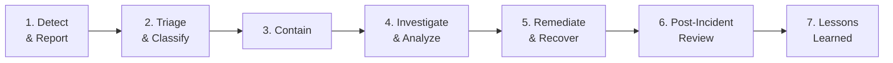

# Incident Response Plan

| Field         | Value                                |
|---------------|--------------------------------------|
| **Version**   | 1.0.0                                |
| **Status**    | Draft                                |
| **Author**    | Vox                                  |
| **Reviewer**  | Vox                                  |
| **Created**   | 2026-03-27                           |
| **Updated**   | 2026-03-27                           |
| **Standard**  | ISO/IEC 27001:2022 Annex A.5.24–A.5.28 |

---

## 1. Purpose

This plan defines the procedures for identifying, responding to, containing, and recovering from information security incidents in the Utopia project. It establishes a structured approach to minimize impact and prevent recurrence.

## 2. Scope

This plan covers all incidents affecting:

- Application security (authentication bypass, data exposure, injection attacks)
- Infrastructure security (container escape, K8s compromise, unauthorized access)
- Supply chain security (compromised dependency, malicious image)
- Data security (data breach, data loss, corruption)
- Availability (DoS, service outage, resource exhaustion)
- Operational security (secret exposure, certificate failure, misconfiguration)

## 3. Incident Classification

### 3.1. Severity Levels

| Severity | Code | Description | Examples | Response Time |
|----------|------|-------------|----------|---------------|
| **Critical** | SEV-1 | Active exploitation, data breach, complete system compromise | Unauthorized data access, credential leak in public, active attack | Immediate (< 1 hour) |
| **High** | SEV-2 | Exploitable vulnerability identified, partial system compromise | Critical CVE in running service, auth bypass, privilege escalation | < 4 hours |
| **Medium** | SEV-3 | Vulnerability with limited exploitability, service degradation | High CVE, misconfiguration, partial outage | < 24 hours |
| **Low** | SEV-4 | Informational findings, no immediate threat | Medium/low CVE, policy violation, warning | < 72 hours |

### 3.2. Incident Categories

| Category | ID | Description |
|----------|----|-------------|
| **Unauthorized Access** | INC-AUTH | Broken authentication, session hijacking, brute force |
| **Data Breach** | INC-DATA | Unauthorized data exposure, exfiltration, leakage |
| **Malware / Supply Chain** | INC-MALW | Compromised dependency, malicious code, container image |
| **Denial of Service** | INC-DOS | Service unavailability, resource exhaustion |
| **Misconfiguration** | INC-CONF | Exposed secrets, insecure defaults, drift |
| **Infrastructure** | INC-INFRA | Container escape, K8s compromise, network breach |

## 4. Incident Response Team

As a solo operator project, Vox fills all roles:

| Role | Responsibility | Contact |
|------|---------------|---------|
| **Incident Commander** | Overall coordination, severity decision | Vox |
| **Technical Lead** | Investigation, containment, remediation | Vox |
| **Communications** | Stakeholder notification (if applicable) | Vox |
| **Documentation** | Incident timeline, post-mortem | Vox |

## 5. Incident Response Lifecycle



### 5.1. Phase 1 — Detect & Report

#### Detection Sources

| Source | Tool | Detection Type |
|--------|------|---------------|
| **Application logs** | Loki + Grafana | Auth failures, error spikes, anomalous patterns |
| **Metrics** | Prometheus + Grafana | Resource anomalies, error rates, latency |
| **Alerts** | Grafana Alerting | Threshold-based and anomaly alerts |
| **CI/CD** | GitHub Actions | Failed security scans, quality gate failures |
| **Image scanning** | Trivy | New CVE in running images |
| **Git scanning** | Gitleaks / TruffleHog | Committed secrets detected |
| **K8s events** | Prometheus / Loki | OPA denials, pod security violations |
| **External** | GitHub Security Advisories | Dependency vulnerability notifications |

#### Alert Routing

| Alert Type | Severity | Notification |
|------------|----------|-------------|
| Secret detected in commit | SEV-1 | Immediate (Grafana → email/webhook) |
| Critical CVE in running image | SEV-2 | High priority (Grafana → email) |
| Auth failure rate > threshold | SEV-2 | High priority |
| Error rate > 5% (5xx) | SEV-3 | Standard alert |
| Certificate expiry < 7 days | SEV-3 | Standard alert |
| Resource usage > 90% | SEV-3 | Standard alert |

### 5.2. Phase 2 — Triage & Classify

Triage checklist:

- [ ] What was detected? (Alert, log, scan finding)
- [ ] When was it detected? (Timestamp, duration)
- [ ] What systems are affected? (Services, namespaces, data)
- [ ] Is the system actively being exploited?
- [ ] What is the blast radius? (Single service, module, cluster-wide)
- [ ] Assign severity level (SEV-1 through SEV-4)
- [ ] Create incident record with unique ID: `INC-YYYY-MM-DD-NNN`

### 5.3. Phase 3 — Contain

#### Containment Actions by Category

| Category | Immediate Actions |
|----------|------------------|
| **INC-AUTH** | Revoke compromised sessions/tokens, lock affected accounts, enable enhanced logging |
| **INC-DATA** | Isolate affected service (scale to 0 replicas), preserve logs, block network egress |
| **INC-MALW** | Quarantine affected pods, block image from registry, roll back to known-good version |
| **INC-DOS** | Enable rate limiting, scale up resources, block offending IPs via network policy |
| **INC-CONF** | Rotate exposed secrets, apply corrective configuration, force ArgoCD sync |
| **INC-INFRA** | Isolate affected node/namespace, revoke ServiceAccount tokens, audit RBAC |

#### Emergency Commands

```bash
# Scale down compromised service
kubectl scale deployment <service> -n utopia --replicas=0

# Rotate Keycloak admin credentials
# (via Keycloak Admin Console or API)

# Rotate Vault secrets
vault kv put kv/utopia/<path> <new-values>

# Block network to/from namespace
kubectl apply -f emergency-network-policy.yaml

# Force ArgoCD sync to known-good state
argocd app sync <app> --force --revision <known-good-commit>

# Revoke all active sessions in Keycloak
# Keycloak Admin Console → Sessions → Logout All
```

### 5.4. Phase 4 — Investigate & Analyze

Investigation checklist:

- [ ] Collect and preserve evidence (logs, metrics, configurations)
- [ ] Establish timeline of events
- [ ] Identify root cause
- [ ] Determine scope of impact (data, systems, users)
- [ ] Check for indicators of compromise (IoC) in other systems
- [ ] Document all findings

#### Log Analysis

| Data Source | Query Location | What to Look For |
|-------------|---------------|------------------|
| Application logs | Grafana → Explore → Loki | Error patterns, auth events, unusual requests |
| K8s events | `kubectl get events -n utopia` | Pod failures, policy violations |
| Keycloak logs | Grafana → Loki (keycloak label) | Login attempts, admin actions, token events |
| Network logs | K8s NetworkPolicy logs | Blocked connections, unusual traffic |
| Git history | `git log --oneline --since="<timestamp>"` | Recent changes that may correlate |
| Trivy reports | CI artifacts / Harbor | CVE details, fix versions |

### 5.5. Phase 5 — Remediate & Recover

| Step | Action | Verification |
|------|--------|--------------|
| 1 | Apply fix (code, config, or infrastructure) | PR with fix passes all CI gates |
| 2 | Rebuild affected images | Trivy scan passes (0 critical/high) |
| 3 | Deploy via ArgoCD (GitOps) | ArgoCD sync healthy |
| 4 | Rotate all potentially compromised credentials | Vault audit log confirms rotation |
| 5 | Verify service health | Prometheus health metrics green |
| 6 | Monitor for recurrence | Enhanced monitoring for 48 hours |

### 5.6. Phase 6 — Post-Incident Review

Post-incident review MUST be completed within 5 business days of incident closure.

#### Post-Incident Report Template

```markdown
# Incident Report: INC-YYYY-MM-DD-NNN

## Summary
- **Severity**: SEV-X
- **Category**: INC-XXX
- **Duration**: Start → End (total hours)
- **Impact**: Description of impact

## Timeline
| Time | Event |
|------|-------|
| HH:MM | Detection |
| HH:MM | Triage started |
| HH:MM | Containment applied |
| HH:MM | Root cause identified |
| HH:MM | Fix deployed |
| HH:MM | Incident closed |

## Root Cause Analysis
(5 Whys or Fishbone analysis)

## Impact Assessment
- Data affected: (none / type / volume)
- Services affected: (list)
- Duration of impact: (minutes / hours)

## Actions Taken
1. (containment action)
2. (remediation action)
3. (recovery action)

## Lessons Learned
- What went well?
- What could be improved?
- What was lucky?

## Follow-Up Actions
| Action | Owner | Due Date | Status |
|--------|-------|----------|--------|
| (action item) | Vox | YYYY-MM-DD | Open |
```

### 5.7. Phase 7 — Lessons Learned

- Update [RISK-ASSESSMENT.md](./RISK-ASSESSMENT.md) with new or revised risks
- Update detection rules if the incident was not caught early
- File ADR if architecture changes are needed
- Update runbooks with new procedures
- Update this plan if process gaps were identified

## 6. Specific Playbooks

### 6.1. Playbook — Secret Exposed in Git

| Step | Action |
|------|--------|
| 1 | **Immediately rotate** the exposed secret in Vault |
| 2 | Use `git filter-repo` or BFG to remove secret from history |
| 3 | Force push the cleaned history |
| 4 | Verify no cached copies exist (CI artifacts, Docker layers) |
| 5 | Review Gitleaks rules; add pattern if not covered |
| 6 | Check if secret was used elsewhere (other services, configs) |

### 6.2. Playbook — Critical CVE in Running Container

| Step | Action |
|------|--------|
| 1 | Check if CVE is exploitable in Utopia's context |
| 2 | If exploitable: apply containment (network policy, WAF rule) |
| 3 | Update base image or patched dependency |
| 4 | Rebuild and scan with Trivy |
| 5 | Deploy patched image via ArgoCD |
| 6 | Verify fix: `trivy image <new-image>` |

### 6.3. Playbook — Unauthorized Access Detected

| Step | Action |
|------|--------|
| 1 | Revoke all sessions for affected user(s) in Keycloak |
| 2 | Lock affected account(s) |
| 3 | Review access logs for scope of unauthorized activity |
| 4 | Check for data exfiltration attempts |
| 5 | Reset credentials and enforce MFA |
| 6 | Review RBAC policies for least privilege compliance |

## 7. Communication Plan

| Audience | When | Channel | Content |
|----------|------|---------|---------|
| Vox (self) | Immediately | Grafana alerts | Alert details |
| Git history | After remediation | Incident report in repo | Full post-mortem |
| Risk register | After review | Update RISK-ASSESSMENT.md | New/revised risks |

## 8. Incident Response Testing

| Activity | Frequency | Method |
|----------|-----------|--------|
| Tabletop exercise | Every 6 months | Walk through a scenario manually |
| Detection validation | Quarterly | Trigger test alerts, verify routing |
| Playbook review | Every 6 months | Review and update playbooks |
| Backup restoration | Quarterly | Test PostgreSQL backup restore |

## 9. References

- [ISO/IEC 27001:2022](https://www.iso.org/standard/27001) — Annex A.5.24–A.5.28
- [NIST SP 800-61 Rev. 2](https://csrc.nist.gov/publications/detail/sp/800-61/rev-2/final) — Computer Security Incident Handling Guide
- [RISK-ASSESSMENT.md](./RISK-ASSESSMENT.md)
- [SECURITY-STANDARD.md](../00-standards/SECURITY-STANDARD.md)
- [ACCESS-CONTROL-POLICY.md](./ACCESS-CONTROL-POLICY.md)

## Changelog

| Version | Date       | Author | Description          |
|---------|------------|--------|----------------------|
| 1.0.0   | 2026-03-27 | Vox    | Initial draft        |
