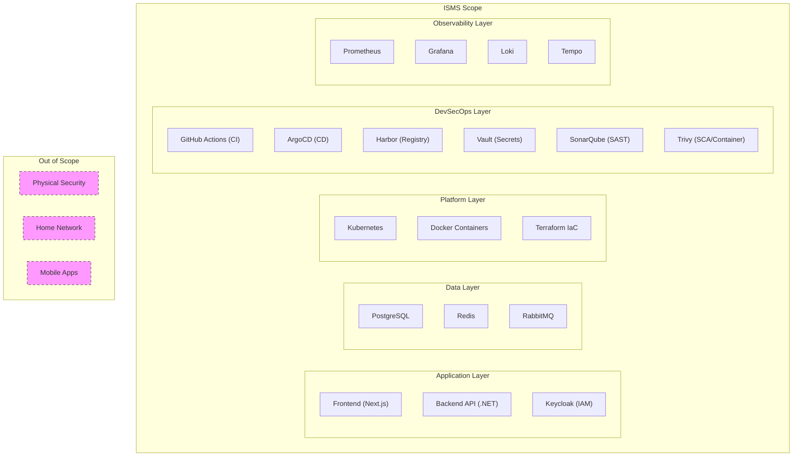

# ISMS Scope

| Field         | Value                                |
|---------------|--------------------------------------|
| **Version**   | 1.0.0                                |
| **Status**    | Draft                                |
| **Author**    | Vox                                  |
| **Reviewer**  | Vox                                  |
| **Created**   | 2026-03-27                           |
| **Updated**   | 2026-03-27                           |
| **Standard**  | ISO/IEC 27001:2022, Clause 4.3      |

---

## 1. Purpose

This document defines the scope of the Information Security Management System (ISMS) for the **Utopia** project in accordance with ISO/IEC 27001:2022, Clause 4.3. It establishes the boundaries and applicability of the ISMS across the project's information assets, processes, and infrastructure.

## 2. Organization Context

### 2.1. Organization

| Field | Value |
|-------|-------|
| Project Name | Utopia |
| Type | Personal production-grade reference project |
| Owner | Vox |
| Purpose | Demonstrate end-to-end DevSecOps practices with comprehensive documentation |

### 2.2. Interested Parties

| Party | Expectations | Relevance |
|-------|-------------|-----------|
| Project Owner (Vox) | Secure, well-documented platform following industry standards | Primary stakeholder |
| End Users | Data privacy, secure authentication, service availability | Application consumers |
| Open Source Community | Security best practices, reference implementations | Secondary audience |
| Cloud Providers | Compliance with acceptable use policies | Infrastructure dependency |
| Regulatory Bodies | GDPR-aligned data handling (if applicable) | Legal compliance |

### 2.3. Internal and External Issues

| Category | Issue | Impact on ISMS |
|----------|-------|---------------|
| **Internal** | Single-person team — all roles performed by one person | Risk of oversight; compensated by automation |
| **Internal** | Personal development machine as primary environment | Physical security scope is limited |
| **Internal** | DevSecOps is a primary learning objective | Security controls are intentionally comprehensive |
| **External** | Evolving threat landscape (supply chain attacks, zero-days) | Continuous monitoring and updates required |
| **External** | Dependency on third-party open-source software | SCA and dependency scanning required |
| **External** | Cloud provider security shared responsibility model | IaC must enforce cloud security baseline |

## 3. ISMS Scope Statement

The ISMS for the Utopia project encompasses:

> **The design, development, deployment, and operation of the Utopia web application platform, including:**
>
> - Application source code (backend, frontend)
> - Infrastructure as Code definitions and deployment pipelines
> - Container images and orchestration configurations
> - Data stored in databases, caches, and logs
> - Identity and access management systems
> - CI/CD pipelines and DevSecOps toolchain
> - Monitoring, logging, and alerting systems
> - Documentation and knowledge management
>
> **Operating from a local development environment (Lenovo Legion 5 Pro) and cloud-hosted Kubernetes clusters, managed by a single operator (Vox).**

## 4. Scope Boundaries

### 4.1. In Scope

| Category | Assets | Controls |
|----------|--------|----------|
| **Applications** | Backend API (.NET 8), Frontend (Next.js), Keycloak | Secure SDLC, SAST, DAST, code review |
| **Data** | PostgreSQL databases, Redis cache, RabbitMQ messages | Encryption, access control, backup |
| **Infrastructure** | Kubernetes (K3s/cloud), Docker containers, Terraform | IaC security, network policies, hardening |
| **CI/CD** | GitHub Actions, ArgoCD, Harbor | Pipeline security, artifact signing, supply chain |
| **Secrets** | API keys, database credentials, TLS certificates | Vault management, rotation, scanning |
| **Monitoring** | Prometheus, Grafana, Loki, Tempo | Security event monitoring, alerting |
| **Documentation** | All documents in `documents/` directory | Version control, review process |
| **Source Control** | GitHub repository | Branch protection, access control, audit |

### 4.2. Out of Scope

| Exclusion | Justification |
|-----------|---------------|
| Physical security of the development machine | Personal device — covered by OS-level security and disk encryption |
| Network security of home/office network | Outside project control — compensated by TLS everywhere |
| Mobile applications | Not in project scope (see [PROJECT-CHARTER.md](../01-project/PROJECT-CHARTER.md)) |
| Third-party SaaS operational security | Covered by vendor shared responsibility model |
| Business continuity for an actual business | Personal project — DR plan covers technical recovery only |
| Compliance auditing by external parties | No regulatory requirement for personal project |

### 4.3. Scope Diagram

## 5. Information Assets

### 5.1. Asset Inventory

| Asset ID | Asset | Type | Owner | Classification | Location |
|----------|-------|------|-------|---------------|----------|
| A-001 | Application source code | Software | Vox | Internal | GitHub repository |
| A-002 | PostgreSQL databases | Data | Vox | Confidential | K8s PVC / Local Docker |
| A-003 | User data (profiles, emails) | Data | Vox | Confidential | PostgreSQL |
| A-004 | API keys and secrets | Data | Vox | Confidential | HashiCorp Vault |
| A-005 | TLS certificates | Data | Vox | Confidential | cert-manager / Vault |
| A-006 | Docker images | Software | Vox | Internal | Harbor registry |
| A-007 | Terraform state files | Data | Vox | Confidential | Remote backend (encrypted) |
| A-008 | CI/CD pipeline definitions | Software | Vox | Internal | GitHub repository |
| A-009 | Kubernetes manifests / Helm charts | Software | Vox | Internal | GitHub repository |
| A-010 | Application logs | Data | Vox | Internal | Loki |
| A-011 | Audit logs | Data | Vox | Confidential | Loki (immutable) |
| A-012 | Monitoring data (metrics, traces) | Data | Vox | Internal | Prometheus / Tempo |
| A-013 | Documentation | Information | Vox | Internal | GitHub repository |
| A-014 | Backup files | Data | Vox | Confidential | Object storage |

### 5.2. Data Classification

Defined in [SECURITY-STANDARD.md](../00-standards/SECURITY-STANDARD.md), Section 12.1.

| Level | Description | Handling |
|-------|-------------|---------|
| **Confidential** | Secrets, PII, credentials, state files | Encrypted at rest + in transit, access-logged |
| **Internal** | Source code, configs, logs, metrics | Access-controlled, encrypted in transit |
| **Public** | Documentation (if published), public API specs | No special controls |

## 6. Applicable Controls

The full control mapping is maintained in [SECURITY-STANDARD.md](../00-standards/SECURITY-STANDARD.md), Section 3. Summary of applicable control categories:

| ISO 27001:2022 Category | Controls Applied | Implementation |
|--------------------------|-----------------|----------------|
| **A.5** Organizational | A.5.1, A.5.14, A.5.19, A.5.23, A.5.24, A.5.29 | Policies, incident response, supplier security |
| **A.8** Technological | A.8.1, A.8.3–A.8.5, A.8.7, A.8.9–A.8.10, A.8.12, A.8.15–A.8.16, A.8.20, A.8.24–A.8.29, A.8.31–A.8.32 | Access control, encryption, secure development, monitoring |

Controls not applicable to a single-person personal project (e.g., A.6 People controls for HR, A.7 Physical controls for office) are excluded from the Statement of Applicability.

## 7. ISMS Maintenance

| Activity | Frequency | Responsible |
|----------|-----------|-------------|
| ISMS scope review | Every 6 months | Vox |
| Risk assessment review | Every 6 months | Vox |
| Policy review | Annually | Vox |
| Security incident review | After each incident | Vox |
| Asset inventory update | When architecture changes | Vox |
| Control effectiveness review | Quarterly | Vox |

## 8. References

- [ISO/IEC 27001:2022](https://www.iso.org/standard/27001) — Clause 4.3: Determining the scope
- [SECURITY-STANDARD.md](../00-standards/SECURITY-STANDARD.md) — Controls mapping
- [RISK-ASSESSMENT.md](./RISK-ASSESSMENT.md) — Risk assessment
- [PROJECT-CHARTER.md](../01-project/PROJECT-CHARTER.md) — Project scope

## Changelog

| Version | Date       | Author | Description          |
|---------|------------|--------|----------------------|
| 1.0.0   | 2026-03-27 | Vox    | Initial draft        |
