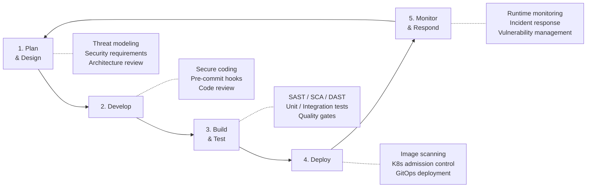

# Secure Development Policy

| Field         | Value                                |
|---------------|--------------------------------------|
| **Version**   | 1.0.0                                |
| **Status**    | Draft                                |
| **Author**    | Vox                                  |
| **Reviewer**  | Vox                                  |
| **Created**   | 2026-03-27                           |
| **Updated**   | 2026-03-27                           |
| **Standard**  | ISO/IEC 27001:2022 Annex A.8.25–A.8.28; OWASP ASVS v4.0.3 |

---

## 1. Purpose

This policy establishes secure software development lifecycle (SSDLC) requirements for the Utopia project. It ensures that security is integrated into every phase of design, development, testing, and deployment.

## 2. Scope

This policy applies to all code, configuration, and infrastructure-as-code within the Utopia project:

- Backend (.NET 8 / C# 12)
- Frontend (Next.js / TypeScript)
- Infrastructure as Code (Terraform, Ansible)
- Kubernetes manifests (Helm charts, Kustomize)
- CI/CD pipeline definitions (GitHub Actions)
- Container images (Dockerfiles)

## 3. Secure Development Lifecycle

## 4. Phase 1 — Plan & Design

### 4.1. Threat Modeling

Threat modeling MUST be performed for:

- New modules or services
- Changes to authentication/authorization flows
- New external integrations
- Changes to data handling (PII, credentials)

**Method**: STRIDE (Spoofing, Tampering, Repudiation, Information Disclosure, Denial of Service, Elevation of Privilege)

| STRIDE Category | Mitigation Approach |
|----------------|---------------------|
| Spoofing | Keycloak authentication, JWT validation |
| Tampering | Input validation, integrity checks, signed tokens |
| Repudiation | Structured audit logging, correlation IDs |
| Information Disclosure | Encryption (TLS, at-rest), data classification |
| Denial of Service | Rate limiting, resource limits, circuit breakers |
| Elevation of Privilege | RBAC, server-side authorization, least privilege |

### 4.2. Security Requirements

Every feature MUST include security requirements:

- Authentication: Who can access?
- Authorization: What can they do?
- Input validation: What data is accepted?
- Data classification: What sensitivity level?
- Logging: What events are recorded?

## 5. Phase 2 — Develop

### 5.1. Secure Coding Requirements — .NET

| Category | Requirement | Reference |
|----------|-------------|-----------|
| **Input Validation** | FluentValidation on ALL API inputs | OWASP ASVS V5 |
| **SQL Injection** | EF Core parameterized queries ONLY; no string concatenation in SQL | OWASP ASVS V5.3 |
| **Output Encoding** | Use `System.Text.Encodings.Web` for HTML/JS/URL encoding | OWASP ASVS V5.3 |
| **Authentication** | Delegate to Keycloak; NEVER implement custom auth | OWASP ASVS V2 |
| **Session Management** | JWT validation via `Microsoft.AspNetCore.Authentication.JwtBearer` | OWASP ASVS V3 |
| **Error Handling** | Return RFC 7807 ProblemDetails; NEVER expose stack traces | OWASP ASVS V7.4 |
| **Logging** | Serilog structured logging; NEVER log PII, tokens, or credentials | OWASP ASVS V7 |
| **Cryptography** | Use `System.Security.Cryptography`; NEVER implement custom crypto | OWASP ASVS V6 |
| **Deserialization** | `System.Text.Json` with explicit types; no `TypeNameHandling` | OWASP ASVS V5.5 |
| **File Upload** | Validate MIME type, size limit, rename files; store outside webroot | OWASP ASVS V12 |
| **HTTP Headers** | Security headers middleware (CSP, HSTS, X-Content-Type-Options) | OWASP ASVS V14 |
| **Dependencies** | Lock file committed; no wildcard versions | OWASP ASVS V14.2 |

### 5.2. Secure Coding Requirements — TypeScript / Next.js

| Category | Requirement | Reference |
|----------|-------------|-----------|
| **XSS Prevention** | React auto-escaping; NEVER use `dangerouslySetInnerHTML` | OWASP ASVS V5.3 |
| **Input Validation** | Zod schemas on ALL form inputs and API responses | OWASP ASVS V5 |
| **Token Handling** | httpOnly cookies ONLY; NEVER store tokens in localStorage | OWASP ASVS V3.3 |
| **CSRF Protection** | SameSite=Strict cookies; Next.js CSRF tokens for mutations | OWASP ASVS V4.2 |
| **CSP** | Content Security Policy header; restrict script-src to self | OWASP ASVS V14 |
| **Server Components** | Fetch data on server side; NEVER expose internal URLs to client | Next.js security |
| **Environment Variables** | NEVER prefix secrets with `NEXT_PUBLIC_` | Next.js security |
| **Dependencies** | `pnpm audit`; no `--ignore-scripts` bypass | OWASP ASVS V14.2 |

### 5.3. Secure Coding Requirements — Infrastructure as Code

| Category | Requirement |
|----------|-------------|
| **Terraform** | No hardcoded secrets; use `sensitive = true` for outputs; remote state encrypted |
| **Kubernetes** | Pod Security Standards `restricted`; no `privileged: true`; read-only rootfs |
| **Docker** | Non-root USER; no `--privileged`; multi-stage builds; COPY not ADD |
| **Helm** | Values validated; no `tpl` with user input; secrets via External Secrets Operator |
| **Ansible** | Vault-encrypted variables; no plaintext passwords in playbooks |

### 5.4. Pre-Commit Hooks

The following hooks MUST run before every commit:

| Hook | Tool | Purpose |
|------|------|---------|
| Secret detection | Gitleaks | Prevent committing secrets, API keys, tokens |
| Lint (C#) | dotnet format | Enforce coding standards |
| Lint (TypeScript) | ESLint + Prettier | Enforce coding standards |
| Lint (Terraform) | `terraform fmt` + `tflint` | Enforce IaC standards |
| Lint (Dockerfile) | Hadolint | Enforce Dockerfile best practices |
| Lint (YAML) | yamllint | Validate K8s manifests, CI configs |
| Commit message | commitlint | Enforce Conventional Commits |

## 6. Phase 3 — Build & Test

### 6.1. CI Security Pipeline

```mermaid
flowchart LR
    subgraph Build["Build Stage"]
        B1["Compile / Build"]
        B2["Unit Tests"]
        B3["Code Coverage"]
    end

    subgraph Scan["Security Scan Stage"]
        S1["SAST\n(SonarQube + Semgrep)"]
        S2["SCA\n(Trivy fs)"]
        S3["Secret Scan\n(TruffleHog)"]
        S4["License Check"]
    end

    subgraph Image["Image Stage"]
        I1["Docker Build"]
        I2["Image Scan\n(Trivy image)"]
        I3["Push to Harbor"]
    end

    subgraph Gate["Quality Gate"]
        G1{{"Pass all gates?"}}
    end

    Build --> Scan --> Image --> Gate
    Gate -->|Pass| Deploy["Deploy via ArgoCD"]
    Gate -->|Fail| Block["Block Merge"]
```

### 6.2. Quality Gates

| Gate | Tool | Threshold | Blocking |
|------|------|-----------|----------|
| **SAST — New Issues** | SonarQube | 0 new critical/major issues | Yes |
| **SAST — Security Hotspots** | SonarQube | 0 unreviewed hotspots | Yes |
| **SAST — Custom Rules** | Semgrep | 0 findings on custom rules | Yes |
| **SCA — Critical CVE** | Trivy | 0 critical vulnerabilities | Yes |
| **SCA — High CVE** | Trivy | 0 high vulnerabilities (fixable) | Yes |
| **Secret Detection** | TruffleHog | 0 findings | Yes |
| **Code Coverage** | Coverlet / Istanbul | ≥ 80% line coverage | Yes |
| **Unit Tests** | xUnit / Vitest | 100% pass | Yes |
| **Integration Tests** | Testcontainers / Playwright | 100% pass | Yes |
| **Image CVE — Critical** | Trivy | 0 critical | Yes |
| **Image CVE — High** | Trivy | 0 high (fixable) | Yes |
| **License Compliance** | Trivy | No GPL/AGPL in non-GPL project | Yes |

### 6.3. Security Testing Requirements

| Test Type | Tool | When | Coverage |
|-----------|------|------|----------|
| **Unit (Security logic)** | xUnit / Vitest | Every commit | Auth, validation, encoding |
| **Integration** | Testcontainers | Every PR | API auth flows, RBAC enforcement |
| **DAST** | OWASP ZAP | Weekly / pre-release | Top 10 vulnerability scan |
| **Penetration Test** | Manual / ZAP active | Before major release | Full application surface |
| **Infrastructure Scan** | Trivy K8s | Weekly | K8s misconfiguration |

## 7. Phase 4 — Deploy

### 7.1. Deployment Security Requirements

| Requirement | Implementation |
|-------------|---------------|
| **GitOps only** | All deployments through ArgoCD; no `kubectl apply` from local machine |
| **Image provenance** | Only images from Harbor (internal registry) |
| **Image scanning** | Trivy scan MUST pass before image is promoted |
| **Admission control** | OPA Gatekeeper validates all resources before admission |
| **Rollback capability** | ArgoCD automatic rollback on health check failure |
| **No manual changes** | Drift detection enabled; manual changes are overwritten |

### 7.2. OPA Gatekeeper Policies

| Policy | Enforcement |
|--------|-------------|
| Container must run as non-root | `deny` |
| Container must have resource limits | `deny` |
| Container must have readiness/liveness probes | `deny` |
| No `latest` image tag | `deny` |
| No host networking | `deny` |
| No privileged containers | `deny` |
| Required labels (app, version, team) | `deny` |
| Allowed registries (Harbor only) | `deny` |

## 8. Phase 5 — Monitor & Respond

### 8.1. Runtime Security Monitoring

| What | How | Alert |
|------|-----|-------|
| Authentication failures | Keycloak + Loki logs | > 10 failures in 5 minutes |
| Authorization denials | Backend structured logs | > 5 denials for same user in 1 minute |
| Error rate spike | Prometheus metrics | > 5% error rate (5xx) |
| Resource anomaly | Prometheus + Grafana | CPU/memory exceeds 90% |
| New vulnerability in running image | Trivy (scheduled scan) | Any critical/high CVE |
| Certificate expiry | cert-manager + Prometheus | < 7 days to expiry |

### 8.2. Vulnerability Management

| Severity | SLA | Action |
|----------|-----|--------|
| **Critical** | 24 hours | Patch, rebuild, redeploy |
| **High** | 7 days | Schedule patch |
| **Medium** | 30 days | Plan for next release |
| **Low** | 90 days | Backlog |

## 9. Dependency Management

### 9.1. Dependency Rules

- All dependencies MUST be declared in lock files (`packages.lock.json`, `pnpm-lock.yaml`, `.terraform.lock.hcl`)
- Dependency updates MUST go through the standard CI pipeline
- No direct `install` commands in production; only lock file-based `restore`
- Abandoned dependencies (no update > 12 months) SHOULD be replaced

### 9.2. Automated Updates

| Tool | Scope | Frequency |
|------|-------|-----------|
| Dependabot | NuGet, npm, GitHub Actions, Docker | Weekly PRs |
| Renovate (alternative) | All package ecosystems | Weekly PRs |

## 10. Developer Security Training

As a solo developer project, Vox MUST:

- Review OWASP Top 10 annually
- Review OWASP ASVS checklist per module implementation
- Stay current with .NET and Next.js security advisories
- Review GitHub Security Advisories for dependencies

## 11. References

- [ISO/IEC 27001:2022](https://www.iso.org/standard/27001) — Annex A.8.25–A.8.28
- [OWASP ASVS v4.0.3](https://owasp.org/www-project-application-security-verification-standard/)
- [OWASP Top 10 (2021)](https://owasp.org/www-project-top-ten/)
- [SECURITY-STANDARD.md](../00-standards/SECURITY-STANDARD.md)
- [CODING-STANDARD.md](../00-standards/CODING-STANDARD.md)
- [RISK-ASSESSMENT.md](./RISK-ASSESSMENT.md)
- [SUPPLY-CHAIN-SECURITY.md](./SUPPLY-CHAIN-SECURITY.md)
- [OWASP-ASVS-CHECKLIST.md](./OWASP-ASVS-CHECKLIST.md)

## Changelog

| Version | Date       | Author | Description          |
|---------|------------|--------|----------------------|
| 1.0.0   | 2026-03-27 | Vox    | Initial draft        |
