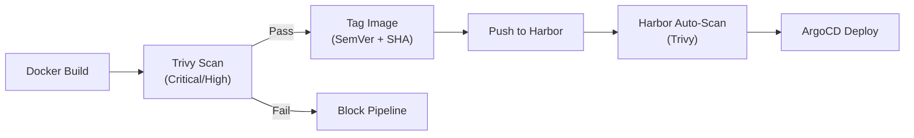

# Supply Chain Security

| Field         | Value                                |
|---------------|--------------------------------------|
| **Version**   | 1.0.0                                |
| **Status**    | Draft                                |
| **Author**    | Vox                                  |
| **Reviewer**  | Vox                                  |
| **Created**   | 2026-03-27                           |
| **Updated**   | 2026-03-27                           |
| **Standard**  | ISO/IEC 27001:2022 Annex A.5.19–A.5.22; SLSA v1.0 |

---

## 1. Purpose

This document defines the supply chain security requirements for the Utopia project. It covers dependency management, container image security, CI/CD pipeline integrity, and third-party risk management to protect against supply chain attacks.

## 2. Scope

All external components consumed by the Utopia project:

- NuGet packages (.NET backend)
- npm packages (Next.js frontend)
- Container base images (Docker)
- GitHub Actions (CI/CD)
- Terraform providers and modules
- Helm charts
- Operating system packages (Alpine APK)

## 3. Threat Landscape

### 3.1. Supply Chain Attack Vectors

| Vector | Description | Example |
|--------|-------------|---------|
| **Dependency Confusion** | Malicious package with same name as internal package | Private package name registered on public registry |
| **Typosquatting** | Malicious package with similar name | `lodahs` instead of `lodash` |
| **Compromised Maintainer** | Legitimate package updated with malicious code | `event-stream` incident (2018) |
| **Malicious Dependency** | Intentionally malicious package | Crypto-mining packages on npm |
| **Compromised Build** | Build pipeline modified to inject malware | SolarWinds attack |
| **Poisoned Base Image** | Tampered container image | Unofficial Docker Hub images |
| **CI Action Compromise** | GitHub Action updated with malicious payload | Action with broad permissions exfiltrating secrets |

### 3.2. Related Risks

See [RISK-ASSESSMENT.md](./RISK-ASSESSMENT.md), section 4.3 (Supply Chain Risks): R-SUP-001 through R-SUP-004.

## 4. Dependency Management

### 4.1. General Rules

| Rule | Requirement |
|------|------------|
| **Lock files** | MUST be committed: `packages.lock.json`, `pnpm-lock.yaml`, `.terraform.lock.hcl` |
| **Exact versions** | MUST use exact versions in manifests (no `^` or `~` in production) |
| **Dependency review** | New dependencies MUST be reviewed before adoption |
| **Minimal dependencies** | Prefer standard library over third-party for simple tasks |
| **License compliance** | No GPL/AGPL dependencies in non-GPL project |
| **Abandoned check** | Dependencies with no update > 12 months SHOULD be replaced |

### 4.2. Dependency Review Checklist

Before adding a new dependency:

- [ ] Is it actively maintained? (Last commit < 6 months)
- [ ] Does it have a significant user base? (Downloads, stars, dependents)
- [ ] Is the source code public and auditable?
- [ ] Does it have known critical/high vulnerabilities?
- [ ] Is the license compatible? (MIT, Apache 2.0, BSD preferred)
- [ ] Does it pull in excessive transitive dependencies?
- [ ] Is there a standard library or framework alternative?
- [ ] Is the package name correct? (Not typosquatting)

### 4.3. NuGet (.NET) Security

| Control | Implementation |
|---------|---------------|
| **Package source** | `nuget.org` only; configure in `nuget.config` |
| **Lock file** | `packages.lock.json` committed; `RestoreLockedMode=true` in CI |
| **Vulnerability scan** | `dotnet list package --vulnerable` in CI |
| **SCA scan** | Trivy `fs` mode on solution |
| **Audit** | `dotnet audit` (future) or Dependabot alerts |
| **Pinning** | Exact versions in `.csproj` (`<PackageReference Version="x.y.z" />`) |

### 4.4. npm (Next.js) Security

| Control | Implementation |
|---------|---------------|
| **Package manager** | pnpm (strict, efficient) |
| **Package source** | `registry.npmjs.org` only |
| **Lock file** | `pnpm-lock.yaml` committed; `--frozen-lockfile` in CI |
| **Vulnerability scan** | `pnpm audit --prod` in CI |
| **SCA scan** | Trivy `fs` mode on project |
| **Scripts** | Review `postinstall` scripts; no `--ignore-scripts` bypass |
| **Pinning** | Exact versions in `package.json` |

### 4.5. Terraform Providers

| Control | Implementation |
|---------|---------------|
| **Provider source** | `registry.terraform.io` official providers only |
| **Lock file** | `.terraform.lock.hcl` committed |
| **Version constraints** | Pessimistic constraint (`~> x.y`) with lock file |
| **Provider signing** | Verify provider signatures (HashiCorp signed) |

### 4.6. Automated Dependency Updates

| Tool | Configuration |
|------|--------------|
| **Dependabot** | Weekly PRs for NuGet, npm, GitHub Actions, Docker, Terraform |
| **PR requirements** | Must pass full CI pipeline (SAST, SCA, tests) before merge |
| **Auto-merge** | Patch updates ONLY if all checks pass; minor/major require manual review |
| **Grouping** | Group minor framework updates (e.g., all `Microsoft.` packages) |

## 5. Container Image Security

### 5.1. Base Image Selection

| Image | Use Case | Source | Size |
|-------|----------|--------|------|
| `mcr.microsoft.com/dotnet/aspnet:8.0-alpine` | .NET runtime | Microsoft Container Registry | ~100MB |
| `mcr.microsoft.com/dotnet/sdk:8.0-alpine` | .NET build | Microsoft Container Registry | ~400MB |
| `node:20-alpine` | Next.js build/runtime | Docker Hub Official | ~130MB |
| `postgres:16-alpine` | PostgreSQL | Docker Hub Official | ~80MB |
| `redis:7-alpine` | Redis | Docker Hub Official | ~30MB |

**Base image rules**:

- MUST use official images from verified publishers
- MUST use Alpine variants where available (minimal attack surface)
- MUST pin to specific version tags (no `latest`)
- SHOULD pin to digest for critical images

### 5.2. Dockerfile Security Requirements

| Requirement | Detail |
|-------------|--------|
| **Multi-stage build** | Separate build and runtime stages |
| **Non-root user** | `USER 1001:1001` in runtime stage |
| **Read-only rootfs** | `readOnlyRootFilesystem: true` in K8s spec |
| **No ADD** | Use `COPY` instead of `ADD` (no remote URLs) |
| **No secrets in image** | NEVER `COPY` or `ENV` secrets; inject at runtime |
| **HEALTHCHECK** | Include HEALTHCHECK instruction |
| **Minimal packages** | No `curl`, `wget`, `sh` in production image (where possible) |
| **LABEL** | Include `maintainer`, `version`, `description` labels |
| **.dockerignore** | Exclude `.git`, `node_modules`, `.env`, `*.md` |

### 5.3. Image Scanning Pipeline



### 5.4. Container Registry (Harbor)

| Configuration | Value |
|--------------|-------|
| **Registry** | Harbor (self-hosted on K3d) |
| **Project** | `utopia` (private) |
| **Auto-scan** | Enabled (Trivy scanner) |
| **Vulnerability policy** | Block pull if critical CVE found |
| **Garbage collection** | Weekly; keep last 10 tags per repository |
| **Robot accounts** | CI push (write-only), K8s pull (read-only) |
| **Content trust** | Image signing (Cosign, future enhancement) |

### 5.5. Image Tagging Strategy

| Tag Format | Example | Usage |
|------------|---------|-------|
| `<semver>` | `1.2.3` | Release version |
| `<semver>-<sha7>` | `1.2.3-abc1234` | Build traceability |
| `<branch>-<sha7>` | `main-abc1234` | Branch builds |
| `sha-<sha7>` | `sha-abc1234` | Immutable reference |

**Rules**:
- NEVER use `latest` tag
- Production deployments MUST reference by digest or SemVer tag
- ArgoCD MUST use immutable tags or digests

## 6. CI/CD Pipeline Security

### 6.1. GitHub Actions Security

| Control | Implementation |
|---------|---------------|
| **Action pinning** | Pin ALL actions by SHA: `uses: actions/checkout@<full-sha>` |
| **Permissions** | Explicit `permissions:` block with least privilege |
| **OIDC** | Use OIDC federation for cloud/registry auth (no static tokens) |
| **Environment protection** | Production environment requires manual approval |
| **Branch protection** | `main` requires PR, CI pass, no force push |
| **Secret masking** | GitHub automatically masks registered secrets in logs |
| **Audit log** | Review GitHub audit log monthly |

### 6.2. GitHub Actions Permissions

```yaml
# Example: Minimal permissions for CI workflow
permissions:
  contents: read        # Checkout code
  security-events: write # Upload SARIF (CodeQL/SonarQube)
  packages: write       # Push to GHCR/Harbor (if needed)
  id-token: write       # OIDC token (for Vault/Harbor auth)
```

**Permission rules**:

- NEVER use `permissions: write-all`
- Each job SHOULD declare its own permissions
- `pull-requests: write` only when the job posts PR comments

### 6.3. Pipeline Integrity

| Control | Purpose |
|---------|---------|
| **Reproducible builds** | Lock files, pinned dependencies, deterministic build |
| **Build provenance** | GitHub Actions attestation (SLSA Level 2 target) |
| **Artifact integrity** | Checksum verification for build outputs |
| **Pipeline-as-Code** | All CI/CD in version-controlled YAML; no manual modifications |
| **No self-hosted runners** | Use GitHub-hosted runners (isolated, ephemeral) |

## 7. Third-Party Risk Assessment

### 7.1. Third-Party Inventory

| Component | Provider | Risk Level | Mitigation |
|-----------|----------|------------|------------|
| **Keycloak** | CNCF / Red Hat | Low | Open-source, audited, large community |
| **PostgreSQL** | PostgreSQL Global Dev Group | Low | Battle-tested, open-source, widely audited |
| **Redis** | Redis Ltd | Low | Open-source core, BSL license for enterprise |
| **RabbitMQ** | Broadcom / VMware | Low | Open-source, CNCF-adjacent, MPL-2.0 |
| **Harbor** | CNCF Graduated | Low | CNCF graduated, security-focused |
| **ArgoCD** | CNCF Graduated | Low | CNCF graduated, Intuit-backed |
| **Vault** | HashiCorp | Medium | BSL license change; OpenBao as alternative |
| **SonarQube** | SonarSource | Low | Community Edition, LGPL |
| **Trivy** | Aqua Security | Low | Open-source, Apache 2.0 |
| **Grafana/Loki/Tempo** | Grafana Labs | Low | AGPLv3 for OSS; self-hosted |
| **Prometheus** | CNCF Graduated | Low | Open-source, Apache 2.0 |

### 7.2. Third-Party Selection Criteria

- MUST be open-source with inspectable code
- SHOULD be CNCF-hosted or backed by reputable organization
- MUST have active maintenance (commits in last 3 months)
- MUST have security advisory process (CVE reporting)
- License MUST be compatible with project goals

### 7.3. Third-Party Monitoring

| Activity | Frequency | Tool/Method |
|----------|-----------|-------------|
| CVE monitoring | Continuous | GitHub Security Advisories, Trivy DB |
| License change monitoring | Quarterly | Manual review |
| End-of-life tracking | Quarterly | Version lifecycle pages |
| Alternative assessment | Annually | Evaluate alternatives if risk increases |

## 8. SLSA Compliance Target

The Utopia project targets **SLSA Level 2** for build integrity:

| SLSA Requirement | Level 2 | Utopia Implementation |
|-----------------|---------|----------------------|
| **Source** — Version controlled | ✅ | Git (GitHub) |
| **Source** — Verified history | ✅ | Branch protection, signed commits (future) |
| **Build** — Scripted build | ✅ | GitHub Actions workflows |
| **Build** — Build service | ✅ | GitHub-hosted runners |
| **Build** — Build as code | ✅ | Workflow YAML in repository |
| **Build** — Ephemeral environment | ✅ | GitHub-hosted runners (ephemeral) |
| **Provenance** — Available | ✅ | GitHub Actions attestation |
| **Provenance** — Authenticated | ✅ | Signed by GitHub Actions OIDC |

## 9. Supply Chain Incident Response

If a supply chain compromise is detected:

1. **Identify** affected packages/images
2. **Pin** to last known-good version immediately
3. **Block** the compromised version in CI (deny list)
4. **Audit** all deployments using the affected component
5. **Scan** for indicators of compromise in running systems
6. **Replace** if the upstream project is irrecoverably compromised
7. **Report** findings in incident report (see [INCIDENT-RESPONSE-PLAN.md](./INCIDENT-RESPONSE-PLAN.md))

## 10. References

- [ISO/IEC 27001:2022](https://www.iso.org/standard/27001) — Annex A.5.19–A.5.22: Supplier relationships
- [SLSA v1.0](https://slsa.dev/) — Supply-chain Levels for Software Artifacts
- [OWASP Top 10 CI/CD Security Risks](https://owasp.org/www-project-top-10-ci-cd-security-risks/)
- [SECURITY-STANDARD.md](../00-standards/SECURITY-STANDARD.md)
- [RISK-ASSESSMENT.md](./RISK-ASSESSMENT.md)
- [SECURE-DEVELOPMENT-POLICY.md](./SECURE-DEVELOPMENT-POLICY.md)
- [CODING-STANDARD.md](../00-standards/CODING-STANDARD.md)

## Changelog

| Version | Date       | Author | Description          |
|---------|------------|--------|----------------------|
| 1.0.0   | 2026-03-27 | Vox    | Initial draft        |
