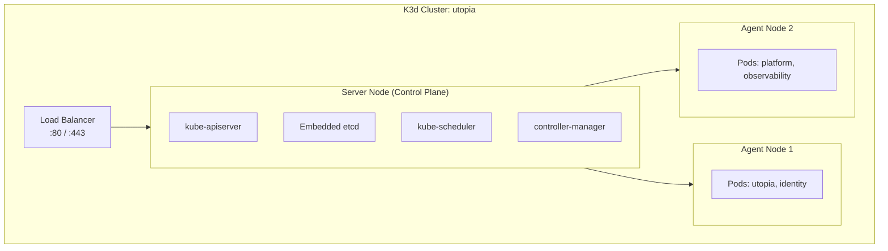
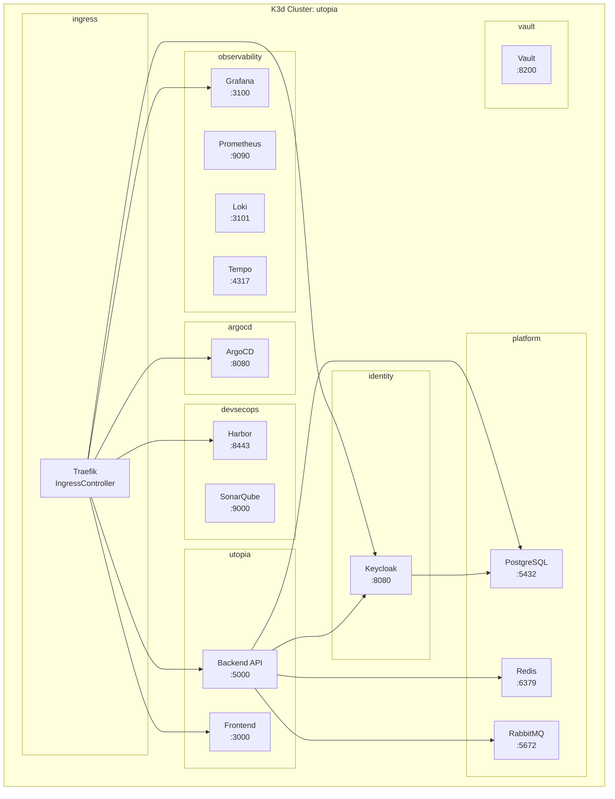

# Kubernetes Architecture

| Field         | Value                                |
|---------------|--------------------------------------|
| **Version**   | 1.0.0                                |
| **Status**    | Draft                                |
| **Author**    | Vox                                  |
| **Reviewer**  | Vox                                  |
| **Created**   | 2026-03-27                           |
| **Updated**   | 2026-03-27                           |
| **Standard**  | CNCF Best Practices; ISO/IEC 27001:2022 |

---

## 1. Purpose

This document describes the Kubernetes architecture for the Utopia project, including cluster topology, namespace design, resource allocation, and operational configuration using K3d (K3s in Docker).

## 2. Cluster Topology

### 2.1. Technology Choice

K3d (K3s in Docker) is the local Kubernetes distribution for Utopia. See [ADR-0006](../03-adr/ADR-0006-k3s-local-kubernetes.md) for the decision rationale.

| Aspect | Value |
|--------|-------|
| **Distribution** | K3s v1.29+ via K3d |
| **Startup time** | ~20 seconds |
| **Memory per node** | ~500 MB |
| **Ingress controller** | Traefik (bundled) |
| **Container runtime** | containerd |
| **Storage** | Local-path provisioner (default) |

### 2.2. Cluster Configuration

```yaml
# k3d-config.yaml
apiVersion: k3d.io/v1alpha5
kind: Simple
metadata:
  name: utopia
servers: 1
agents: 2
image: rancher/k3s:v1.29.2-k3s1
ports:
  - port: 443:443
    nodeFilters:
      - loadbalancer
  - port: 80:80
    nodeFilters:
      - loadbalancer
registries:
  create:
    name: utopia-registry.localhost
    host: "0.0.0.0"
    hostPort: "5500"
options:
  k3d:
    wait: true
    timeout: "120s"
  k3s:
    extraArgs:
      - arg: "--disable=traefik"
        nodeFilters:
          - server:*
  kubeconfig:
    updateDefaultKubeconfig: true
    switchCurrentContext: true
volumes:
  - volume: utopia-storage:/var/lib/rancher/k3s/storage
    nodeFilters:
      - all
```

### 2.3. Node Layout



## 3. Namespace Design

### 3.1. Namespace Overview

| Namespace | Purpose | Components |
|-----------|---------|------------|
| `utopia` | Application workloads | Backend API, Frontend, Catalog module |
| `identity` | Identity & authentication | Keycloak |
| `platform` | Platform services | PostgreSQL, Redis, RabbitMQ |
| `observability` | Monitoring & logging | Prometheus, Grafana, Loki, Tempo |
| `devsecops` | Security scanning tools | SonarQube, Harbor |
| `ingress` | Ingress controller | Traefik / Nginx |
| `argocd` | GitOps deployment | ArgoCD |
| `vault` | Secret management | HashiCorp Vault |
| `cert-manager` | Certificate management | cert-manager |

### 3.2. Namespace Diagram



## 4. Resource Allocation

### 4.1. Resource Requests and Limits

| Component | Namespace | CPU Request | CPU Limit | Memory Request | Memory Limit |
|-----------|-----------|-------------|-----------|----------------|--------------|
| Backend API | `utopia` | 100m | 500m | 256Mi | 512Mi |
| Frontend | `utopia` | 50m | 200m | 128Mi | 256Mi |
| Keycloak | `identity` | 200m | 1000m | 512Mi | 1Gi |
| PostgreSQL | `platform` | 200m | 1000m | 512Mi | 2Gi |
| Redis | `platform` | 50m | 200m | 64Mi | 256Mi |
| RabbitMQ | `platform` | 100m | 500m | 256Mi | 512Mi |
| Prometheus | `observability` | 100m | 500m | 256Mi | 1Gi |
| Grafana | `observability` | 50m | 200m | 128Mi | 256Mi |
| Loki | `observability` | 100m | 500m | 256Mi | 512Mi |
| Tempo | `observability` | 50m | 200m | 128Mi | 256Mi |
| SonarQube | `devsecops` | 200m | 1000m | 1Gi | 2Gi |
| Harbor | `devsecops` | 100m | 500m | 256Mi | 1Gi |
| ArgoCD | `argocd` | 100m | 500m | 256Mi | 512Mi |
| Vault | `vault` | 50m | 200m | 128Mi | 256Mi |
| Traefik | `ingress` | 50m | 200m | 64Mi | 128Mi |
| cert-manager | `cert-manager` | 50m | 200m | 64Mi | 128Mi |
| **Total** | | **1550m** | **7300m** | **3.9Gi** | **10.5Gi** |

> **Hardware**: 40 GB RAM, multi-core i9. Cluster uses ~10.5 Gi max limits, leaving ~29 GB for host OS and Docker overhead.

### 4.2. Resource Policies

- All Pods MUST have resource requests and limits defined
- Resource requests SHOULD be set to typical steady-state usage
- Resource limits SHOULD be set to maximum acceptable burst
- OPA Gatekeeper policy enforces presence of resource definitions
- LimitRange applied per namespace as safety net

### 4.3. LimitRange Example

```yaml
apiVersion: v1
kind: LimitRange
metadata:
  name: default-limits
  namespace: utopia
spec:
  limits:
    - default:
        cpu: "500m"
        memory: "512Mi"
      defaultRequest:
        cpu: "100m"
        memory: "128Mi"
      type: Container
```

## 5. Pod Security

### 5.1. Pod Security Standards

Utopia enforces **Restricted** Pod Security Standards:

| Profile | Namespaces | Enforcement |
|---------|-----------|-------------|
| **Restricted** | `utopia`, `identity`, `ingress` | `enforce` |
| **Baseline** | `platform`, `observability`, `devsecops` | `enforce` |
| **Privileged** | None | Not used |

```yaml
# Namespace label for PSS enforcement
apiVersion: v1
kind: Namespace
metadata:
  name: utopia
  labels:
    pod-security.kubernetes.io/enforce: restricted
    pod-security.kubernetes.io/audit: restricted
    pod-security.kubernetes.io/warn: restricted
```

### 5.2. Security Context Template

All application Pods MUST include:

```yaml
securityContext:
  runAsNonRoot: true
  runAsUser: 1001
  runAsGroup: 1001
  fsGroup: 1001
  seccompProfile:
    type: RuntimeDefault
containers:
  - name: app
    securityContext:
      allowPrivilegeEscalation: false
      readOnlyRootFilesystem: true
      capabilities:
        drop:
          - ALL
```

## 6. Service Accounts

### 6.1. Service Account Configuration

| Service Account | Namespace | Permissions | automountServiceAccountToken |
|----------------|-----------|-------------|------------------------------|
| `utopia-api` | `utopia` | Read own ConfigMap/Secrets | `true` (for Vault injection) |
| `utopia-frontend` | `utopia` | None | `false` |
| `keycloak` | `identity` | Read own Secrets | `true` |
| `default` | All | None | `false` |

**Rules**:

- `automountServiceAccountToken: false` on all `default` ServiceAccounts
- Dedicated ServiceAccount per application
- RBAC bindings scoped to namespace

### 6.2. RBAC Example

```yaml
apiVersion: rbac.authorization.k8s.io/v1
kind: Role
metadata:
  name: utopia-api-role
  namespace: utopia
rules:
  - apiGroups: [""]
    resources: ["configmaps"]
    resourceNames: ["utopia-api-config"]
    verbs: ["get", "watch"]
  - apiGroups: [""]
    resources: ["secrets"]
    resourceNames: ["utopia-api-secrets"]
    verbs: ["get"]
---
apiVersion: rbac.authorization.k8s.io/v1
kind: RoleBinding
metadata:
  name: utopia-api-binding
  namespace: utopia
subjects:
  - kind: ServiceAccount
    name: utopia-api
    namespace: utopia
roleRef:
  kind: Role
  name: utopia-api-role
  apiGroup: rbac.authorization.k8s.io
```

## 7. Health Checks

### 7.1. Probe Configuration

All application Pods MUST implement:

| Probe | Purpose | Configuration |
|-------|---------|---------------|
| **Readiness** | Traffic routing | HTTP GET `/health/ready`, period 10s, threshold 3 |
| **Liveness** | Auto-restart | HTTP GET `/health/live`, period 15s, threshold 3 |
| **Startup** | Slow-start protection | HTTP GET `/health/live`, period 5s, failureThreshold 30 |

### 7.2. Probe Template

```yaml
readinessProbe:
  httpGet:
    path: /health/ready
    port: 8080
  initialDelaySeconds: 5
  periodSeconds: 10
  failureThreshold: 3
livenessProbe:
  httpGet:
    path: /health/live
    port: 8080
  initialDelaySeconds: 15
  periodSeconds: 15
  failureThreshold: 3
startupProbe:
  httpGet:
    path: /health/live
    port: 8080
  periodSeconds: 5
  failureThreshold: 30
```

## 8. ConfigMap & Secret Management

### 8.1. Configuration Strategy

| Type | Storage | Source |
|------|---------|--------|
| **Application config** | ConfigMap | Git (ArgoCD managed) |
| **Feature flags** | ConfigMap | Git (ArgoCD managed) |
| **Sensitive config** | K8s Secret | Vault (External Secrets Operator) |
| **TLS certificates** | K8s Secret | cert-manager |

### 8.2. External Secrets Operator

```yaml
apiVersion: external-secrets.io/v1beta1
kind: ExternalSecret
metadata:
  name: utopia-api-secrets
  namespace: utopia
spec:
  refreshInterval: 1h
  secretStoreRef:
    name: vault-backend
    kind: ClusterSecretStore
  target:
    name: utopia-api-secrets
    creationPolicy: Owner
  data:
    - secretKey: ConnectionStrings__DefaultConnection
      remoteRef:
        key: kv/utopia/api
        property: db_connection_string
    - secretKey: Redis__ConnectionString
      remoteRef:
        key: kv/utopia/api
        property: redis_connection_string
```

## 9. Horizontal Pod Autoscaler

### 9.1. HPA Configuration

| Component | Min | Max | Target CPU | Target Memory |
|-----------|-----|-----|------------|---------------|
| Backend API | 1 | 3 | 70% | 80% |
| Frontend | 1 | 2 | 70% | — |
| Keycloak | 1 | 2 | 80% | — |

```yaml
apiVersion: autoscaling/v2
kind: HorizontalPodAutoscaler
metadata:
  name: utopia-api-hpa
  namespace: utopia
spec:
  scaleTargetRef:
    apiVersion: apps/v1
    kind: Deployment
    name: utopia-api
  minReplicas: 1
  maxReplicas: 3
  metrics:
    - type: Resource
      resource:
        name: cpu
        target:
          type: Utilization
          averageUtilization: 70
    - type: Resource
      resource:
        name: memory
        target:
          type: Utilization
          averageUtilization: 80
```

## 10. Deployment Strategy

| Component | Strategy | Configuration |
|-----------|----------|---------------|
| Backend API | RollingUpdate | maxSurge: 1, maxUnavailable: 0 |
| Frontend | RollingUpdate | maxSurge: 1, maxUnavailable: 0 |
| Keycloak | RollingUpdate | maxSurge: 0, maxUnavailable: 1 |
| PostgreSQL | Recreate | N/A (StatefulSet) |
| Redis | Recreate | N/A (StatefulSet) |

## 11. Helm Chart Structure

All Kubernetes resources are managed via Helm charts:

```
infrastructure/helm/
├── charts/
│   ├── utopia-api/
│   │   ├── Chart.yaml
│   │   ├── values.yaml
│   │   ├── values-dev.yaml
│   │   ├── values-staging.yaml
│   │   └── templates/
│   │       ├── deployment.yaml
│   │       ├── service.yaml
│   │       ├── ingress.yaml
│   │       ├── configmap.yaml
│   │       ├── external-secret.yaml
│   │       ├── hpa.yaml
│   │       ├── serviceaccount.yaml
│   │       └── networkpolicy.yaml
│   ├── utopia-frontend/
│   ├── keycloak/
│   ├── platform/
│   └── observability/
└── environments/
    ├── dev/
    │   └── values.yaml
    └── staging/
        └── values.yaml
```

## 12. Cluster Operations

### 12.1. Cluster Lifecycle Commands

| Action | Command |
|--------|---------|
| Create cluster | `k3d cluster create --config k3d-config.yaml` |
| Delete cluster | `k3d cluster delete utopia` |
| Stop cluster | `k3d cluster stop utopia` |
| Start cluster | `k3d cluster start utopia` |
| List clusters | `k3d cluster list` |
| Import image | `k3d image import <image> -c utopia` |

### 12.2. Namespace Setup Script

```bash
#!/bin/bash
# Create all namespaces with labels
NAMESPACES=("utopia" "identity" "platform" "observability" "devsecops" "ingress" "argocd" "vault" "cert-manager")

for NS in "${NAMESPACES[@]}"; do
  kubectl create namespace "$NS" --dry-run=client -o yaml | kubectl apply -f -
done

# Apply PSS labels
kubectl label namespace utopia pod-security.kubernetes.io/enforce=restricted --overwrite
kubectl label namespace identity pod-security.kubernetes.io/enforce=restricted --overwrite
kubectl label namespace platform pod-security.kubernetes.io/enforce=baseline --overwrite
kubectl label namespace observability pod-security.kubernetes.io/enforce=baseline --overwrite
```

## 13. References

- [K3d Documentation](https://k3d.io/)
- [K3s Documentation](https://docs.k3s.io/)
- [Kubernetes Pod Security Standards](https://kubernetes.io/docs/concepts/security/pod-security-standards/)
- [ADR-0006-k3s-local-kubernetes.md](../03-adr/ADR-0006-k3s-local-kubernetes.md)
- [C4-CONTAINER.md](../02-architecture/C4-CONTAINER.md)
- [ACCESS-CONTROL-POLICY.md](../04-security/ACCESS-CONTROL-POLICY.md)
- [NETWORKING.md](./NETWORKING.md)

## Changelog

| Version | Date       | Author | Description          |
|---------|------------|--------|----------------------|
| 1.0.0   | 2026-03-27 | Vox    | Initial draft        |
