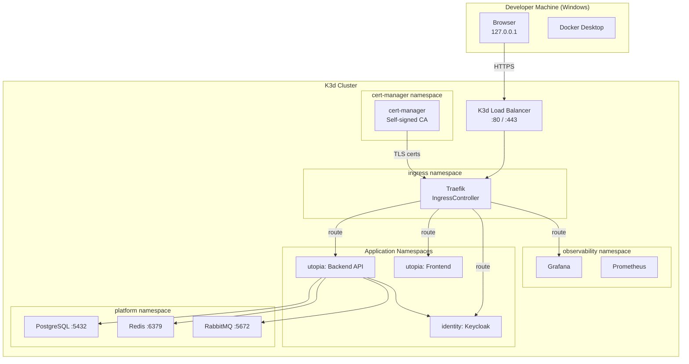
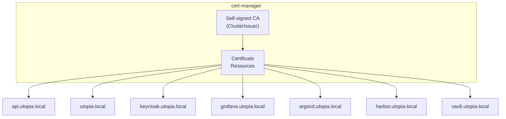

# Networking

| Field         | Value                                |
|---------------|--------------------------------------|
| **Version**   | 1.0.0                                |
| **Status**    | Draft                                |
| **Author**    | Vox                                  |
| **Reviewer**  | Vox                                  |
| **Created**   | 2026-03-27                           |
| **Updated**   | 2026-03-27                           |
| **Standard**  | Kubernetes Networking Model; ISO/IEC 27001:2022 |

---

## 1. Purpose

This document defines the networking architecture for the Utopia project, including ingress routing, DNS resolution, service discovery, network policies, and TLS termination within the K3d/K3s cluster.

## 2. Network Topology



## 3. DNS Configuration

### 3.1. Local DNS Entries

All services are accessed via `*.utopia.local` hostnames. Add to Windows `hosts` file:

```
# C:\Windows\System32\drivers\etc\hosts
127.0.0.1  utopia.local
127.0.0.1  api.utopia.local
127.0.0.1  keycloak.utopia.local
127.0.0.1  grafana.utopia.local
127.0.0.1  argocd.utopia.local
127.0.0.1  harbor.utopia.local
127.0.0.1  rabbitmq.utopia.local
127.0.0.1  sonarqube.utopia.local
127.0.0.1  vault.utopia.local
127.0.0.1  mailpit.utopia.local
```

### 3.2. Hostname Mapping

| Hostname | Target Service | Namespace | Port |
|----------|---------------|-----------|------|
| `utopia.local` | Frontend (Next.js) | `utopia` | 3000 |
| `api.utopia.local` | Backend API (.NET) | `utopia` | 8080 |
| `keycloak.utopia.local` | Keycloak | `identity` | 8080 |
| `grafana.utopia.local` | Grafana | `observability` | 3000 |
| `argocd.utopia.local` | ArgoCD | `argocd` | 8080 |
| `harbor.utopia.local` | Harbor | `devsecops` | 8443 |
| `rabbitmq.utopia.local` | RabbitMQ Management | `platform` | 15672 |
| `sonarqube.utopia.local` | SonarQube | `devsecops` | 9000 |
| `vault.utopia.local` | HashiCorp Vault | `vault` | 8200 |
| `mailpit.utopia.local` | Mailpit (dev email) | `platform` | 8025 |

## 4. Ingress Configuration

### 4.1. Ingress Controller

| Aspect | Configuration |
|--------|--------------|
| **Controller** | Traefik v3 (K3s bundled) or Nginx Ingress (alternative) |
| **TLS Termination** | At ingress controller |
| **HTTP → HTTPS** | Redirect enabled |
| **Rate Limiting** | Middleware applied per route |
| **CORS** | Configured per service |

### 4.2. Ingress Resource Template

```yaml
apiVersion: networking.k8s.io/v1
kind: Ingress
metadata:
  name: utopia-api
  namespace: utopia
  annotations:
    cert-manager.io/cluster-issuer: utopia-ca-issuer
    traefik.ingress.kubernetes.io/router.tls: "true"
    traefik.ingress.kubernetes.io/router.middlewares: ingress-rate-limit@kubernetescrd
spec:
  tls:
    - hosts:
        - api.utopia.local
      secretName: api-utopia-tls
  rules:
    - host: api.utopia.local
      http:
        paths:
          - path: /
            pathType: Prefix
            backend:
              service:
                name: utopia-api
                port:
                  number: 8080
```

### 4.3. Traefik Middleware

```yaml
# Rate limiting middleware
apiVersion: traefik.io/v1alpha1
kind: Middleware
metadata:
  name: rate-limit
  namespace: ingress
spec:
  rateLimit:
    average: 100
    burst: 50
    period: 1m

# Security headers middleware
apiVersion: traefik.io/v1alpha1
kind: Middleware
metadata:
  name: security-headers
  namespace: ingress
spec:
  headers:
    customResponseHeaders:
      X-Content-Type-Options: nosniff
      X-Frame-Options: DENY
      Referrer-Policy: strict-origin-when-cross-origin
      Permissions-Policy: "camera=(), microphone=(), geolocation=()"
    stsSeconds: 31536000
    stsIncludeSubdomains: true
    stsPreload: true
    contentSecurityPolicy: "default-src 'self'; script-src 'self'; style-src 'self' 'unsafe-inline'"
```

## 5. Service Discovery

### 5.1. Kubernetes DNS

Services communicate within the cluster via Kubernetes DNS (CoreDNS):

| Pattern | Example | Usage |
|---------|---------|-------|
| `<service>.<namespace>.svc.cluster.local` | `postgres.platform.svc.cluster.local` | Full FQDN |
| `<service>.<namespace>` | `postgres.platform` | Short form (within cluster) |
| `<service>` | `utopia-api` | Same namespace only |

### 5.2. Service-to-Service Communication

| Source | Destination | Protocol | DNS Name |
|--------|-------------|----------|----------|
| Backend API | PostgreSQL | TCP/TLS :5432 | `postgres.platform` |
| Backend API | Redis | TCP/TLS :6379 | `redis.platform` |
| Backend API | RabbitMQ | AMQPS :5672 | `rabbitmq.platform` |
| Backend API | Keycloak | HTTPS :8080 | `keycloak.identity` |
| Frontend (SSR) | Backend API | HTTPS :8080 | `utopia-api.utopia` |
| Keycloak | PostgreSQL | TCP/TLS :5432 | `postgres.platform` |
| Prometheus | All services | HTTP (metrics) | Per-service endpoints |

### 5.3. Kubernetes Service Template

```yaml
apiVersion: v1
kind: Service
metadata:
  name: utopia-api
  namespace: utopia
  labels:
    app.kubernetes.io/name: backend-api
    app.kubernetes.io/part-of: utopia
spec:
  type: ClusterIP
  selector:
    app.kubernetes.io/name: backend-api
  ports:
    - name: http
      port: 8080
      targetPort: 8080
      protocol: TCP
    - name: metrics
      port: 9090
      targetPort: 9090
      protocol: TCP
```

## 6. Network Policies

### 6.1. Default Deny Policy

Every namespace MUST have a default-deny ingress policy:

```yaml
apiVersion: networking.k8s.io/v1
kind: NetworkPolicy
metadata:
  name: default-deny-ingress
  namespace: utopia
spec:
  podSelector: {}
  policyTypes:
    - Ingress
```

### 6.2. Application Network Policies

```yaml
# Allow ingress to Backend API from Traefik only
apiVersion: networking.k8s.io/v1
kind: NetworkPolicy
metadata:
  name: allow-api-ingress
  namespace: utopia
spec:
  podSelector:
    matchLabels:
      app.kubernetes.io/name: backend-api
  policyTypes:
    - Ingress
  ingress:
    - from:
        - namespaceSelector:
            matchLabels:
              kubernetes.io/metadata.name: ingress
          podSelector:
            matchLabels:
              app.kubernetes.io/name: traefik
      ports:
        - port: 8080
          protocol: TCP
    - from:
        - namespaceSelector:
            matchLabels:
              kubernetes.io/metadata.name: observability
          podSelector:
            matchLabels:
              app.kubernetes.io/name: prometheus
      ports:
        - port: 9090
          protocol: TCP
```

### 6.3. Network Policy Matrix

| Source Namespace | Destination Namespace | Allowed | Ports |
|-----------------|----------------------|---------|-------|
| `ingress` | `utopia` | ✅ | 8080, 3000 |
| `ingress` | `identity` | ✅ | 8080 |
| `ingress` | `observability` | ✅ | 3000 (Grafana) |
| `ingress` | `argocd` | ✅ | 8080 |
| `ingress` | `devsecops` | ✅ | 8443, 9000 |
| `ingress` | `vault` | ✅ | 8200 |
| `utopia` | `platform` | ✅ | 5432, 6379, 5672 |
| `utopia` | `identity` | ✅ | 8080 |
| `identity` | `platform` | ✅ | 5432 |
| `observability` | All | ✅ | 9090 (metrics) |
| `argocd` | All | ✅ | Various (deploy) |
| All others | → | ❌ | Default deny |

## 7. TLS Configuration

### 7.1. Certificate Architecture



### 7.2. ClusterIssuer Configuration

```yaml
# Self-signed CA for local development
apiVersion: cert-manager.io/v1
kind: ClusterIssuer
metadata:
  name: utopia-ca-issuer
spec:
  selfSigned: {}
---
apiVersion: cert-manager.io/v1
kind: Certificate
metadata:
  name: utopia-ca
  namespace: cert-manager
spec:
  isCA: true
  commonName: utopia-ca
  secretName: utopia-ca-secret
  duration: 87600h  # 10 years
  issuerRef:
    name: utopia-ca-issuer
    kind: ClusterIssuer
---
apiVersion: cert-manager.io/v1
kind: ClusterIssuer
metadata:
  name: utopia-ca
spec:
  ca:
    secretName: utopia-ca-secret
```

### 7.3. TLS Requirements

- All ingress MUST terminate TLS at the ingress controller
- Internal service communication SHOULD use TLS where supported
- Database connections MUST use TLS (`sslmode=verify-full`)
- Certificates auto-renewed by cert-manager (90-day default)
- CA certificate MUST be trusted by pods (mounted as ConfigMap)

## 8. Port Allocation

### 8.1. External Ports (Host-accessible)

| Port | Protocol | Service |
|------|----------|---------|
| 80 | HTTP | Ingress (redirect to HTTPS) |
| 443 | HTTPS | Ingress (TLS termination) |
| 5500 | HTTPS | K3d embedded registry |

### 8.2. Internal Ports (Cluster-only)

| Port | Protocol | Service | Namespace |
|------|----------|---------|-----------|
| 3000 | HTTP | Frontend | `utopia` |
| 5432 | TCP | PostgreSQL | `platform` |
| 5672 | TCP | RabbitMQ (AMQP) | `platform` |
| 6379 | TCP | Redis | `platform` |
| 8080 | HTTP | Backend API / Keycloak / ArgoCD | Various |
| 8200 | HTTP | Vault | `vault` |
| 8443 | HTTPS | Harbor | `devsecops` |
| 9000 | HTTP | SonarQube | `devsecops` |
| 9090 | HTTP | Prometheus / Metrics endpoints | `observability` |
| 3100 | HTTP | Loki | `observability` |
| 4317 | gRPC | Tempo (OTLP) | `observability` |
| 15672 | HTTP | RabbitMQ Management | `platform` |

## 9. CORS Configuration

### 9.1. Backend API CORS

| Setting | Value |
|---------|-------|
| **Allowed Origins** | `https://utopia.local` |
| **Allowed Methods** | `GET, POST, PUT, PATCH, DELETE, OPTIONS` |
| **Allowed Headers** | `Authorization, Content-Type, X-Correlation-Id` |
| **Exposed Headers** | `X-Correlation-Id, X-Pagination` |
| **Allow Credentials** | `true` |
| **Max Age** | `3600` (1 hour) |

### 9.2. Keycloak CORS

| Setting | Value |
|---------|-------|
| **Web Origins** | `https://utopia.local`, `https://api.utopia.local` |

## 10. References

- [Kubernetes Networking Model](https://kubernetes.io/docs/concepts/services-networking/)
- [Traefik Documentation](https://doc.traefik.io/traefik/)
- [cert-manager Documentation](https://cert-manager.io/docs/)
- [KUBERNETES-ARCHITECTURE.md](./KUBERNETES-ARCHITECTURE.md)
- [SECURITY-STANDARD.md](../00-standards/SECURITY-STANDARD.md)
- [CRYPTOGRAPHY-POLICY.md](../04-security/CRYPTOGRAPHY-POLICY.md)
- [C4-CONTAINER.md](../02-architecture/C4-CONTAINER.md)

## Changelog

| Version | Date       | Author | Description          |
|---------|------------|--------|----------------------|
| 1.0.0   | 2026-03-27 | Vox    | Initial draft        |
