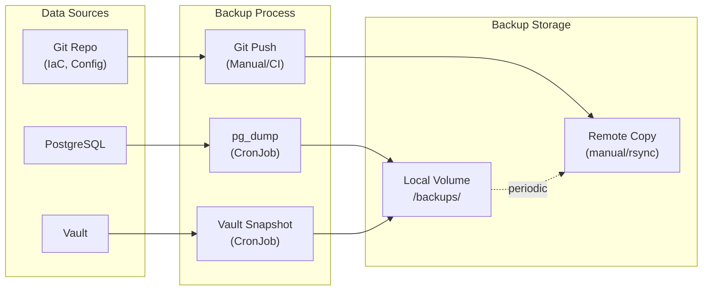

# Storage & Backup

| Field         | Value                                |
|---------------|--------------------------------------|
| **Version**   | 1.0.0                                |
| **Status**    | Draft                                |
| **Author**    | Vox                                  |
| **Reviewer**  | Vox                                  |
| **Created**   | 2026-03-27                           |
| **Updated**   | 2026-03-27                           |
| **Standard**  | ISO/IEC 27001:2022 Annex A.8.13–A.8.14 |

---

## 1. Purpose

This document defines the storage architecture, persistent volume strategy, backup procedures, and disaster recovery plan for the Utopia project's stateful services.

## 2. Stateful Services Inventory

| Service | Data Type | Storage Mechanism | Persistence Required |
|---------|-----------|-------------------|---------------------|
| **PostgreSQL** | Relational data (users, products) | PV (hostPath on K3d) | Critical |
| **Redis** | Cache, sessions | PV (optional) | Non-critical (ephemeral OK) |
| **RabbitMQ** | Message queues | PV (hostPath on K3d) | Important |
| **Keycloak** | Identity config (in PostgreSQL) | Via PostgreSQL | Critical |
| **Vault** | Secrets, encryption keys | PV (hostPath on K3d) | Critical |
| **Harbor** | Container images, scan results | PV (hostPath on K3d) | Important |
| **Prometheus** | Time-series metrics | PV (hostPath on K3d) | Important |
| **Loki** | Log data | PV (hostPath on K3d) | Important |
| **Grafana** | Dashboards, alerts (as code) | ConfigMap / Git | Non-critical |
| **SonarQube** | Analysis results (in PostgreSQL) | Via PostgreSQL | Non-critical |

## 3. Kubernetes Storage

### 3.1. Storage Provisioner

K3d/K3s includes the **local-path-provisioner** by default:

| Aspect | Configuration |
|--------|---------------|
| **Provisioner** | `rancher.io/local-path` |
| **StorageClass** | `local-path` (default) |
| **Reclaim Policy** | `Delete` |
| **Volume Binding** | `WaitForFirstConsumer` |
| **Host Path** | `/var/lib/rancher/k3s/storage/` |

### 3.2. StorageClass

```yaml
apiVersion: storage.k8s.io/v1
kind: StorageClass
metadata:
  name: local-path
  annotations:
    storageclass.kubernetes.io/is-default-class: "true"
provisioner: rancher.io/local-path
reclaimPolicy: Delete
volumeBindingMode: WaitForFirstConsumer
```

### 3.3. Persistent Volume Claims

| Service | PVC Name | Size | Access Mode | StorageClass |
|---------|----------|------|-------------|--------------|
| PostgreSQL | `postgres-data` | 10Gi | ReadWriteOnce | `local-path` |
| Redis | `redis-data` | 1Gi | ReadWriteOnce | `local-path` |
| RabbitMQ | `rabbitmq-data` | 2Gi | ReadWriteOnce | `local-path` |
| Vault | `vault-data` | 1Gi | ReadWriteOnce | `local-path` |
| Harbor | `harbor-data` | 20Gi | ReadWriteOnce | `local-path` |
| Prometheus | `prometheus-data` | 10Gi | ReadWriteOnce | `local-path` |
| Loki | `loki-data` | 10Gi | ReadWriteOnce | `local-path` |
| SonarQube | `sonarqube-data` | 5Gi | ReadWriteOnce | `local-path` |
| **Total** | | **59Gi** | | |

### 3.4. PVC Template (StatefulSet)

```yaml
apiVersion: apps/v1
kind: StatefulSet
metadata:
  name: postgres
  namespace: platform
spec:
  serviceName: postgres
  replicas: 1
  selector:
    matchLabels:
      app.kubernetes.io/name: postgres
  template:
    metadata:
      labels:
        app.kubernetes.io/name: postgres
    spec:
      containers:
        - name: postgres
          image: postgres:16-alpine
          volumeMounts:
            - name: postgres-data
              mountPath: /var/lib/postgresql/data
              subPath: pgdata
  volumeClaimTemplates:
    - metadata:
        name: postgres-data
      spec:
        accessModes: ["ReadWriteOnce"]
        storageClassName: local-path
        resources:
          requests:
            storage: 10Gi
```

## 4. Backup Strategy

### 4.1. Backup Overview



### 4.2. Backup Schedule

| Data Source | Method | Schedule | Retention | RPO | RTO |
|-------------|--------|----------|-----------|-----|-----|
| **PostgreSQL** | `pg_dump` (CronJob) | Every 6 hours | 7 days | 6 hours | 1 hour |
| **PostgreSQL (WAL)** | WAL archiving | Continuous | 3 days | Minutes | 30 min |
| **Vault** | Raft snapshot | Daily | 7 days | 24 hours | 1 hour |
| **IaC / Config** | Git repository | On every commit | Unlimited | 0 (Git) | Minutes |
| **Grafana dashboards** | Git (dashboards-as-code) | On change | Unlimited | 0 (Git) | Minutes |
| **Helm values** | Git repository | On every commit | Unlimited | 0 (Git) | Minutes |
| **Harbor images** | Rebuild from source | N/A (reproducible) | N/A | N/A | Build time |
| **Prometheus data** | No backup (recreatable) | N/A | N/A | N/A | N/A |
| **Loki data** | No backup (ephemeral) | N/A | N/A | N/A | N/A |

### 4.3. PostgreSQL Backup CronJob

```yaml
apiVersion: batch/v1
kind: CronJob
metadata:
  name: postgres-backup
  namespace: platform
spec:
  schedule: "0 */6 * * *"  # Every 6 hours
  concurrencyPolicy: Forbid
  successfulJobsHistoryLimit: 3
  failedJobsHistoryLimit: 3
  jobTemplate:
    spec:
      template:
        spec:
          securityContext:
            runAsUser: 1001
            runAsGroup: 1001
          containers:
            - name: backup
              image: postgres:16-alpine
              command:
                - /bin/sh
                - -c
                - |
                  TIMESTAMP=$(date +%Y%m%d_%H%M%S)
                  BACKUP_FILE="/backups/utopia_${TIMESTAMP}.sql.gz"
                  
                  pg_dump -h postgres.platform -U utopia -d utopia \
                    --format=custom \
                    --compress=9 \
                    --file="${BACKUP_FILE}"
                  
                  # Verify backup
                  pg_restore --list "${BACKUP_FILE}" > /dev/null 2>&1
                  if [ $? -eq 0 ]; then
                    echo "Backup verified: ${BACKUP_FILE}"
                  else
                    echo "Backup verification FAILED: ${BACKUP_FILE}"
                    exit 1
                  fi
                  
                  # Cleanup old backups (keep 7 days)
                  find /backups -name "utopia_*.sql.gz" -mtime +7 -delete
                  
                  echo "Backup complete. Current backups:"
                  ls -lh /backups/utopia_*.sql.gz
              env:
                - name: PGPASSWORD
                  valueFrom:
                    secretKeyRef:
                      name: postgres-credentials
                      key: password
              volumeMounts:
                - name: backup-volume
                  mountPath: /backups
          volumes:
            - name: backup-volume
              persistentVolumeClaim:
                claimName: postgres-backups
          restartPolicy: OnFailure
```

### 4.4. Backup Monitoring

| Check | Alert Condition | Severity |
|-------|----------------|----------|
| Backup CronJob failure | Job status = Failed | High |
| Backup age | Last successful backup > 12 hours | High |
| Backup size anomaly | Size < 50% of previous backup | Medium |
| Backup storage usage | Volume > 80% full | Medium |

## 5. Restore Procedures

### 5.1. PostgreSQL Restore

```bash
# 1. Identify the backup to restore
ls -lt /backups/utopia_*.sql.gz

# 2. Stop application pods
kubectl scale deployment utopia-api -n utopia --replicas=0

# 3. Restore the database
pg_restore -h postgres.platform -U utopia_migration -d utopia \
  --clean --if-exists \
  /backups/utopia_20260327_060000.sql.gz

# 4. Verify data integrity
psql -h postgres.platform -U utopia -d utopia -c "SELECT count(*) FROM identity.users;"

# 5. Restart application pods
kubectl scale deployment utopia-api -n utopia --replicas=1

# 6. Verify application health
kubectl get pods -n utopia
curl -k https://api.utopia.local/health/ready
```

### 5.2. Vault Restore

```bash
# 1. Stop Vault
kubectl scale statefulset vault -n vault --replicas=0

# 2. Restore from snapshot
vault operator raft snapshot restore /backups/vault_snapshot_latest.snap

# 3. Start Vault
kubectl scale statefulset vault -n vault --replicas=1

# 4. Unseal Vault (if auto-unseal is not configured)
vault operator unseal <key>

# 5. Verify
vault status
vault kv list kv/utopia/
```

### 5.3. Full Cluster Recovery

If the K3d cluster is destroyed, recovery follows this order:

| Step | Action | Source |
|------|--------|--------|
| 1 | Create K3d cluster | `k3d-config.yaml` (Git) |
| 2 | Apply Terraform base | `terraform apply` (Git) |
| 3 | Deploy ArgoCD | Helm chart (Git) |
| 4 | ArgoCD syncs all apps | Git manifests |
| 5 | Restore PostgreSQL backup | Backup volume |
| 6 | Restore Vault snapshot | Backup volume |
| 7 | Verify all services | Health checks |

> **Note**: Recovery is simplified by GitOps — all Kubernetes resources are declaratively defined in Git. Only stateful data (PostgreSQL, Vault) requires backup restoration.

## 6. Data Retention

### 6.1. Retention Policy

| Data Type | Retention Period | Justification |
|-----------|-----------------|---------------|
| Application database | Indefinite (lifetime of project) | Core data |
| Database backups | 7 days rolling | Balance storage vs. recovery window |
| Vault snapshots | 7 days rolling | Secret recovery |
| Application logs (Loki) | 30 days | Troubleshooting window |
| Metrics (Prometheus) | 15 days | Performance analysis |
| Traces (Tempo) | 7 days | Request debugging |
| Container images (Harbor) | Last 10 tags per repo | GC policy |
| CI/CD artifacts | 30 days | Debug pipeline issues |
| Audit logs | 90 days | Compliance requirement |

### 6.2. Prometheus Retention

```yaml
# Prometheus configuration
prometheus:
  prometheusSpec:
    retention: 15d
    retentionSize: 8GB
    storageSpec:
      volumeClaimTemplate:
        spec:
          storageClassName: local-path
          resources:
            requests:
              storage: 10Gi
```

### 6.3. Loki Retention

```yaml
# Loki configuration
loki:
  limits_config:
    retention_period: 720h  # 30 days
  compactor:
    retention_enabled: true
    retention_delete_delay: 2h
```

## 7. Storage Monitoring

| Metric | Source | Alert Threshold |
|--------|--------|-----------------|
| PVC usage % | kubelet metrics | > 80% |
| PostgreSQL database size | `pg_database_size()` | > 8 GB (of 10 GB PVC) |
| Backup volume usage | Node exporter | > 80% |
| Inode usage | Node exporter | > 80% |

## 8. References

- [ISO/IEC 27001:2022](https://www.iso.org/standard/27001) — Annex A.8.13 (Backup), A.8.14 (Redundancy)
- [K3s Storage Documentation](https://docs.k3s.io/storage)
- [DATA-ARCHITECTURE.md](../02-architecture/DATA-ARCHITECTURE.md)
- [KUBERNETES-ARCHITECTURE.md](./KUBERNETES-ARCHITECTURE.md)
- [INCIDENT-RESPONSE-PLAN.md](../04-security/INCIDENT-RESPONSE-PLAN.md)
- [RUNBOOK-DATABASE-FAILOVER.md](../06-devops/runbooks/RUNBOOK-DATABASE-FAILOVER.md)

## Changelog

| Version | Date       | Author | Description          |
|---------|------------|--------|----------------------|
| 1.0.0   | 2026-03-27 | Vox    | Initial draft        |
