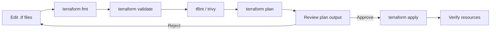

# Terraform Structure

| Field         | Value                                |
|---------------|--------------------------------------|
| **Version**   | 1.0.0                                |
| **Status**    | Draft                                |
| **Author**    | Vox                                  |
| **Reviewer**  | Vox                                  |
| **Created**   | 2026-03-27                           |
| **Updated**   | 2026-03-27                           |
| **Standard**  | HashiCorp Recommended Practices; ISO/IEC 27001:2022 |

---

## 1. Purpose

This document defines the Terraform/OpenTofu project structure, module design, state management, and operational workflows for provisioning and managing the Utopia infrastructure. See [ADR-0007](../03-adr/ADR-0007-terraform-iac.md) for the decision rationale.

## 2. Tool Selection

| Tool | Version | Purpose |
|------|---------|---------|
| **Terraform** | ≥ 1.7 | Primary IaC tool |
| **OpenTofu** | ≥ 1.7 | Open-source alternative (MPL-2.0) |
| **tflint** | Latest | Terraform linter |
| **terraform-docs** | Latest | Auto-generate module documentation |
| **tfsec / Trivy** | Latest | Security scanning for Terraform |
| **Checkov** | Latest | Policy-as-code scanning |

> **Note**: Terraform and OpenTofu are interchangeable for Utopia. Configuration files are compatible with both.

## 3. Project Structure

```
infrastructure/terraform/
├── environments/
│   ├── dev/
│   │   ├── main.tf
│   │   ├── variables.tf
│   │   ├── outputs.tf
│   │   ├── terraform.tfvars
│   │   ├── backend.tf
│   │   └── providers.tf
│   └── staging/
│       ├── main.tf
│       ├── variables.tf
│       ├── outputs.tf
│       ├── terraform.tfvars
│       ├── backend.tf
│       └── providers.tf
├── modules/
│   ├── k3d-cluster/
│   │   ├── main.tf
│   │   ├── variables.tf
│   │   ├── outputs.tf
│   │   └── README.md
│   ├── keycloak-realm/
│   │   ├── main.tf
│   │   ├── variables.tf
│   │   ├── outputs.tf
│   │   └── README.md
│   ├── vault-config/
│   │   ├── main.tf
│   │   ├── variables.tf
│   │   ├── outputs.tf
│   │   └── README.md
│   ├── harbor-project/
│   │   ├── main.tf
│   │   ├── variables.tf
│   │   ├── outputs.tf
│   │   └── README.md
│   ├── kubernetes-namespace/
│   │   ├── main.tf
│   │   ├── variables.tf
│   │   ├── outputs.tf
│   │   └── README.md
│   └── argocd-app/
│       ├── main.tf
│       ├── variables.tf
│       ├── outputs.tf
│       └── README.md
├── .terraform.lock.hcl
├── .tflint.hcl
└── README.md
```

## 4. File Conventions

### 4.1. Standard File Layout

Every Terraform root module and child module MUST contain:

| File | Purpose |
|------|---------|
| `main.tf` | Primary resource definitions |
| `variables.tf` | Input variable declarations |
| `outputs.tf` | Output value declarations |
| `providers.tf` | Provider configuration (root modules only) |
| `backend.tf` | State backend configuration (root modules only) |
| `terraform.tfvars` | Variable values (root modules only, environment-specific) |
| `versions.tf` | Required provider versions (if separate from providers.tf) |
| `README.md` | Auto-generated by terraform-docs |

### 4.2. Naming Conventions

| Element | Convention | Example |
|---------|-----------|---------|
| **Files** | Lowercase, hyphens | `main.tf`, `vault-config.tf` |
| **Resources** | Lowercase, underscores | `resource "kubernetes_namespace" "utopia"` |
| **Variables** | Lowercase, underscores | `variable "cluster_name"` |
| **Outputs** | Lowercase, underscores | `output "kubeconfig_path"` |
| **Modules** | Lowercase, hyphens | `module "keycloak-realm"` |
| **Locals** | Lowercase, underscores | `locals { common_tags = ... }` |

### 4.3. Variable Conventions

```hcl
variable "cluster_name" {
  description = "Name of the K3d cluster"
  type        = string
  default     = "utopia"

  validation {
    condition     = can(regex("^[a-z][a-z0-9-]*$", var.cluster_name))
    error_message = "Cluster name must start with a letter and contain only lowercase alphanumeric characters and hyphens."
  }
}

variable "db_password" {
  description = "PostgreSQL password"
  type        = string
  sensitive   = true  # MUST mark sensitive variables
}
```

## 5. Provider Configuration

### 5.1. Required Providers

```hcl
terraform {
  required_version = ">= 1.7.0"

  required_providers {
    kubernetes = {
      source  = "hashicorp/kubernetes"
      version = "~> 2.27"
    }
    helm = {
      source  = "hashicorp/helm"
      version = "~> 2.12"
    }
    keycloak = {
      source  = "mrparkers/keycloak"
      version = "~> 4.4"
    }
    vault = {
      source  = "hashicorp/vault"
      version = "~> 4.2"
    }
    harbor = {
      source  = "goharbor/harbor"
      version = "~> 3.10"
    }
    postgresql = {
      source  = "cyrilgdn/postgresql"
      version = "~> 1.22"
    }
  }
}
```

### 5.2. Provider Authentication

| Provider | Auth Method | Secret Source |
|----------|-------------|--------------|
| Kubernetes | kubeconfig | Local file (`~/.kube/config`) |
| Helm | kubeconfig | Local file (`~/.kube/config`) |
| Keycloak | Client credentials | Vault KV |
| Vault | Token | Environment variable (bootstrap) |
| Harbor | Robot account | Vault KV |
| PostgreSQL | Password | Vault KV |

## 6. Module Design

### 6.1. Module Principles

- Each module manages a **single concern** (one service or one logical group)
- Modules MUST be **idempotent** (safe to apply repeatedly)
- Modules MUST NOT hardcode environment-specific values
- Modules MUST declare all inputs via `variable` blocks
- Modules MUST expose key outputs via `output` blocks
- Modules MUST include `README.md` (auto-generated by terraform-docs)

### 6.2. Module Catalog

| Module | Purpose | Resources Managed |
|--------|---------|-------------------|
| `k3d-cluster` | Create K3d cluster | K3d cluster, registry |
| `kubernetes-namespace` | Create namespaces with policies | Namespace, LimitRange, NetworkPolicy, PSS labels |
| `keycloak-realm` | Configure Keycloak realm | Realm, clients, roles, groups, identity providers |
| `vault-config` | Configure Vault secrets engine | KV engine, policies, auth methods, secrets |
| `harbor-project` | Configure Harbor registry | Project, robot accounts, vulnerability policy |
| `argocd-app` | Create ArgoCD Application | Application, AppProject, repository credentials |

### 6.3. Module Usage Example

```hcl
# environments/dev/main.tf

module "namespaces" {
  source = "../../modules/kubernetes-namespace"

  namespaces = {
    utopia = {
      pss_level = "restricted"
      resource_limits = {
        cpu    = "2"
        memory = "4Gi"
      }
    }
    identity = {
      pss_level = "restricted"
      resource_limits = {
        cpu    = "2"
        memory = "2Gi"
      }
    }
    platform = {
      pss_level = "baseline"
      resource_limits = {
        cpu    = "4"
        memory = "6Gi"
      }
    }
  }

  common_labels = local.common_labels
}

module "keycloak" {
  source = "../../modules/keycloak-realm"

  realm_name    = "utopia"
  display_name  = "Utopia"
  admin_email   = "vox@utopia.local"
  
  clients = {
    utopia-api = {
      protocol       = "openid-connect"
      access_type    = "confidential"
      valid_redirects = ["https://utopia.local/*"]
    }
    utopia-frontend = {
      protocol       = "openid-connect"
      access_type    = "public"
      valid_redirects = ["https://utopia.local/*"]
      pkce_required  = true
    }
  }

  roles = ["super-admin", "admin", "user"]
}

module "vault" {
  source = "../../modules/vault-config"

  kv_mount_path = "kv/utopia"
  
  policies = {
    utopia-api = {
      paths = ["kv/data/utopia/api/*"]
      capabilities = ["read"]
    }
    ci-pipeline = {
      paths = ["kv/data/utopia/ci/*"]
      capabilities = ["read"]
    }
  }

  kubernetes_auth = {
    enabled      = true
    cluster_name = var.cluster_name
  }
}
```

## 7. State Management

### 7.1. State Backend

| Environment | Backend | Configuration |
|-------------|---------|---------------|
| **Local dev** | Local file (for now) | `terraform.tfstate` in `.gitignore` |
| **Staging/Prod** | S3-compatible (MinIO) or PostgreSQL | Encrypted, locked |

### 7.2. Local State Rules

- State files MUST be in `.gitignore`
- State files MUST NOT be committed to Git
- State files MUST be backed up before destructive operations
- Sensitive values in state are encrypted at rest

### 7.3. State Backend Configuration (Future)

```hcl
# backend.tf (when remote backend is needed)
terraform {
  backend "s3" {
    bucket         = "utopia-terraform-state"
    key            = "dev/terraform.tfstate"
    region         = "us-east-1"
    encrypt        = true
    dynamodb_table = "utopia-terraform-locks"
    endpoint       = "https://minio.utopia.local"
  }
}
```

### 7.4. State Operations

| Operation | Command | When |
|-----------|---------|------|
| Inspect state | `terraform state list` | Debug resource tracking |
| Move resource | `terraform state mv` | Refactoring modules |
| Import resource | `terraform import` | Adopting existing resources |
| Remove from state | `terraform state rm` | Resource managed elsewhere |
| Force unlock | `terraform force-unlock` | Stuck lock (emergency) |

## 8. Security Scanning

### 8.1. Pre-Commit Scanning

```yaml
# .tflint.hcl
config {
  format = "compact"
  module = true
}

plugin "terraform" {
  enabled = true
  preset  = "recommended"
}
```

### 8.2. CI Security Scanning

| Tool | Purpose | Configuration |
|------|---------|---------------|
| `tflint` | Linting, best practices | `.tflint.hcl` |
| `trivy config` | Security misconfigurations | Trivy config mode |
| `checkov` | Policy-as-code | Checkov Terraform checks |
| `terraform validate` | Syntax validation | Built-in |
| `terraform fmt -check` | Format verification | Built-in |

### 8.3. Scanning Rules

- `terraform fmt` MUST pass (enforced by pre-commit)
- `terraform validate` MUST pass in CI
- `tflint` MUST have 0 errors
- `trivy config` / `checkov` MUST have 0 critical/high findings
- Scan results MUST be uploaded as SARIF to GitHub

## 9. Workflow

### 9.1. Change Workflow



### 9.2. CI/CD Integration

| Stage | Action | Trigger |
|-------|--------|---------|
| **PR** | `fmt -check` + `validate` + `tflint` + `plan` | On PR to `main` |
| **Merge** | `apply` (auto or manual approval) | On merge to `main` |
| **Scheduled** | `plan` (drift detection) | Weekly cron |

### 9.3. Plan Output in PR

Terraform plan output SHOULD be posted as a PR comment for review:

```yaml
# GitHub Actions excerpt
- name: Terraform Plan
  run: terraform plan -no-color -out=tfplan
  
- name: Comment PR
  uses: actions/github-script@<sha>
  with:
    script: |
      const plan = require('fs').readFileSync('tfplan.txt', 'utf8');
      github.rest.issues.createComment({
        issue_number: context.issue.number,
        body: `## Terraform Plan\n\`\`\`\n${plan}\n\`\`\``
      });
```

## 10. Tagging & Labeling

### 10.1. Common Tags

All Terraform-managed resources MUST include:

```hcl
locals {
  common_labels = {
    "app.kubernetes.io/part-of"    = "utopia"
    "app.kubernetes.io/managed-by" = "terraform"
    "environment"                   = var.environment
    "version"                       = var.app_version
  }
}
```

### 10.2. Required Labels (Kubernetes)

| Label | Purpose | Example |
|-------|---------|---------|
| `app.kubernetes.io/name` | Application name | `backend-api` |
| `app.kubernetes.io/version` | Version | `1.2.3` |
| `app.kubernetes.io/component` | Component type | `api`, `database`, `cache` |
| `app.kubernetes.io/part-of` | Parent application | `utopia` |
| `app.kubernetes.io/managed-by` | Management tool | `terraform`, `helm`, `argocd` |

## 11. References

- [Terraform Standard Module Structure](https://developer.hashicorp.com/terraform/language/modules/develop/structure)
- [OpenTofu Documentation](https://opentofu.org/docs/)
- [ADR-0007-terraform-iac.md](../03-adr/ADR-0007-terraform-iac.md)
- [CODING-STANDARD.md](../00-standards/CODING-STANDARD.md)
- [KUBERNETES-ARCHITECTURE.md](./KUBERNETES-ARCHITECTURE.md)
- [SECURITY-STANDARD.md](../00-standards/SECURITY-STANDARD.md)
- [CRYPTOGRAPHY-POLICY.md](../04-security/CRYPTOGRAPHY-POLICY.md)

## Changelog

| Version | Date       | Author | Description          |
|---------|------------|--------|----------------------|
| 1.0.0   | 2026-03-27 | Vox    | Initial draft        |
