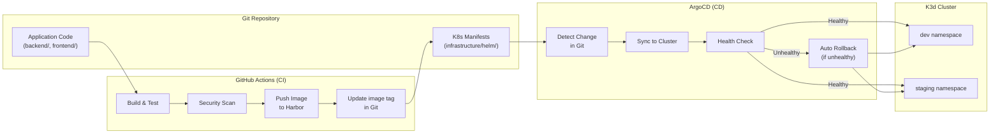
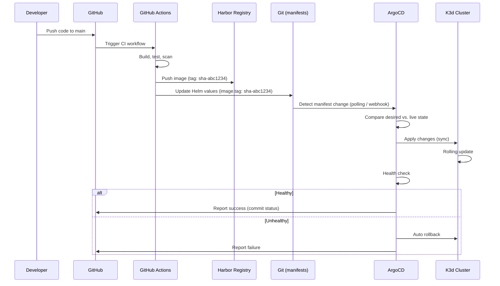
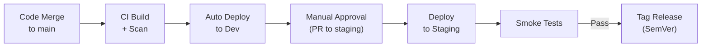

# CD Pipeline

| Field         | Value                                |
|---------------|--------------------------------------|
| **Version**   | 1.0.0                                |
| **Status**    | Draft                                |
| **Author**    | Vox                                  |
| **Reviewer**  | Vox                                  |
| **Created**   | 2026-03-27                           |
| **Updated**   | 2026-03-27                           |
| **Standard**  | GitOps Principles; CNCF Best Practices |

---

## 1. Purpose

This document defines the Continuous Deployment (CD) pipeline for the Utopia project using ArgoCD and GitOps principles. See [ADR-0008](../03-adr/ADR-0008-gitops-argocd.md) for the decision rationale.

## 2. GitOps Principles

| Principle | Implementation |
|-----------|---------------|
| **Declarative** | All desired state is described in Git (Helm charts, K8s manifests) |
| **Versioned & Immutable** | Git is the single source of truth; all changes are commits |
| **Pulled Automatically** | ArgoCD pulls desired state and syncs to cluster |
| **Continuously Reconciled** | ArgoCD detects and corrects drift automatically |

## 3. Deployment Architecture



## 4. ArgoCD Configuration

### 4.1. ArgoCD Installation

| Aspect | Configuration |
|--------|---------------|
| **Install method** | Helm chart |
| **Namespace** | `argocd` |
| **UI access** | `https://argocd.utopia.local` |
| **Authentication** | Keycloak OIDC SSO |
| **RBAC** | Admin role for Vox |
| **Notifications** | GitHub commit status |

### 4.2. AppProject

```yaml
apiVersion: argoproj.io/v1alpha1
kind: AppProject
metadata:
  name: utopia
  namespace: argocd
spec:
  description: Utopia project applications
  sourceRepos:
    - "https://github.com/vox/utopia.git"
  destinations:
    - namespace: utopia
      server: https://kubernetes.default.svc
    - namespace: identity
      server: https://kubernetes.default.svc
    - namespace: platform
      server: https://kubernetes.default.svc
    - namespace: observability
      server: https://kubernetes.default.svc
    - namespace: devsecops
      server: https://kubernetes.default.svc
    - namespace: ingress
      server: https://kubernetes.default.svc
    - namespace: vault
      server: https://kubernetes.default.svc
    - namespace: cert-manager
      server: https://kubernetes.default.svc
  clusterResourceWhitelist:
    - group: ""
      kind: Namespace
    - group: networking.k8s.io
      kind: IngressClass
    - group: rbac.authorization.k8s.io
      kind: ClusterRole
    - group: rbac.authorization.k8s.io
      kind: ClusterRoleBinding
  namespaceResourceWhitelist:
    - group: "*"
      kind: "*"
  orphanedResources:
    warn: true
```

### 4.3. Application Definitions

#### Backend API Application

```yaml
apiVersion: argoproj.io/v1alpha1
kind: Application
metadata:
  name: utopia-api
  namespace: argocd
  finalizers:
    - resources-finalizer.argocd.argoproj.io
spec:
  project: utopia
  source:
    repoURL: https://github.com/vox/utopia.git
    targetRevision: main
    path: infrastructure/helm/charts/utopia-api
    helm:
      valueFiles:
        - values.yaml
        - values-dev.yaml
  destination:
    server: https://kubernetes.default.svc
    namespace: utopia
  syncPolicy:
    automated:
      prune: true
      selfHeal: true
      allowEmpty: false
    syncOptions:
      - CreateNamespace=false
      - PrunePropagationPolicy=foreground
      - PruneLast=true
    retry:
      limit: 3
      backoff:
        duration: 5s
        factor: 2
        maxDuration: 3m
  revisionHistoryLimit: 10
```

#### ApplicationSet (All Services)

```yaml
apiVersion: argoproj.io/v1alpha1
kind: ApplicationSet
metadata:
  name: utopia-apps
  namespace: argocd
spec:
  generators:
    - list:
        elements:
          - name: backend-api
            chart: utopia-api
            namespace: utopia
          - name: frontend
            chart: utopia-frontend
            namespace: utopia
          - name: keycloak
            chart: keycloak
            namespace: identity
          - name: platform
            chart: platform
            namespace: platform
          - name: observability
            chart: observability
            namespace: observability
  template:
    metadata:
      name: "utopia-{{name}}"
      namespace: argocd
    spec:
      project: utopia
      source:
        repoURL: https://github.com/vox/utopia.git
        targetRevision: main
        path: "infrastructure/helm/charts/{{chart}}"
        helm:
          valueFiles:
            - values.yaml
            - values-dev.yaml
      destination:
        server: https://kubernetes.default.svc
        namespace: "{{namespace}}"
      syncPolicy:
        automated:
          prune: true
          selfHeal: true
```

## 5. Deployment Flow

### 5.1. Image Update Flow



### 5.2. Image Tag Update (CI Step)

```yaml
# In CI workflow after image push
- name: Update Helm values
  run: |
    cd infrastructure/helm/charts/utopia-api
    yq -i '.image.tag = "${{ github.sha }}"' values-dev.yaml
    
    git config user.name "github-actions[bot]"
    git config user.email "github-actions[bot]@users.noreply.github.com"
    git add values-dev.yaml
    git commit -m "chore: update backend-api image to ${{ github.sha }}"
    git push
```

## 6. Sync Policies

### 6.1. Automated Sync

| Setting | Value | Purpose |
|---------|-------|---------|
| `automated.prune` | `true` | Remove resources not in Git |
| `automated.selfHeal` | `true` | Revert manual changes |
| `automated.allowEmpty` | `false` | Prevent accidental deletion of all resources |

### 6.2. Sync Waves

Deployment order is controlled via sync waves:

| Wave | Resources | Purpose |
|------|-----------|---------|
| -2 | Namespaces, CRDs | Prerequisites |
| -1 | ConfigMaps, Secrets, ExternalSecrets | Configuration |
| 0 | Deployments, StatefulSets, Services | Main workloads |
| 1 | Ingress, NetworkPolicies | Networking |
| 2 | HPA, PDB | Scaling policies |
| 3 | CronJobs, Jobs | Post-deploy tasks |

```yaml
# Example: sync wave annotation
metadata:
  annotations:
    argocd.argoproj.io/sync-wave: "-1"
```

### 6.3. Health Checks

ArgoCD monitors resource health after sync:

| Resource | Health Check | Timeout |
|----------|-------------|---------|
| Deployment | All replicas ready | 5 minutes |
| StatefulSet | All replicas ready | 10 minutes |
| Job | Completed successfully | 5 minutes |
| Ingress | Hostname assigned | 2 minutes |
| PersistentVolumeClaim | Bound | 2 minutes |

## 7. Rollback Strategy

### 7.1. Automatic Rollback

ArgoCD automatically rolls back if health checks fail after sync:

```yaml
syncPolicy:
  retry:
    limit: 3
    backoff:
      duration: 5s
      factor: 2
      maxDuration: 3m
```

### 7.2. Manual Rollback

```bash
# View deployment history
argocd app history utopia-api

# Rollback to previous version
argocd app rollback utopia-api <revision-id>

# Or: revert the Git commit and let ArgoCD sync
git revert <commit-sha>
git push
```

### 7.3. Rollback Rules

- Prefer Git revert over ArgoCD rollback (maintains GitOps)
- Database rollbacks MUST use expand-contract pattern (see [DATA-ARCHITECTURE.md](../02-architecture/DATA-ARCHITECTURE.md))
- Rollback MUST be tested in staging before production

## 8. Environment Promotion



| Environment | Trigger | Sync | Approval |
|-------------|---------|------|----------|
| **dev** | Push to `main` | Automated | None |
| **staging** | PR to update staging values | Automated after merge | Manual PR review |
| **production** | Future: manual trigger | Manual | Required |

## 9. Drift Detection

| Setting | Configuration |
|---------|---------------|
| **Polling interval** | 3 minutes (default) |
| **Self-heal** | Enabled (revert manual kubectl changes) |
| **Prune** | Enabled (remove orphaned resources) |
| **Diff strategy** | Server-side diff |

ArgoCD detects drift when:

- Someone runs `kubectl apply/edit/patch` directly → reverted
- Someone scales a deployment manually → reverted to Git value
- A resource is created outside Git → marked as orphaned

## 10. Monitoring ArgoCD

| Metric | Source | Alert |
|--------|--------|-------|
| App sync status | ArgoCD metrics | App not synced > 10 minutes |
| App health status | ArgoCD metrics | App degraded/unhealthy |
| Sync failure count | ArgoCD metrics | > 3 consecutive failures |
| Repository connectivity | ArgoCD health | Cannot reach Git repo |

## 11. References

- [ArgoCD Documentation](https://argo-cd.readthedocs.io/)
- [GitOps Principles](https://opengitops.dev/)
- [ADR-0008-gitops-argocd.md](../03-adr/ADR-0008-gitops-argocd.md)
- [CI-PIPELINE.md](./CI-PIPELINE.md)
- [ENVIRONMENT-STRATEGY.md](./ENVIRONMENT-STRATEGY.md)
- [KUBERNETES-ARCHITECTURE.md](../05-infrastructure/KUBERNETES-ARCHITECTURE.md)

## Changelog

| Version | Date       | Author | Description          |
|---------|------------|--------|----------------------|
| 1.0.0   | 2026-03-27 | Vox    | Initial draft        |
