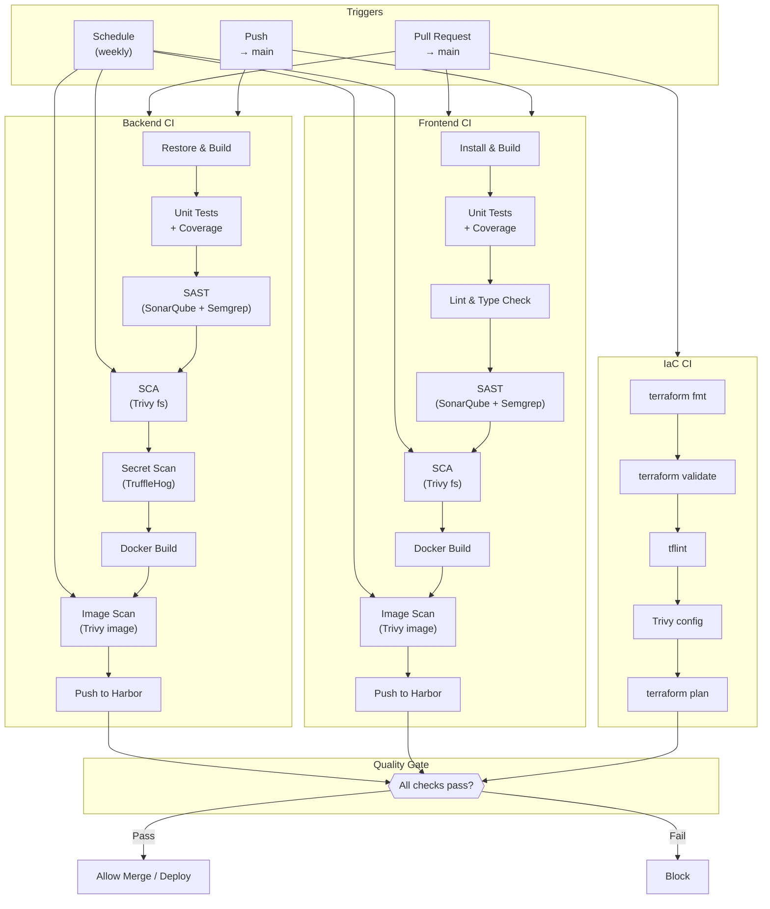

# CI Pipeline

| Field         | Value                                |
|---------------|--------------------------------------|
| **Version**   | 1.0.0                                |
| **Status**    | Draft                                |
| **Author**    | Vox                                  |
| **Reviewer**  | Vox                                  |
| **Created**   | 2026-03-27                           |
| **Updated**   | 2026-03-27                           |
| **Standard**  | GitHub Actions Best Practices; ISO/IEC 27001:2022 |

---

## 1. Purpose

This document defines the Continuous Integration (CI) pipeline architecture for the Utopia project using GitHub Actions. It covers workflow structure, quality gates, security scanning, and artifact management. See [ADR-0005](../03-adr/ADR-0005-github-actions-cicd.md) for the platform decision.

## 2. CI Architecture Overview



## 3. Workflow Structure

### 3.1. Repository Workflow Files

```
.github/
├── workflows/
│   ├── ci-backend.yaml          # Backend CI
│   ├── ci-frontend.yaml         # Frontend CI
│   ├── ci-iac.yaml              # Infrastructure-as-Code CI
│   ├── security-scan.yaml       # Scheduled security scans
│   ├── dependency-review.yaml   # Dependency update review
│   └── release.yaml             # Release tagging
├── actions/
│   ├── setup-dotnet/
│   │   └── action.yaml          # Composite: .NET setup
│   ├── setup-node/
│   │   └── action.yaml          # Composite: Node.js setup
│   ├── trivy-scan/
│   │   └── action.yaml          # Composite: Trivy scanning
│   └── docker-build-push/
│       └── action.yaml          # Composite: Build + push
└── CODEOWNERS
```

### 3.2. Reusable Composite Actions

Shared logic is extracted into composite actions to avoid duplication:

| Composite Action | Purpose |
|-----------------|---------|
| `setup-dotnet` | Install .NET SDK, restore NuGet, cache packages |
| `setup-node` | Install Node.js, pnpm, install deps, cache |
| `trivy-scan` | Run Trivy with standard configuration |
| `docker-build-push` | Build image, scan, tag, push to Harbor |

## 4. Backend CI Workflow

```yaml
# .github/workflows/ci-backend.yaml
name: Backend CI

on:
  pull_request:
    branches: [main]
    paths:
      - "backend/**"
      - ".github/workflows/ci-backend.yaml"
  push:
    branches: [main]
    paths:
      - "backend/**"

permissions:
  contents: read
  security-events: write
  pull-requests: write

env:
  DOTNET_VERSION: "8.0.x"
  REGISTRY: harbor.utopia.local
  IMAGE_NAME: utopia/backend-api

jobs:
  build-and-test:
    runs-on: ubuntu-latest
    steps:
      - name: Checkout
        uses: actions/checkout@<sha>

      - name: Setup .NET
        uses: actions/setup-dotnet@<sha>
        with:
          dotnet-version: ${{ env.DOTNET_VERSION }}

      - name: Restore
        run: dotnet restore --locked-mode
        working-directory: backend

      - name: Build
        run: dotnet build --no-restore -c Release
        working-directory: backend

      - name: Test
        run: |
          dotnet test --no-build -c Release \
            --collect:"XPlat Code Coverage" \
            --results-directory ./coverage \
            -- DataCollectionRunSettings.DataCollectors.DataCollector.Configuration.Format=opencover
        working-directory: backend

      - name: Upload coverage
        uses: actions/upload-artifact@<sha>
        with:
          name: coverage-report
          path: backend/coverage/**/coverage.opencover.xml

  sast:
    runs-on: ubuntu-latest
    needs: build-and-test
    steps:
      - name: Checkout
        uses: actions/checkout@<sha>
        with:
          fetch-depth: 0

      - name: SonarQube Scan
        uses: SonarSource/sonarqube-scan-action@<sha>
        env:
          SONAR_TOKEN: ${{ secrets.SONAR_TOKEN }}
          SONAR_HOST_URL: ${{ secrets.SONAR_HOST_URL }}
        with:
          projectBaseDir: backend

      - name: Semgrep Scan
        uses: semgrep/semgrep-action@<sha>
        with:
          config: >-
            p/csharp
            p/dotnet
            p/owasp-top-ten
          publishToken: ${{ secrets.SEMGREP_APP_TOKEN }}

  sca:
    runs-on: ubuntu-latest
    steps:
      - name: Checkout
        uses: actions/checkout@<sha>

      - name: Trivy filesystem scan
        uses: aquasecurity/trivy-action@<sha>
        with:
          scan-type: fs
          scan-ref: backend
          format: sarif
          output: trivy-fs-results.sarif
          severity: CRITICAL,HIGH
          exit-code: 1

      - name: Upload SARIF
        uses: github/codeql-action/upload-sarif@<sha>
        if: always()
        with:
          sarif_file: trivy-fs-results.sarif

  secret-scan:
    runs-on: ubuntu-latest
    steps:
      - name: Checkout
        uses: actions/checkout@<sha>
        with:
          fetch-depth: 0

      - name: TruffleHog scan
        uses: trufflesecurity/trufflehog@<sha>
        with:
          extra_args: --only-verified

  docker:
    runs-on: ubuntu-latest
    needs: [build-and-test, sast, sca, secret-scan]
    if: github.event_name == 'push' && github.ref == 'refs/heads/main'
    steps:
      - name: Checkout
        uses: actions/checkout@<sha>

      - name: Set up Docker Buildx
        uses: docker/setup-buildx-action@<sha>

      - name: Login to Harbor
        uses: docker/login-action@<sha>
        with:
          registry: ${{ env.REGISTRY }}
          username: ${{ secrets.HARBOR_USERNAME }}
          password: ${{ secrets.HARBOR_PASSWORD }}

      - name: Build and push
        uses: docker/build-push-action@<sha>
        with:
          context: backend
          push: true
          tags: |
            ${{ env.REGISTRY }}/${{ env.IMAGE_NAME }}:${{ github.sha }}
            ${{ env.REGISTRY }}/${{ env.IMAGE_NAME }}:latest
          cache-from: type=gha
          cache-to: type=gha,mode=max

      - name: Trivy image scan
        uses: aquasecurity/trivy-action@<sha>
        with:
          image-ref: ${{ env.REGISTRY }}/${{ env.IMAGE_NAME }}:${{ github.sha }}
          format: sarif
          output: trivy-image-results.sarif
          severity: CRITICAL,HIGH
          exit-code: 1
```

## 5. Frontend CI Workflow

```yaml
# .github/workflows/ci-frontend.yaml
name: Frontend CI

on:
  pull_request:
    branches: [main]
    paths:
      - "frontend/**"
      - ".github/workflows/ci-frontend.yaml"
  push:
    branches: [main]
    paths:
      - "frontend/**"

permissions:
  contents: read
  security-events: write

env:
  NODE_VERSION: "20"
  REGISTRY: harbor.utopia.local
  IMAGE_NAME: utopia/frontend

jobs:
  lint-and-test:
    runs-on: ubuntu-latest
    steps:
      - name: Checkout
        uses: actions/checkout@<sha>

      - name: Setup pnpm
        uses: pnpm/action-setup@<sha>
        with:
          version: 9

      - name: Setup Node.js
        uses: actions/setup-node@<sha>
        with:
          node-version: ${{ env.NODE_VERSION }}
          cache: pnpm
          cache-dependency-path: frontend/pnpm-lock.yaml

      - name: Install dependencies
        run: pnpm install --frozen-lockfile
        working-directory: frontend

      - name: Type check
        run: pnpm tsc --noEmit
        working-directory: frontend

      - name: Lint
        run: pnpm lint
        working-directory: frontend

      - name: Unit tests + coverage
        run: pnpm test -- --coverage --reporter=default --reporter=junit
        working-directory: frontend

      - name: Build
        run: pnpm build
        working-directory: frontend

  sast:
    runs-on: ubuntu-latest
    needs: lint-and-test
    steps:
      - name: Checkout
        uses: actions/checkout@<sha>
        with:
          fetch-depth: 0

      - name: SonarQube Scan
        uses: SonarSource/sonarqube-scan-action@<sha>
        env:
          SONAR_TOKEN: ${{ secrets.SONAR_TOKEN }}
          SONAR_HOST_URL: ${{ secrets.SONAR_HOST_URL }}
        with:
          projectBaseDir: frontend

      - name: Semgrep Scan
        uses: semgrep/semgrep-action@<sha>
        with:
          config: >-
            p/typescript
            p/react
            p/nextjs
            p/owasp-top-ten

  sca:
    runs-on: ubuntu-latest
    steps:
      - name: Checkout
        uses: actions/checkout@<sha>

      - name: pnpm audit
        run: |
          corepack enable pnpm
          pnpm audit --prod
        working-directory: frontend

      - name: Trivy filesystem scan
        uses: aquasecurity/trivy-action@<sha>
        with:
          scan-type: fs
          scan-ref: frontend
          format: sarif
          output: trivy-fs-results.sarif
          severity: CRITICAL,HIGH
          exit-code: 1

  docker:
    runs-on: ubuntu-latest
    needs: [lint-and-test, sast, sca]
    if: github.event_name == 'push' && github.ref == 'refs/heads/main'
    steps:
      - name: Checkout
        uses: actions/checkout@<sha>

      - name: Build and push
        uses: docker/build-push-action@<sha>
        with:
          context: frontend
          push: true
          tags: |
            ${{ env.REGISTRY }}/${{ env.IMAGE_NAME }}:${{ github.sha }}
          cache-from: type=gha
          cache-to: type=gha,mode=max

      - name: Trivy image scan
        uses: aquasecurity/trivy-action@<sha>
        with:
          image-ref: ${{ env.REGISTRY }}/${{ env.IMAGE_NAME }}:${{ github.sha }}
          severity: CRITICAL,HIGH
          exit-code: 1
```

## 6. IaC CI Workflow

```yaml
# .github/workflows/ci-iac.yaml
name: IaC CI

on:
  pull_request:
    branches: [main]
    paths:
      - "infrastructure/terraform/**"
      - "infrastructure/helm/**"
      - ".github/workflows/ci-iac.yaml"

permissions:
  contents: read
  pull-requests: write

jobs:
  terraform:
    runs-on: ubuntu-latest
    strategy:
      matrix:
        environment: [dev]
    defaults:
      run:
        working-directory: infrastructure/terraform/environments/${{ matrix.environment }}
    steps:
      - name: Checkout
        uses: actions/checkout@<sha>

      - name: Setup Terraform
        uses: hashicorp/setup-terraform@<sha>
        with:
          terraform_version: "1.7"

      - name: Format check
        run: terraform fmt -check -recursive -diff

      - name: Init
        run: terraform init -backend=false

      - name: Validate
        run: terraform validate

      - name: tflint
        uses: terraform-linters/setup-tflint@<sha>
      - run: tflint --init && tflint

      - name: Trivy config scan
        uses: aquasecurity/trivy-action@<sha>
        with:
          scan-type: config
          scan-ref: infrastructure/terraform
          severity: CRITICAL,HIGH
          exit-code: 1

  helm:
    runs-on: ubuntu-latest
    steps:
      - name: Checkout
        uses: actions/checkout@<sha>

      - name: Helm lint
        run: |
          for chart in infrastructure/helm/charts/*/; do
            helm lint "$chart"
          done

      - name: Trivy Helm scan
        uses: aquasecurity/trivy-action@<sha>
        with:
          scan-type: config
          scan-ref: infrastructure/helm
          severity: CRITICAL,HIGH

  dockerfile:
    runs-on: ubuntu-latest
    steps:
      - name: Checkout
        uses: actions/checkout@<sha>

      - name: Hadolint — Backend
        uses: hadolint/hadolint-action@<sha>
        with:
          dockerfile: backend/Dockerfile

      - name: Hadolint — Frontend
        uses: hadolint/hadolint-action@<sha>
        with:
          dockerfile: frontend/Dockerfile
```

## 7. Quality Gates

### 7.1. Gate Definitions

| Gate | Tool | Threshold | Blocking |
|------|------|-----------|----------|
| Build success | dotnet build / pnpm build | Pass | Yes |
| Unit tests | xUnit / Vitest | 100% pass | Yes |
| Code coverage | Coverlet / Istanbul | ≥ 80% lines | Yes |
| SAST — Critical | SonarQube | 0 new critical issues | Yes |
| SAST — Major | SonarQube | 0 new major issues | Yes |
| SAST — Hotspots | SonarQube | 0 unreviewed hotspots | Yes |
| SAST — Custom | Semgrep | 0 findings | Yes |
| SCA — Critical CVE | Trivy | 0 critical | Yes |
| SCA — High CVE | Trivy | 0 high (fixable) | Yes |
| Secret detection | TruffleHog | 0 verified secrets | Yes |
| Lint | dotnet format / ESLint | 0 errors | Yes |
| Type check | TypeScript | 0 errors | Yes |
| Image scan — Critical | Trivy | 0 critical | Yes |
| Image scan — High | Trivy | 0 high (fixable) | Yes |
| IaC format | terraform fmt | Pass | Yes |
| IaC validate | terraform validate | Pass | Yes |
| IaC lint | tflint | 0 errors | Yes |
| IaC security | Trivy config | 0 critical/high | Yes |
| Dockerfile lint | Hadolint | 0 errors | Yes |
| Helm lint | helm lint | Pass | Yes |

### 7.2. SonarQube Quality Gate

| Metric | Threshold |
|--------|-----------|
| New code coverage | ≥ 80% |
| New code duplications | ≤ 3% |
| New reliability issues | 0 |
| New security issues | 0 |
| New maintainability issues | 0 (A rating) |
| Security hotspots reviewed | 100% |

## 8. Caching Strategy

| Cache | Tool | Key |
|-------|------|-----|
| NuGet packages | `actions/cache` | `nuget-${{ hashFiles('**/packages.lock.json') }}` |
| pnpm store | `actions/setup-node` cache | `pnpm-${{ hashFiles('**/pnpm-lock.yaml') }}` |
| Docker layers | `docker/build-push-action` gha cache | BuildKit GHA cache |
| Terraform providers | `actions/cache` | `terraform-${{ hashFiles('**/.terraform.lock.hcl') }}` |
| SonarQube cache | `actions/cache` | `sonar-${{ runner.os }}` |

## 9. GitHub Actions Security

### 9.1. Security Rules

| Rule | Implementation |
|------|---------------|
| Pin actions by SHA | ALL `uses:` references use full commit SHA |
| Minimal permissions | `permissions:` block on every workflow and job |
| No `write-all` | NEVER use `permissions: write-all` |
| OIDC for auth | Use OIDC tokens for Harbor, Vault (no static tokens) |
| Secret management | All secrets in GitHub Encrypted Secrets or Vault |
| Branch protection | `main` requires PR + CI pass + no force push |
| CODEOWNERS | All workflow changes require Vox review |

### 9.2. Branch Protection Rules

| Setting | Value |
|---------|-------|
| Require PR before merging | Yes |
| Required status checks | `build-and-test`, `sast`, `sca`, `secret-scan` |
| Require up-to-date branches | Yes |
| Require conversation resolution | Yes |
| Restrict force pushes | Yes |
| Restrict deletions | Yes |

## 10. Notifications

| Event | Channel | Condition |
|-------|---------|-----------|
| CI failure | GitHub PR check | Always on failure |
| Security finding | GitHub Security tab (SARIF) | Always |
| Dependency alert | GitHub Dependabot | New vulnerability |
| Build success + deploy | GitHub Actions log | On push to main |

## 11. References

- [GitHub Actions Documentation](https://docs.github.com/en/actions)
- [ADR-0005-github-actions-cicd.md](../03-adr/ADR-0005-github-actions-cicd.md)
- [SECURE-DEVELOPMENT-POLICY.md](../04-security/SECURE-DEVELOPMENT-POLICY.md)
- [SUPPLY-CHAIN-SECURITY.md](../04-security/SUPPLY-CHAIN-SECURITY.md)
- [CODING-STANDARD.md](../00-standards/CODING-STANDARD.md)
- [CD-PIPELINE.md](./CD-PIPELINE.md)

## Changelog

| Version | Date       | Author | Description          |
|---------|------------|--------|----------------------|
| 1.0.0   | 2026-03-27 | Vox    | Initial draft        |
