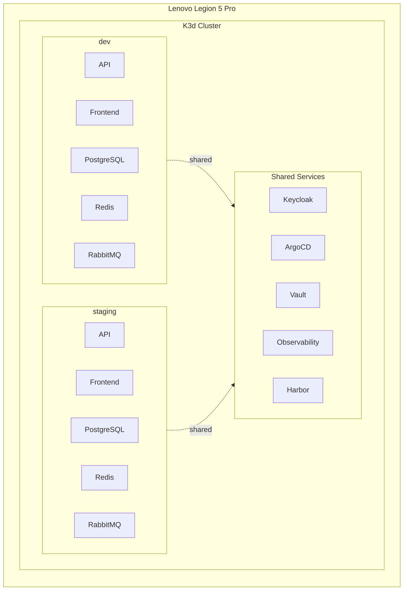
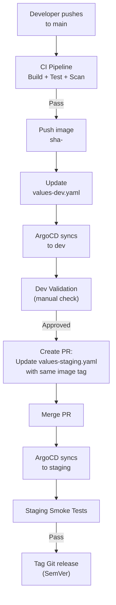

# Environment Strategy

| Field         | Value                                |
|---------------|--------------------------------------|
| **Version**   | 1.0.0                                |
| **Status**    | Draft                                |
| **Author**    | Vox                                  |
| **Reviewer**  | Vox                                  |
| **Created**   | 2026-03-27                           |
| **Updated**   | 2026-03-27                           |
| **Standard**  | 12-Factor App; GitOps Principles     |

---

## 1. Purpose

This document defines the environment strategy for the Utopia project — how environments are structured, when each is used, how configuration differs, and how changes are promoted across environments.

## 2. Environment Overview

| Environment | Purpose | Cluster | Namespace suffix | Auto-deploy | Audience |
|-------------|---------|---------|------------------|-------------|----------|
| **dev** | Active development & integration testing | K3d local | `-dev` | Yes (on push to `main`) | Vox |
| **staging** | Pre-release validation & smoke testing | K3d local | `-staging` | Yes (on merge to staging values) | Vox |

> **Note**: Production is out of scope for the initial release. The architecture supports adding a production environment (cloud or dedicated server) when needed. See [PROJECT-CHARTER.md](../01-project/PROJECT-CHARTER.md).

## 3. Environment Architecture



## 4. Configuration Management

### 4.1. Configuration Sources

| Source | Purpose | Example |
|--------|---------|---------|
| **Helm values.yaml** | Default values (shared) | Image repository, port numbers |
| **Helm values-{env}.yaml** | Environment overrides | Replica count, resource limits |
| **ExternalSecrets** | Sensitive values from Vault | DB passwords, API keys |
| **ConfigMaps** | Non-sensitive runtime config | Feature flags, log levels |

### 4.2. Configuration Differences

| Setting | dev | staging |
|---------|-----|---------|
| **Replicas** | 1 | 2 |
| **API log level** | Debug | Information |
| **Database** | `utopia_dev` | `utopia_staging` |
| **Redis DB index** | 0 | 1 |
| **RabbitMQ vhost** | `/dev` | `/staging` |
| **Image tag** | `sha-<commit>` | `sha-<commit>` (promoted) |
| **CPU request (API)** | 100m | 200m |
| **Memory request (API)** | 128Mi | 256Mi |
| **CPU limit (API)** | 250m | 500m |
| **Memory limit (API)** | 256Mi | 512Mi |
| **Trace sampling** | 100% | 10% |
| **Debug endpoints** | Enabled | Disabled |
| **Swagger UI** | Enabled | Disabled |
| **CORS origins** | `*` | `https://*.utopia.local` |
| **Rate limiting** | Relaxed | Strict |
| **EF Core migrations** | Auto on startup | Manual via Job |
| **Seed data** | Yes | Minimal |

### 4.3. Helm Values Example

```yaml
# values.yaml (shared defaults)
image:
  repository: harbor.utopia.local/utopia/api
  pullPolicy: IfNotPresent
  tag: "latest"  # overridden per environment

service:
  type: ClusterIP
  port: 8080

healthCheck:
  liveness:
    path: /health/live
    initialDelaySeconds: 10
  readiness:
    path: /health/ready
    initialDelaySeconds: 5

---
# values-dev.yaml
replicaCount: 1
image:
  tag: "sha-abc1234"

resources:
  requests:
    cpu: 100m
    memory: 128Mi
  limits:
    cpu: 250m
    memory: 256Mi

env:
  - name: ASPNETCORE_ENVIRONMENT
    value: Development
  - name: Serilog__MinimumLevel__Default
    value: Debug
  - name: ConnectionStrings__DefaultConnection
    valueFrom:
      secretKeyRef:
        name: utopia-api-secrets
        key: db-connection-string

---
# values-staging.yaml
replicaCount: 2
image:
  tag: "sha-abc1234"

resources:
  requests:
    cpu: 200m
    memory: 256Mi
  limits:
    cpu: 500m
    memory: 512Mi

env:
  - name: ASPNETCORE_ENVIRONMENT
    value: Staging
  - name: Serilog__MinimumLevel__Default
    value: Information
```

## 5. Promotion Workflow



### 5.1. Promotion Rules

| Rule | Description |
|------|-------------|
| **Same artifact** | The exact same Docker image (SHA tag) is promoted between environments |
| **No rebuilds** | Never rebuild for a different environment — only change configuration |
| **Git-driven** | Promotion happens via updating Helm values files in Git |
| **PR required** | dev → staging promotion requires a pull request |
| **Tests pass** | CI quality gates MUST pass before any deployment |

## 6. Namespace Strategy

| Namespace | Environment | Contents |
|-----------|-------------|----------|
| `utopia` | dev (default) | Backend API, Frontend, PostgreSQL, Redis, RabbitMQ |
| `utopia-staging` | staging | Backend API, Frontend, PostgreSQL, Redis, RabbitMQ |
| `identity` | shared | Keycloak (shared instance, separate realms per env) |
| `platform` | shared | Harbor registry |
| `observability` | shared | Prometheus, Grafana, Loki, Tempo, OTel Collector |
| `devsecops` | shared | SonarQube, security scanning jobs |
| `argocd` | shared | ArgoCD |
| `vault` | shared | HashiCorp Vault |
| `ingress` | shared | Traefik ingress controller |

### 6.1. Shared Services Isolation

Shared services use separate configurations per environment:

| Service | Isolation Method |
|---------|-----------------|
| **Keycloak** | Separate realm per env (`utopia-dev`, `utopia-staging`) |
| **Vault** | Separate secret path (`secret/utopia/dev/`, `secret/utopia/staging/`) |
| **Harbor** | Same project, images tagged with env promotion metadata |
| **Grafana** | Dashboard folders per environment, data source labels |

## 7. Database Per Environment

| Property | dev | staging |
|----------|-----|---------|
| **Database name** | `utopia_dev` | `utopia_staging` |
| **PostgreSQL instance** | Shared pod, separate database | Shared pod, separate database |
| **Schema migration** | Auto on startup (EF Core) | Manual Job pre-deploy |
| **Seed data** | Full test data | Minimal reference data |
| **Backup** | Every 6 hours | Every 6 hours |

```yaml
# Database migration Job for staging
apiVersion: batch/v1
kind: Job
metadata:
  name: utopia-api-migrate
  namespace: utopia-staging
  annotations:
    argocd.argoproj.io/sync-wave: "-1"
    argocd.argoproj.io/hook: PreSync
spec:
  template:
    spec:
      containers:
        - name: migrate
          image: harbor.utopia.local/utopia/api:sha-abc1234
          command: ["dotnet", "Utopia.Api.dll", "--migrate"]
          envFrom:
            - secretRef:
                name: utopia-api-secrets
      restartPolicy: Never
  backoffLimit: 3
```

## 8. Feature Flags

Feature flags are used to control feature availability per environment without code changes:

| Flag | dev | staging | Mechanism |
|------|-----|---------|-----------|
| `EnableSwagger` | true | false | ConfigMap → env variable |
| `EnableDebugEndpoints` | true | false | ConfigMap → env variable |
| `EnableDetailedErrors` | true | false | `ASPNETCORE_ENVIRONMENT` |
| `EnableSeedData` | true | false | ConfigMap → env variable |

## 9. DNS & Ingress Per Environment

| Service | dev URL | staging URL |
|---------|---------|-------------|
| Backend API | `https://api.utopia.local` | `https://api-staging.utopia.local` |
| Frontend | `https://app.utopia.local` | `https://app-staging.utopia.local` |
| Keycloak | `https://auth.utopia.local` | `https://auth.utopia.local` (shared) |
| Grafana | `https://grafana.utopia.local` | (shared) |
| ArgoCD | `https://argocd.utopia.local` | (shared) |

Host entries in `C:\Windows\System32\drivers\etc\hosts`:

```
127.0.0.1  api.utopia.local
127.0.0.1  api-staging.utopia.local
127.0.0.1  app.utopia.local
127.0.0.1  app-staging.utopia.local
127.0.0.1  auth.utopia.local
127.0.0.1  grafana.utopia.local
127.0.0.1  argocd.utopia.local
127.0.0.1  harbor.utopia.local
127.0.0.1  vault.utopia.local
127.0.0.1  sonarqube.utopia.local
```

## 10. References

- [CD-PIPELINE.md](./CD-PIPELINE.md)
- [KUBERNETES-ARCHITECTURE.md](../05-infrastructure/KUBERNETES-ARCHITECTURE.md)
- [NETWORKING.md](../05-infrastructure/NETWORKING.md)
- [TERRAFORM-STRUCTURE.md](../05-infrastructure/TERRAFORM-STRUCTURE.md)
- [PROJECT-CHARTER.md](../01-project/PROJECT-CHARTER.md)

## Changelog

| Version | Date       | Author | Description          |
|---------|------------|--------|----------------------|
| 1.0.0   | 2026-03-27 | Vox    | Initial draft        |
