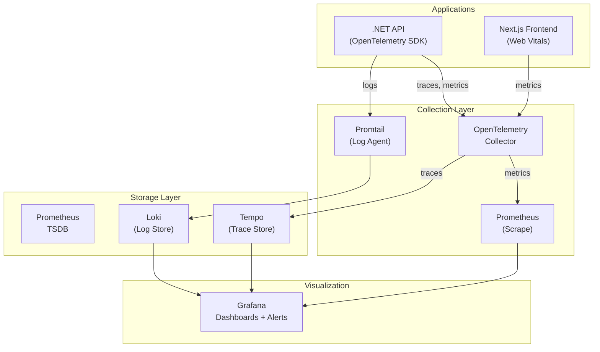
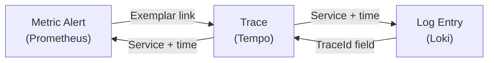

# Monitoring & Observability

| Field         | Value                                    |
|---------------|------------------------------------------|
| **Version**   | 1.0.0                                    |
| **Status**    | Draft                                    |
| **Author**    | Vox                                      |
| **Reviewer**  | Vox                                      |
| **Created**   | 2026-03-27                               |
| **Updated**   | 2026-03-27                               |
| **Standard**  | OpenTelemetry Specification; CNCF Observability |

---

## 1. Purpose

This document defines the monitoring, logging, tracing, and alerting strategy for the Utopia project. The observability stack enables real-time visibility into system health, rapid incident detection, and root-cause analysis.

## 2. Observability Architecture



## 3. Three Pillars of Observability

### 3.1. Metrics (Prometheus)

| Aspect | Configuration |
|--------|---------------|
| **Tool** | Prometheus 2.x (kube-prometheus-stack Helm chart) |
| **Namespace** | `observability` |
| **Scrape interval** | 15 seconds |
| **Retention** | 15 days local |
| **Storage** | PVC 10Gi |
| **Service discovery** | Kubernetes SD (pods, services, endpoints) |

#### Application Metrics (.NET)

```csharp
// Program.cs — OpenTelemetry metrics setup
builder.Services.AddOpenTelemetry()
    .WithMetrics(metrics =>
    {
        metrics
            .AddAspNetCoreInstrumentation()
            .AddHttpClientInstrumentation()
            .AddRuntimeInstrumentation()
            .AddMeter("Utopia.Api")
            .AddPrometheusExporter();
    });

// Endpoint
app.MapPrometheusScrapingEndpoint("/metrics");
```

#### Custom Business Metrics

| Metric Name | Type | Labels | Description |
|-------------|------|--------|-------------|
| `utopia_http_requests_total` | Counter | method, endpoint, status | Total HTTP requests |
| `utopia_http_request_duration_seconds` | Histogram | method, endpoint | Request latency |
| `utopia_active_users` | Gauge | — | Currently active users |
| `utopia_orders_created_total` | Counter | status | Orders created |
| `utopia_cache_hit_ratio` | Gauge | cache_name | Redis cache hit percentage |
| `utopia_rabbitmq_messages_published` | Counter | exchange, routing_key | Messages published |
| `utopia_rabbitmq_messages_consumed` | Counter | queue | Messages consumed |
| `utopia_db_query_duration_seconds` | Histogram | query_type, module | Database query latency |

#### Infrastructure Metrics (Auto-discovered)

| Target | Metrics | Scrape Port |
|--------|---------|-------------|
| Node | CPU, memory, disk, network | 9100 (node-exporter) |
| Kubernetes | Pod status, resource usage | kubelet /metrics |
| PostgreSQL | Connections, query stats, replication | 9187 (postgres-exporter) |
| Redis | Memory, connections, hit rate | 9121 (redis-exporter) |
| RabbitMQ | Queue depth, message rate | 15692 (built-in) |
| Traefik | Request count, latency, errors | 9100 (built-in) |
| Keycloak | Login success/failure, token issued | 8080 /metrics |
| ArgoCD | Sync status, app health | 8082 /metrics |

### 3.2. Logging (Loki + Promtail)

| Aspect | Configuration |
|--------|---------------|
| **Log aggregator** | Grafana Loki 2.x |
| **Log collector** | Promtail (DaemonSet) |
| **Namespace** | `observability` |
| **Retention** | 7 days |
| **Storage** | PVC 10Gi |
| **Index** | BoltDB + filesystem |

#### Structured Logging (.NET)

```csharp
// Program.cs — Serilog configuration
builder.Host.UseSerilog((ctx, config) =>
{
    config
        .MinimumLevel.Information()
        .MinimumLevel.Override("Microsoft", LogEventLevel.Warning)
        .MinimumLevel.Override("System", LogEventLevel.Warning)
        .Enrich.FromLogContext()
        .Enrich.WithMachineName()
        .Enrich.WithEnvironmentName()
        .Enrich.WithProperty("Application", "Utopia.Api")
        .WriteTo.Console(new RenderedCompactJsonFormatter())
        .WriteTo.OpenTelemetry(options =>
        {
            options.Endpoint = "http://otel-collector:4317";
            options.Protocol = OtlpProtocol.Grpc;
        });
});
```

#### Log Format (JSON)

```json
{
  "@t": "2026-03-27T10:15:30.123Z",
  "@mt": "Processing order {OrderId} for user {UserId}",
  "@l": "Information",
  "OrderId": "ord-abc123",
  "UserId": "usr-def456",
  "TraceId": "4bf92f3577b34da6a3ce929d0e0e4736",
  "SpanId": "00f067aa0ba902b7",
  "Application": "Utopia.Api",
  "Environment": "dev"
}
```

#### Log Labels (Promtail)

| Label | Source | Example |
|-------|--------|---------|
| `namespace` | K8s metadata | `utopia` |
| `pod` | K8s metadata | `utopia-api-6d7f8-abcde` |
| `container` | K8s metadata | `utopia-api` |
| `app` | K8s label | `utopia-api` |
| `level` | Parsed from log | `Information` |

#### Log Levels

| Level | Usage |
|-------|-------|
| `Fatal` | System cannot continue, immediate action required |
| `Error` | Operation failed, requires attention |
| `Warning` | Unexpected condition, system continues |
| `Information` | Significant business events |
| `Debug` | Diagnostic information (disabled in staging/prod) |

### 3.3. Distributed Tracing (Tempo + OpenTelemetry)

| Aspect | Configuration |
|--------|---------------|
| **Trace backend** | Grafana Tempo 2.x |
| **Instrumentation** | OpenTelemetry SDK for .NET |
| **Protocol** | OTLP gRPC (port 4317) |
| **Namespace** | `observability` |
| **Retention** | 7 days |
| **Storage** | PVC 5Gi |
| **Sampling** | 100% (dev), 10% (staging/prod) |

#### Tracing Configuration (.NET)

```csharp
// Program.cs — OpenTelemetry tracing setup
builder.Services.AddOpenTelemetry()
    .WithTracing(tracing =>
    {
        tracing
            .SetResourceBuilder(ResourceBuilder.CreateDefault()
                .AddService("utopia-api", serviceVersion: "1.0.0"))
            .AddAspNetCoreInstrumentation(options =>
            {
                options.Filter = ctx => !ctx.Request.Path.StartsWithSegments("/health");
                options.RecordException = true;
            })
            .AddHttpClientInstrumentation()
            .AddEntityFrameworkCoreInstrumentation()
            .AddSource("MassTransit")
            .AddOtlpExporter(options =>
            {
                options.Endpoint = new Uri("http://otel-collector:4317");
                options.Protocol = OtlpExportProtocol.Grpc;
            });
    });
```

#### Trace Propagation

| Hop | Propagation Method |
|-----|--------------------|
| HTTP → API | W3C Trace Context header (`traceparent`) |
| API → RabbitMQ | MassTransit built-in propagation |
| API → PostgreSQL | EF Core diagnostic instrumentation |
| API → Redis | StackExchange.Redis instrumentation |
| API → External HTTP | HttpClient instrumentation |

## 4. OpenTelemetry Collector

```yaml
apiVersion: v1
kind: ConfigMap
metadata:
  name: otel-collector-config
  namespace: observability
data:
  config.yaml: |
    receivers:
      otlp:
        protocols:
          grpc:
            endpoint: 0.0.0.0:4317
          http:
            endpoint: 0.0.0.0:4318

    processors:
      batch:
        timeout: 5s
        send_batch_size: 1024
      memory_limiter:
        check_interval: 1s
        limit_mib: 256

    exporters:
      prometheus:
        endpoint: 0.0.0.0:8889
      otlp/tempo:
        endpoint: tempo:4317
        tls:
          insecure: true
      loki:
        endpoint: http://loki:3100/loki/api/v1/push

    service:
      pipelines:
        metrics:
          receivers: [otlp]
          processors: [memory_limiter, batch]
          exporters: [prometheus]
        traces:
          receivers: [otlp]
          processors: [memory_limiter, batch]
          exporters: [otlp/tempo]
        logs:
          receivers: [otlp]
          processors: [memory_limiter, batch]
          exporters: [loki]
```

## 5. Grafana Dashboards

| Dashboard | Data Source | Key Panels |
|-----------|------------|------------|
| **Cluster Overview** | Prometheus | Node CPU/memory, pod count, namespace resource usage |
| **API Performance** | Prometheus | Request rate, p50/p95/p99 latency, error rate |
| **Business Metrics** | Prometheus | Active users, orders, revenue funnel |
| **Database** | Prometheus | Query latency, connection pool, table sizes |
| **RabbitMQ** | Prometheus | Queue depth, publish/consume rate, dead letters |
| **Redis** | Prometheus | Hit rate, memory usage, connections |
| **Logs** | Loki | Error logs, log volume, top error messages |
| **Traces** | Tempo | Service map, trace search, span latency |
| **ArgoCD** | Prometheus | Sync status, app health, deployment frequency |

### Dashboard Access

| Setting | Value |
|---------|-------|
| **URL** | `https://grafana.utopia.local` |
| **Auth** | Keycloak OIDC SSO |
| **Provisioning** | Dashboards-as-code (ConfigMaps) |
| **Home dashboard** | Cluster Overview |

## 6. Alerting

### 6.1. Alert Rules (Prometheus)

#### Critical Alerts (P1 — Immediate)

```yaml
groups:
  - name: critical
    rules:
      - alert: PodCrashLooping
        expr: rate(kube_pod_container_status_restarts_total[15m]) > 0
        for: 5m
        labels:
          severity: critical
        annotations:
          summary: "Pod {{ $labels.pod }} is crash-looping"

      - alert: HighErrorRate
        expr: |
          sum(rate(http_server_request_duration_seconds_count{http_response_status_code=~"5.."}[5m]))
          /
          sum(rate(http_server_request_duration_seconds_count[5m]))
          > 0.05
        for: 5m
        labels:
          severity: critical
        annotations:
          summary: "API error rate > 5%"

      - alert: DatabaseDown
        expr: pg_up == 0
        for: 1m
        labels:
          severity: critical
        annotations:
          summary: "PostgreSQL is unreachable"
```

#### Warning Alerts (P2)

```yaml
      - alert: HighLatency
        expr: |
          histogram_quantile(0.95, 
            rate(http_server_request_duration_seconds_bucket[5m])
          ) > 2
        for: 10m
        labels:
          severity: warning
        annotations:
          summary: "API p95 latency > 2s"

      - alert: DiskSpaceRunningLow
        expr: |
          kubelet_volume_stats_available_bytes
          / kubelet_volume_stats_capacity_bytes
          < 0.2
        for: 15m
        labels:
          severity: warning
        annotations:
          summary: "PVC {{ $labels.persistentvolumeclaim }} has < 20% space"

      - alert: RabbitMQQueueBacklog
        expr: rabbitmq_queue_messages > 1000
        for: 10m
        labels:
          severity: warning
        annotations:
          summary: "Queue {{ $labels.queue }} has > 1000 messages"
```

### 6.2. Alert Notification Channels

| Channel | Destination | Severity |
|---------|-------------|----------|
| **Grafana** | Dashboard visual alert | All |
| **Log** | Alertmanager log | All |

> **Note**: For a personal project with a single developer, alerts are surfaced in Grafana dashboards. Email/Slack notifications can be added when needed.

## 7. SLO Definitions

| Service | SLI | Target | Window |
|---------|-----|--------|--------|
| Backend API | Availability (non-5xx) | 99.5% | 7 days |
| Backend API | Latency p95 | < 500ms | 7 days |
| Frontend | Largest Contentful Paint | < 2.5s | 7 days |
| PostgreSQL | Uptime | 99.9% | 7 days |
| RabbitMQ | Message processing time | < 5s | 7 days |

## 8. Resource Allocation

| Component | CPU Request | CPU Limit | Memory Request | Memory Limit |
|-----------|-------------|-----------|----------------|--------------|
| Prometheus | 200m | 500m | 512Mi | 1Gi |
| Grafana | 100m | 250m | 128Mi | 256Mi |
| Loki | 100m | 250m | 256Mi | 512Mi |
| Tempo | 100m | 250m | 256Mi | 512Mi |
| OTel Collector | 100m | 250m | 128Mi | 256Mi |
| Promtail (per node) | 50m | 100m | 64Mi | 128Mi |

**Total observability stack**: ~650m–1600m CPU, ~1.3Gi–2.6Gi memory

## 9. Correlation

The three pillars are correlated using **TraceId**:

1. **Metric alert fires** → Click "Explore" → See related logs
2. **Log shows error** → Click TraceId → Jump to Tempo trace view
3. **Trace shows slow span** → Check metrics for that service



Grafana Tempo is configured as a linked data source in Loki and Prometheus for seamless jump-to-trace.

## 10. References

- [OpenTelemetry .NET Documentation](https://opentelemetry.io/docs/languages/dotnet/)
- [Grafana Loki Documentation](https://grafana.com/docs/loki/)
- [Grafana Tempo Documentation](https://grafana.com/docs/tempo/)
- [KUBERNETES-ARCHITECTURE.md](../05-infrastructure/KUBERNETES-ARCHITECTURE.md)
- [ENVIRONMENT-STRATEGY.md](./ENVIRONMENT-STRATEGY.md)
- [INCIDENT-RESPONSE-PLAN.md](../04-security/INCIDENT-RESPONSE-PLAN.md)

## Changelog

| Version | Date       | Author | Description          |
|---------|------------|--------|----------------------|
| 1.0.0   | 2026-03-27 | Vox    | Initial draft        |
