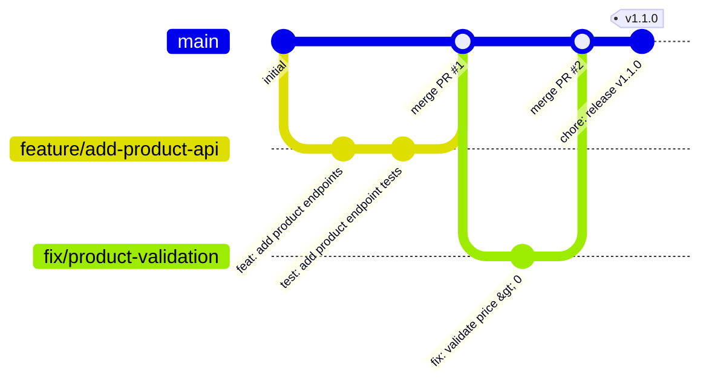
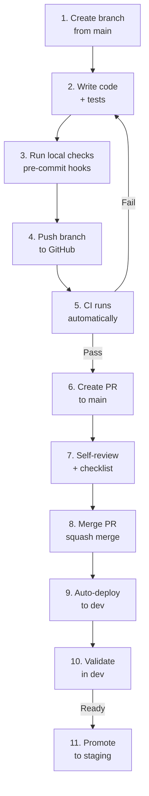

# Development Workflow

| Field         | Value                                |
|---------------|--------------------------------------|
| **Version**   | 1.0.0                                |
| **Status**    | Draft                                |
| **Author**    | Vox                                  |
| **Reviewer**  | Vox                                  |
| **Created**   | 2026-03-27                           |
| **Updated**   | 2026-03-27                           |
| **Standard**  | CODING-STANDARD.md; VERSIONING-STANDARD.md |

---

## 1. Purpose

This document describes the day-to-day development workflow for the Utopia project — from creating a branch to deploying to staging. It codifies the branching strategy, commit conventions, testing flow, and PR process.

## 2. Branching Strategy



### 2.1. Branch Types

| Branch | Pattern | Source | Merges Into | Purpose |
|--------|---------|--------|-------------|---------|
| **main** | `main` | — | — | Production-ready code, always deployable |
| **feature** | `feature/<description>` | `main` | `main` | New functionality |
| **fix** | `fix/<description>` | `main` | `main` | Bug fixes |
| **hotfix** | `hotfix/<description>` | `main` | `main` | Urgent production fixes |
| **chore** | `chore/<description>` | `main` | `main` | Maintenance, docs, refactoring |
| **infra** | `infra/<description>` | `main` | `main` | Infrastructure changes |

### 2.2. Branch Rules

- `main` is **protected** — no direct pushes
- All changes go through pull requests
- Branch names MUST be lowercase with hyphens: `feature/add-product-search`
- Delete branches after merge

## 3. Development Cycle



### Step-by-Step

#### 1. Create a Branch

```powershell
git checkout main
git pull origin main
git checkout -b feature/add-product-search
```

#### 2. Write Code + Tests

Follow [CODING-STANDARD.md](../00-standards/CODING-STANDARD.md) for all code.

- Backend: Write feature code → write unit tests → write integration tests
- Frontend: Write component → write Vitest tests → write Playwright E2E (if applicable)
- IaC: Write Terraform module → write validation → plan

#### 3. Run Local Checks

Pre-commit hooks run automatically (configured via Husky for frontend, dotnet tools for backend):

```powershell
# Backend
cd backend
dotnet format --verify-no-changes
dotnet build --no-restore
dotnet test --no-build

# Frontend
cd frontend
pnpm lint
pnpm type-check
pnpm test

# IaC
cd infrastructure/terraform
terraform fmt -check -recursive
terraform validate
```

#### 4. Commit with Conventional Commits

```bash
git add .
git commit -m "feat(catalog): add product search endpoint"
```

### Commit Message Format

```
<type>(<scope>): <description>

[optional body]

[optional footer(s)]
```

| Type | Description |
|------|-------------|
| `feat` | New feature |
| `fix` | Bug fix |
| `test` | Adding or updating tests |
| `docs` | Documentation changes |
| `chore` | Maintenance, dependencies |
| `refactor` | Code refactoring (no behavior change) |
| `ci` | CI/CD pipeline changes |
| `infra` | Infrastructure changes |
| `style` | Code formatting (no logic change) |
| `perf` | Performance improvement |

| Scope | Description |
|-------|-------------|
| `identity` | Identity module |
| `catalog` | Catalog module |
| `shared` | Shared kernel |
| `frontend` | Frontend app |
| `infra` | Infrastructure / Terraform |
| `ci` | CI/CD pipelines |
| `docs` | Documentation |

**Examples:**

```
feat(catalog): add product search with full-text query
fix(identity): handle expired refresh token gracefully
test(catalog): add integration tests for product CRUD
chore(deps): update MassTransit to 8.2.0
infra(k8s): add HPA for backend API deployment
ci: add Trivy container scan to backend pipeline
docs: update API contracts for product images
```

#### 5. Push and CI

```powershell
git push -u origin feature/add-product-search
```

CI runs automatically. See [CI-PIPELINE.md](../06-devops/CI-PIPELINE.md) for all quality gates.

#### 6. Create Pull Request

On GitHub, create a PR targeting `main`. The PR template:

```markdown
## Description
Brief description of what this PR does.

## Type of Change
- [ ] Feature
- [ ] Bug fix
- [ ] Refactoring
- [ ] Infrastructure
- [ ] Documentation

## Checklist
- [ ] Code follows [CODING-STANDARD.md](documents/00-standards/CODING-STANDARD.md)
- [ ] Tests added/updated and passing
- [ ] No new warnings or errors
- [ ] CI pipeline passes
- [ ] Security impact considered
- [ ] Documentation updated (if applicable)
- [ ] Database migrations are backward-compatible

## Screenshots / Evidence
(if applicable)
```

#### 7. Self-Review

Review your own PR using [REVIEW-CHECKLIST.md](../00-standards/REVIEW-CHECKLIST.md):

- Code quality and standards compliance
- Test coverage and meaningful assertions
- Security considerations
- No secrets or sensitive data committed

#### 8. Merge

- Use **Squash and Merge** to keep a clean main branch history
- Ensure the squash commit message follows conventional commits format
- Delete the source branch after merge

#### 9–11. Deploy and Promote

- Merge to `main` → CI builds → auto-deploy to `dev`
- Validate in dev → promote to staging via PR (see [CD-PIPELINE.md](../06-devops/CD-PIPELINE.md))

## 4. Testing Strategy

### 4.1. Backend (.NET)

| Layer | Tool | Coverage Target | Run |
|-------|------|----------------|-----|
| **Unit tests** | xUnit + FluentAssertions | 80%+ | `dotnet test` |
| **Integration tests** | xUnit + Testcontainers | Key paths | `dotnet test --filter Category=Integration` |
| **Architecture tests** | NetArchTest | Module boundaries | Part of unit test suite |

```powershell
# Run all backend tests
cd backend
dotnet test --collect:"XPlat Code Coverage"

# Generate coverage report
reportgenerator -reports:"**/coverage.cobertura.xml" -targetdir:"coverage" -reporttypes:"Html"
```

### 4.2. Frontend (Next.js)

| Layer | Tool | Coverage Target | Run |
|-------|------|----------------|-----|
| **Unit / Component** | Vitest + Testing Library | 80%+ | `pnpm test` |
| **E2E** | Playwright | Critical flows | `pnpm test:e2e` |

```powershell
# Run frontend tests
cd frontend
pnpm test              # Unit + component tests
pnpm test:coverage     # With coverage report
pnpm test:e2e          # Playwright E2E
```

### 4.3. Infrastructure

| Tool | Purpose | Run |
|------|---------|-----|
| `terraform validate` | Syntax and config validation | `terraform validate` |
| `terraform plan` | Dry-run changes | `terraform plan` |
| `tflint` | Linting | `tflint --recursive` |

## 5. Database Migrations

### 5.1. Creating Migrations

```powershell
cd backend/src/Utopia.Infrastructure

# Create migration
dotnet ef migrations add AddProductSearchIndex `
  --project ../Utopia.Infrastructure `
  --startup-project ../Utopia.Api

# Review the generated migration file before committing
```

### 5.2. Migration Rules

- Migrations MUST be backward-compatible (expand-contract pattern)
- Never rename or drop columns directly — add new, migrate data, then drop old
- Test migration against a copy of dev data before merging
- See [DATA-ARCHITECTURE.md](../02-architecture/DATA-ARCHITECTURE.md) for full migration strategy

## 6. Security Workflow

### 6.1. Pre-Commit Security

```powershell
# Scan for secrets (run before committing)
gitleaks detect --source . --verbose

# .NET dependency audit
dotnet list package --vulnerable

# npm dependency audit
cd frontend && pnpm audit
```

### 6.2. CI Security Gates

Automated in CI pipeline (see [CI-PIPELINE.md](../06-devops/CI-PIPELINE.md)):

- Gitleaks — secret detection
- Semgrep — SAST
- SonarQube — code quality + security
- Trivy — container image scanning
- `dotnet list package --vulnerable` — .NET CVE check
- `pnpm audit` — npm CVE check

## 7. Useful Commands Reference

### Backend

```powershell
# Build
dotnet build

# Run with hot reload
dotnet watch run --project src/Utopia.Api

# Format code
dotnet format

# Run specific test
dotnet test --filter "FullyQualifiedName~ProductServiceTests"

# Update EF Core tools
dotnet tool update --global dotnet-ef
```

### Frontend

```powershell
# Dev server
pnpm dev

# Build for production
pnpm build

# Lint + fix
pnpm lint --fix

# Type check
pnpm type-check

# Add a dependency
pnpm add <package>
pnpm add -D <package>  # dev dependency
```

### Kubernetes

```powershell
# View pods in namespace
kubectl get pods -n utopia

# View logs
kubectl logs -f deploy/utopia-api -n utopia

# Port-forward for debugging
kubectl port-forward svc/postgresql 5432:5432 -n utopia

# Restart deployment
kubectl rollout restart deploy/utopia-api -n utopia

# Check events
kubectl get events -n utopia --sort-by='.lastTimestamp'
```

### Docker

```powershell
# Build backend image
docker build -t harbor.utopia.local/utopia/api:dev -f backend/Dockerfile backend/

# Run compose stack
cd backend && docker compose up -d

# View logs
docker compose logs -f api

# Clean up
docker compose down -v
```

### ArgoCD

```powershell
# Login
argocd login argocd.utopia.local --grpc-web

# Sync app manually
argocd app sync utopia-api

# View app status
argocd app get utopia-api

# View deployment history
argocd app history utopia-api
```

## 8. References

- [CODING-STANDARD.md](../00-standards/CODING-STANDARD.md) — Code conventions
- [VERSIONING-STANDARD.md](../00-standards/VERSIONING-STANDARD.md) — SemVer and tagging
- [REVIEW-CHECKLIST.md](../00-standards/REVIEW-CHECKLIST.md) — PR review checklist
- [CI-PIPELINE.md](../06-devops/CI-PIPELINE.md) — CI quality gates
- [CD-PIPELINE.md](../06-devops/CD-PIPELINE.md) — GitOps deployment
- [SECURITY-STANDARD.md](../00-standards/SECURITY-STANDARD.md) — Security rules
- [GETTING-STARTED.md](./GETTING-STARTED.md) — Initial environment setup

## Changelog

| Version | Date       | Author | Description          |
|---------|------------|--------|----------------------|
| 1.0.0   | 2026-03-27 | Vox    | Initial draft        |
